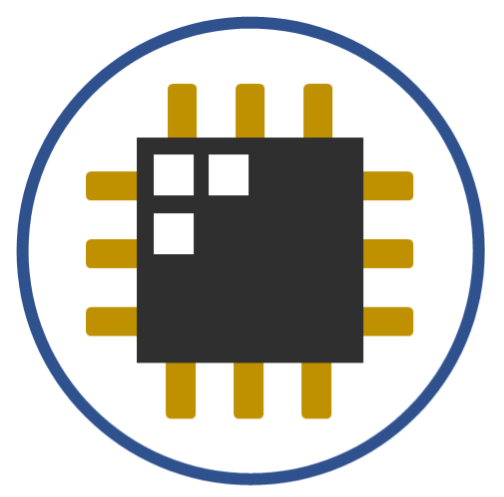

:::: {#tw-root}

::: {}
```{=html}
<!-- ─── HERO ──────────────────────────────────────────────────────────────── -->
<section style="background: radial-gradient(ellipse 80% 60% at 50% 30%, rgba(107,13,26,0.08) 0%, rgba(107,13,26,0.03) 50%, #ffffff 80%);"
         class="text-gray-900 py-28 px-8 text-center">
  <div class="max-w-4xl mx-auto flex flex-col items-center">
    
    <p class="text-xs font-mono mb-4 tracking-widest uppercase" style="color: #6B0D1A;">
      Digitals &nbsp;·&nbsp; UP EEEi
    </p>
    <h1 class="text-6xl font-extrabold mb-6 leading-tight text-gray-950">
      Digital Design Resources
    </h1>
    <p class="text-xl mb-12 max-w-2xl leading-relaxed text-gray-600">
      Course materials, interactive simulation tools, and open-source hardware
      from the digital design people at the University of the Philippines Diliman.
    </p>
    <div class="flex gap-4 flex-wrap justify-center">
      <a href="pages/verilogCrashCourse/index.html"
         class="inline-block font-semibold px-6 py-3 rounded-lg transition-colors border border-transparent"
         style="background: #6B0D1A; color: white;">
        Verilog Crash Course
      </a>
      <a href="kmapgameee"
         class="inline-block font-semibold px-6 py-3 rounded-lg transition-colors border"
         style="border-color: #6B0D1A; color: #6B0D1A;">
        Try the KMap Game
      </a>
    </div>
  </div>
</section>
```
:::

::: {}
```{=html}
<!-- ─── INTERACTIVE TOOLS ─────────────────────────────────────────────────── -->
<section class="py-16 px-8 bg-gray-50">
  <div class="max-w-5xl mx-auto">
    <h2 class="text-2xl font-bold text-gray-800 mb-1">Interactive Tools</h2>
    <p class="text-gray-500 mb-8 text-sm">Browser-based tools — no installation needed</p>
    <div class="grid grid-cols-1 md:grid-cols-3 gap-5">

      <!-- FSM Simulator -->
      <a href="FSM_simulatEEE.html"
         class="block bg-white rounded-xl border border-gray-200 p-6
                hover:shadow-md hover:border-red-300 transition-all group">
        <div class="w-10 h-10 rounded-lg flex items-center justify-center mb-4"
             style="background: #fee2e2;">
          <svg class="w-5 h-5" style="color: #7B0D1E;" fill="none" stroke="currentColor" viewBox="0 0 24 24">
            <path stroke-linecap="round" stroke-linejoin="round" stroke-width="2"
                  d="M8 9l3 3-3 3m5 0h3M5 20h14a2 2 0 002-2V6a2 2 0 00-2-2H5a2 2 0 00-2 2v12a2 2 0 002 2z"/>
          </svg>
        </div>
        <h3 class="font-bold text-gray-900 mb-2 group-hover:text-red-800 transition-colors">
          FSMsimulatEEE
        </h3>
        <p class="text-sm text-gray-500 leading-relaxed">
          Draw and simulate finite state machines directly in your browser.
          Fully client-side — no server required.
        </p>
      </a>

      <!-- KMap Game -->
      <a href="kmapgameee"
         class="block bg-white rounded-xl border border-gray-200 p-6
                hover:shadow-md hover:border-red-300 transition-all group">
        <div class="w-10 h-10 rounded-lg flex items-center justify-center mb-4"
             style="background: #fee2e2;">
          <svg class="w-5 h-5" style="color: #7B0D1E;" fill="none" stroke="currentColor" viewBox="0 0 24 24">
            <path stroke-linecap="round" stroke-linejoin="round" stroke-width="2"
                  d="M4 5a1 1 0 011-1h4a1 1 0 011 1v4a1 1 0 01-1 1H5a1 1 0 01-1-1V5zm10 0a1 1 0 011-1h4a1 1 0 011 1v4a1 1 0 01-1 1h-4a1 1 0 01-1-1V5zM4 15a1 1 0 011-1h4a1 1 0 011 1v4a1 1 0 01-1 1H5a1 1 0 01-1-1v-4zm10 0a1 1 0 011-1h4a1 1 0 011 1v4a1 1 0 01-1 1h-4a1 1 0 01-1-1v-4z"/>
          </svg>
        </div>
        <h3 class="font-bold text-gray-900 mb-2 group-hover:text-red-800 transition-colors">
          kmap-gamEEE
        </h3>
        <p class="text-sm text-gray-500 leading-relaxed">
          Practice Karnaugh map simplification through interactive puzzles
          with immediate feedback.
        </p>
      </a>

      <!-- Vercises -->
      <a href="exercises"
         class="block bg-white rounded-xl border border-gray-200 p-6
                hover:shadow-md hover:border-red-300 transition-all group">
        <div class="w-10 h-10 rounded-lg flex items-center justify-center mb-4"
             style="background: #fee2e2;">
          <svg class="w-5 h-5" style="color: #7B0D1E;" fill="none" stroke="currentColor" viewBox="0 0 24 24">
            <path stroke-linecap="round" stroke-linejoin="round" stroke-width="2"
                  d="M10 20l4-16m4 4l4 4-4 4M6 16l-4-4 4-4"/>
          </svg>
        </div>
        <h3 class="font-bold text-gray-900 mb-2 group-hover:text-red-800 transition-colors">
          Vercises
        </h3>
        <p class="text-sm text-gray-500 leading-relaxed">
          Verilog coding exercises with automated testbench checking and
          instant feedback.
        </p>
      </a>

    </div>
  </div>
</section>
```
:::

::: {}
```{=html}
<!-- ─── COURSE MATERIALS ──────────────────────────────────────────────────── -->
<section class="py-16 px-8 bg-white">
  <div class="max-w-5xl mx-auto">
    <h2 class="text-2xl font-bold text-gray-800 mb-1">Course Materials</h2>
    <p class="text-gray-500 mb-8 text-sm">Open educational resources for digital design</p>

    <a href="pages/verilogCrashCourse/index.html"
       class="block rounded-xl border border-gray-200
              hover:shadow-md hover:border-red-300 transition-all overflow-hidden group">
      <div class="flex flex-col md:flex-row">
        <div class="p-8 flex-1">
          <p class="text-xs font-mono tracking-widest uppercase mb-3" style="color: #6B0D1A;">Course Material &nbsp;·&nbsp; 6 Modules</p>
          <h3 class="text-2xl font-bold text-gray-900 mb-3 group-hover:text-red-800 transition-colors">
            Verilog Crash Course
          </h3>
          <p class="text-gray-500 leading-relaxed mb-5">
            A structured introduction to Verilog HDL covering combinational logic,
            sequential circuits, finite state machines, verification techniques,
            and coding best practices. Originally deployed on UVLe.
          </p>
          <span class="text-sm font-semibold" style="color: #7B0D1E;">View Course →</span>
        </div>
        <div class="hidden md:flex items-center justify-center bg-gray-50 p-8"
             style="min-width: 260px;">
          
        </div>
      </div>
    </a>
  </div>
</section>
```
:::

::: {}
```{=html}
<!-- ─── OPEN SOURCE HARDWARE ──────────────────────────────────────────────── -->
<section class="py-16 px-8 bg-gray-50">
  <div class="max-w-5xl mx-auto">
    <h2 class="text-2xl font-bold text-gray-800 mb-1">Hardware Resources</h2>
    <p class="text-gray-500 mb-8 text-sm">RTL we've built and open-sourced</p>
    <div class="grid grid-cols-1 md:grid-cols-2 gap-5">

      <!-- AllenCore -->
      <a href="https://gitlab.eee.upd.edu.ph/cidr-p3-public/pipelined-RV32IMC"
         target="_blank" rel="noopener noreferrer"
         class="block bg-white rounded-xl border border-gray-200 p-6
                hover:shadow-md hover:border-red-300 transition-all group">
        <div class="flex items-start justify-between mb-3">
          <p class="text-xs font-mono tracking-widest uppercase" style="color: #6B0D1A;">Open Source &nbsp;·&nbsp; GitLab</p>
          <svg class="w-4 h-4 flex-shrink-0 ml-2 text-gray-400 group-hover:text-red-800 transition-colors"
               fill="none" stroke="currentColor" viewBox="0 0 24 24">
            <path stroke-linecap="round" stroke-linejoin="round" stroke-width="2"
                  d="M10 6H6a2 2 0 00-2 2v10a2 2 0 002 2h10a2 2 0 002-2v-4M14 4h6m0 0v6m0-6L10 14"/>
          </svg>
        </div>
        <h3 class="font-bold text-lg text-gray-900 mb-2 group-hover:text-red-800 transition-colors">
          AllenCore
        </h3>
        <p class="text-sm text-gray-500 leading-relaxed">
          A pipelined RV32IMC processor implementing the RISC-V base integer ISA
          with multiply (M) and compressed instruction (C) extensions. Targets the Artix A7-200T.
        </p>
      </a>

      <!-- ADEL Processor -->
      <a href="https://github.com/Lawrence-lugs/sky130_analog_digital_flow_demo/tree/main/adel_proc"
         target="_blank" rel="noopener noreferrer"
         class="block bg-white rounded-xl border border-gray-200 p-6
                hover:shadow-md hover:border-red-300 transition-all group">
        <div class="flex items-start justify-between mb-3">
          <p class="text-xs font-mono tracking-widest uppercase" style="color: #6B0D1A;">Open Source &nbsp;·&nbsp; GitHub</p>
          <svg class="w-4 h-4 flex-shrink-0 ml-2 text-gray-400 group-hover:text-red-800 transition-colors"
               fill="none" stroke="currentColor" viewBox="0 0 24 24">
            <path stroke-linecap="round" stroke-linejoin="round" stroke-width="2"
                  d="M10 6H6a2 2 0 00-2 2v10a2 2 0 002 2h10a2 2 0 002-2v-4M14 4h6m0 0v6m0-6L10 14"/>
          </svg>
        </div>
        <h3 class="font-bold text-lg text-gray-900 mb-2 group-hover:text-red-800 transition-colors">
          ADEL Processor
        </h3>
        <p class="text-sm text-gray-500 leading-relaxed">
          A minimal processor with a simple custom ISA designed to teach students
          processor architecture fundamentals. DRC,LVS clean on the SkyWater 130nm
          open PDK.
        </p>
      </a>

    </div>
  </div>
</section>
```
:::

::: {}
```{=html}
<!-- ─── FOOTER ────────────────────────────────────────────────────────────── -->
<footer class="py-10 px-8 border-t border-gray-200">
  <div class="max-w-5xl mx-auto text-center text-sm text-gray-400">
    <p>Digitals | Electrical and Electronics Engineering Institute</p>
    <p class="mt-1">University of the Philippines Diliman</p>
    <p class="mt-3 text-xs">&copy; 2026 Lawrence Quizon</p>
  </div>
</footer>
```
:::

::::

