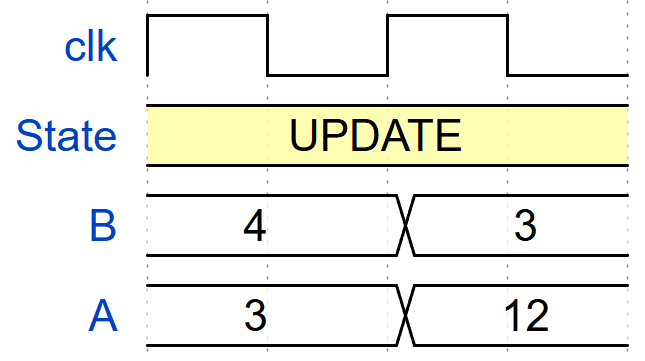
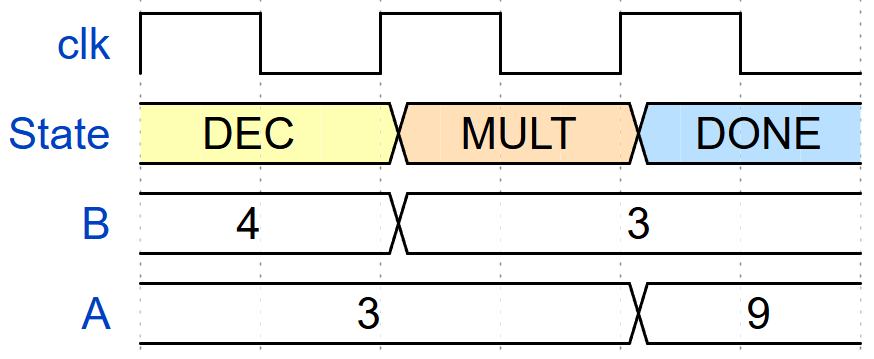
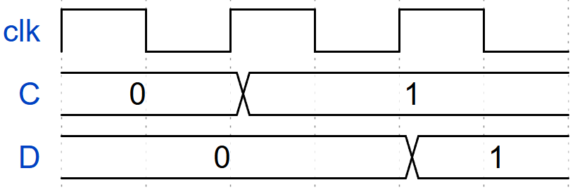
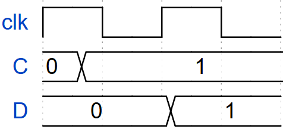
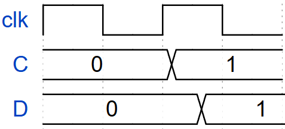
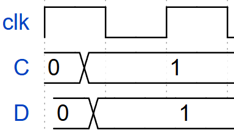

A conventional software reading treats assignments as an ordered sequence: one statement updates a variable, and the next statement uses that updated value. Mapping the same statements into hardware requires information that their written order alone does not provide. **Which variables store values in registers, which respond through combinational logic, and which operations are separated by clock edges?** Without explicit descriptions of these properties, the same algorithm can suggest different results or different times at which a result becomes available. 

The following two case studies show why specifying what a circuit computes is not enough; we must also specify when its values change by **explicitly defining the storage types of the variables used**.

## Case Study 1: How to interpret assignments that are written sequentially?

Consider these two assignments, starting from `A = 3` and `B = 4`:

```text
B = B - 1;
A = A * B;
```

**Does `A * B` use `B = 4` or the updated `B = 3`?** A software reading suggests one answer. In an ASM, the answer also depends on what `A` and `B` represent and where the operations sit relative to the state boundaries.

### Sequential software: use the updated B

With ordinary sequential assignment, the first statement replaces `B` with 3. The next statement reads that new value and computes `A = 3 * 3 = 9`. After both statements, **`A = 9, B = 3`**. Reversing the statements would change the result, because the multiplication would then happen before the decrement.

### Two registers in one ASM step: use the current B

**Now declare both `A` and `B` as registers** and place both assignments on the active path of the same state:

```text
State UPDATE:
    B = B - 1
    A = A * B
```

The subtractor forms `B_next = 4 - 1 = 3`, while the multiplier forms `A_next = 3 * 4 = 12`. Both read the current register outputs. Preparing 3 at the input of register `B` does not change its stored output: the multiplier still sees 4 throughout this cycle. At the next active clock edge, both registers capture together, producing **`A = 12, B = 3`**.

{#fig-regAB  width=45%}

Reversing the written order of these two registered assignments has no effect. As long as their activation conditions and state boundaries remain the same, that visual ordering changes neither their timing nor their result.

### Two registers in successive states: make the new B available first

To use the decremented register value in the multiplication, put a state boundary between the operations:

```text
State DEC:
    B = B - 1
    next state MULT

State MULT:
    A = A * B
    next state DONE
```

At the edge leaving `DEC`, `B` becomes 3 while `A` holds 3. During `MULT`, the multiplier therefore computes `3 * 3`. At the following edge, `A` captures 9. The result is **`A = 9, B = 3`**, now reached across two clock edges.

{#fig-regAB-2states  width=65%}

The assignment text alone cannot distinguish these cases. The chart must clearly identify **which variables are registers or combinational signals** and **which operations belong to the same ASM step or clock cycle**. Those declarations and state boundaries make the intended hardware timing clear.

## Case Study 2: Does a decision see the value just assigned?

Assume initially `C = D = 0`, and consider:

```text
C = 1;
if (C == 1) D = 1;
```

**Does the decision already see `C = 1`, and when does `D` become 1?** Even this small example needs explicit timing definitions for its variables.

### Sequential software: D becomes 1 in the same execution

The first statement changes `C` to 1. The condition then reads that updated value, so the second assignment executes and changes `D` to 1. After the sequence, **`C = D = 1`**. There is no hardware clock-edge requirement in this software interpretation.

For the hardware cases below, imagine enabling a circuit that implements these two statements and leaving it enabled throughout the experiment. The circuit continuously tries to make `C` equal to 1 and checks whether the currently visible `C` is 1 to determine whether to assign 1 to `D`. It does not execute the first line, finish it, and then move on to the second line as a processor would. Both pieces of logic are present and operating together.

### C and D are registers: D needs two active edges

Before the first edge, `C = 1` prepares 1 at the input of register `C`, but its visible output is still the stored 0. The condition `C == 1` therefore evaluates to false. No assignment to `D` is selected, so `D` holds 0.

At the **first active edge**, `C` captures 1 while `D` remains 0. The important detail is that both registers capture according to the values available before that edge. `D` cannot use the new output of `C` at the very edge that produces it.

After this edge, the condition can see the stored `C = 1`. The conditional logic responds after some logic propagation delay and selects 1 for the input of register `D`. That input is now ready, but `D` still stores 0 until the **second active edge**, when it captures 1. Thus the visible values progress from `C = 0, D = 0`, to `C = 1, D = 0`, and finally to `C = 1, D = 1`. The two-edge result comes from the two stages of storage, not from deliberately scheduling the statements in separate steps.

{#fig-regCD  width=65%}

### C is combinational and D is registered: D needs one active edge

Now remove the storage associated with `C`, but keep `D` as a register. When the circuit is enabled, `C = 1` makes the visible value of `C` become 1 after some logic propagation delay. There is no need to wait for a clock edge to make that value available to the condition.

The condition becomes true and selects 1 for the input of register `D` before the first edge. `D` still holds its initial 0 during this interval because it is a register. At the **first active edge**, it captures 1. Removing storage from `C` has removed one edge of waiting: the condition can respond within the cycle instead of waiting for a registered update of `C`.

{#fig-combiC  width=45%}

### C is registered and D is combinational: D responds after the first active edge

Now reverse the combination: keep `C` as a register, but make `D` combinational with a default value of 0. Before the first edge, the assignment `C = 1` prepares 1 at the register input while its visible output remains 0. The condition is false, so `D` takes its default 0.

At the **first active edge**, `C` captures 1. Once that new register output is visible, the condition becomes true and the selected assignment drives `D` to 1 **after some logic propagation delay**. Since `D` has no storage, it does not wait for a second active edge.

{#fig-combiD  width=45%}

Both mixed cases therefore need only one active edge, but the location of the storage changes the timing around that edge. With combinational `C` and registered `D`, the logic prepares `D`'s input before the edge and `D` captures it at the edge. With registered `C` and combinational `D`, the edge updates `C` first, and the logic driving `D` responds afterward. Here `D` changes because the new value propagates from `C`, not because `D` itself is clocked.

### C and D are combinational: neither waits for an active edge

Finally, remove storage from both `C` and `D`. Enabling the circuit drives `C` to 1 after some logic propagation delay. The condition responds to that visible value, and its selected assignment drives `D` to 1 after some logic propagation delay through the conditional logic. Neither signal needs a clock edge to change.

Both therefore become 1 **without waiting for an active edge**, although the changes are not instantaneous. The dependence of `D` on `C` is a logic propagation relationship: a change travels through the circuit. It is not a processor executing one instruction after another, nor a pair of registers passing a value across successive clock edges.

{#fig-combiCD  width=35%}

The assignment text and condition are identical in all four hardware interpretations. **Changing only the variable interpretations changes whether `D` needs two edges, one edge, or no edge at all—and whether it captures a value at an edge or responds through combinational logic afterward.** The final values alone would inevitably hide this difference: every case eventually reaches `C = D = 1`; however, the timing of those changes depends on the variable declarations and is critical for correct hardware implementation. An ASM must therefore specify timing explicitly, rather than leave the reader to infer when those values become available from the written order of the statements.

## Key idea: Two kinds of change happen around one clock cycle

At the abstraction level used in introductory synchronous design, it is helpful to distinguish two kinds of visible change:

### Combinational change

A combinational signal reacts when its inputs or the active control path change. The new value appears after ordinary logic propagation delay. It can therefore change while the machine remains in the same state and before another clock edge occurs.

### Registered change

A register may have a changing candidate value at its input throughout the cycle, but its stored output remains fixed. A new stored value becomes visible only after the active clock edge.

### Main issue: The same assignment text can describe different circuits

Take the simple assignment `Y = X`. The arithmetic content is trivial, yet the hardware depends completely on what `Y` is.

- **If Y is combinational** `Y = X` describes a direct logic relationship. When `X` changes, `Y` can follow during the same cycle after some logic propagation delay.
- **If Y is registered** `Y = X` describes the next input of a bank of flip-flops. `Y` keeps its old stored value until the next active clock edge.

**A single ASM step may contain both behaviors.** The active state and current register values feed combinational logic. Decisions resolve. The active path determines combinational outputs and candidate register inputs. The next clock edge captures the selected registered values and the next state. The next ASM step then begins from those newly visible stored values.

- **Just after edge k:** The current state register and all data registers expose their newly captured values. Combinational logic begins propagating from them.
- **During cycle k:** Decision conditions are evaluated from currently visible inputs and signals. The active path can change if a combinational input changes. Combinational outputs follow the active path after logic delay. Candidate next values for registers are also formed.
- **Just before edge k+1:** The currently resolved path determines the next-state input of the state register and the selected inputs or write enables of the data registers.
- **At edge k+1:** The state register and all enabled data registers capture concurrently.
- **Just after edge k+1:** The next state and new registered data become visible. Combinational logic begins responding to the new values.

The proposed standard resolves the ambiguous assignment issue before the chart is executed. The declaration of a variable determines its hardware behavior everywhere it is assigned. The box containing the assignment determines *when that assignment is active*. The variable type determines *how the assignment takes effect in hardware*.

A useful exercise is to predict a timing trace, change an input between clock edges, and compare the prediction with the simulator. Reset returns each run to a known starting point. The same reasoning explains the circuit: which values need storage, which expressions feed the registers, and which decisions select those expressions. The chart, timing trace, and hardware drawing can all be checked against one another. **A truly hardware-mappable ASM contains enough information to make all three interpretations consistent and predictable.**

::: {.callout-note title="Cycle-level timing, not gate-level timing"}

The standard distinguishes changes that may occur within the current clock period from changes that wait for the active clock edge. Exact nanosecond delays, setup time, hold time, clock skew, and post-route timing remain part of physical implementation and timing analysis.

:::
