The proposal has five rules built around one idea: **boxes determine control activity; declarations determine hardware timing.** The active path selects the assignments. Each variable's declaration determines whether its value responds during the current cycle or is stored at the next clock edge.

## 3.1 Variable declarations {#declarations-and-assignment}

Before execution, the chart declares its inputs, its assignable variables, and its initial state. There is no exact format for the declarations; what is important is that each variable that will appear in the ASM chart is *sufficiently* declared. One possible format for those declarations, which will be used throughout this document, is as follows:

```text
// input declarations
input Flag
input N[7:0]

// combinational variables with default values
combinational out_bit default 0
combinational done    default 0

// registered variables with reset values
register A[7:0] reset 0
register B[7:0] reset 0

// initial/starting state
reset_state S0       
```

An **input** is a signal supplied from outside the system. The ASM reads it but does not assign to it. It is available to combinational logic as a live value: the user or external circuit may change it during execution, independently of the clock or state transitions. Such a change can affect decisions and combinational outputs while the ASM remains in the same state. It changes a register's stored value only through an assignment captured at a clock edge.

A **combinational variable** represents logic that responds during the current cycle and has a declared default. An active assignment determines its value after some logic propagation delay. **Without an active assignment, it takes its default value.** A combinational variable *cannot* hold a value since it is not a memory element. It is preferable that the number of bits in a combinational variable be explicitly declared, so that the simulator can check for overflow and the designer can plan the datapath width.  More details about the timing of combinational variables are in [§3.4](03-semantics.qmd#timing-of-combinational-variables).

A **registered variable** represents storage and has a declared reset value. An active assignment prepares its next value; the register captures that value at the next active clock edge. **Without an active assignment, it holds its current value.** Just like the combinational variables, it is preferable that the number of bits of registers be explicitly declared for hardware translation purposes. More details about the timing of registered variables are in and [§3.5](03-semantics.qmd#timing-of-registered-variables).

The **reset state is the initial state**. ASM execution always starts there with all registered variables at their reset values, and resetting returns the machine to that same starting point. Combinational variables are then evaluated from the initial state, the register values, and the current inputs. An assignment active in the initial state can therefore override a combinational default after some logic propagation delay. The reset state is also the only state that can be reached from a reset signal. The reset signal is not an input; it is a control signal that forces the machine to return to the reset state and restore all registers to their reset values. The reset functionality is highlighted again in [   §3.3](03-semantics.qmd#assignment-rules) and [§3.5](03-semantics.qmd#timing-of-registered-variables).

The motivation for explicit declarations is to avoid interpreting hardware timing at the syntax level. Once the destination's type is declared, either of these consistently defined assignment styles can express the same operation:

```text
input Flag
register A[7:0] reset 0
combinational out_bit default 0

// alternative 1
A ← A + 1       out_bit ← Flag
// alternative 2
A = A + 1       out_bit = Flag
```

Both forms prepare a clocked update for `A` and a current-cycle response for `out_bit`, since the former is a registered variable and the latter is combinational. The declaration also applies wherever the assignment appears: a register in a conditional box remains registered, and a combinational variable in a state box remains combinational. Moving an assignment may change when it is active, but does not change its timing class.

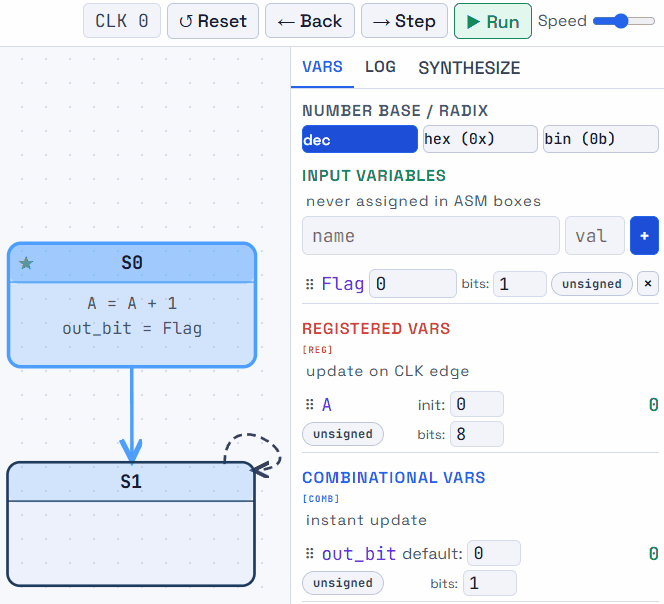{#fig-asm-declarations width=60%}

::: {.callout-note title="Declarations and assignment. Click me for more info." collapse="true"}

`Flag` is an input, `A` is a register, and `out_bit` is combinational. At initial state `S0`, `A` is initialized to 0 (reset value) and `out_bit` reflects what `Flag` is. While in `S0`, changing the value of `Flag` before a clock edge causes `out_bit` to update immediately, while `A` holds its previous value until the next edge. Clicking `Step` creates that clock edge and transitions the ASM into state `S1`; `A` is updated during that same step due to registered behavior. Since `out_bit` is not assigned in `S1`, it takes its default value. More information about the timing of combinational and registered variables is in [§3.4](03-semantics.qmd#timing-of-combinational-variables) and [§3.5](03-semantics.qmd#timing-of-registered-variables).

:::

## 3.2 ASM elements and the active path {#asm-elements-and-the-active-path}

### The elements of an ASM chart

An ASM chart uses three kinds of boxes, connected by arrows:

| Element | How to recognize it | What it means |
| --- | --- | --- |
| **State box** | A rectangle with a state name, such as `WAIT` or `RUN`. | Represents a controller state and may list assignments active whenever that state is current. It has one outgoing path, leading through the operations and decisions for that state. |
| **Decision box** | A diamond containing a condition, with branches labelled true/false or 1/0. | Selects the outgoing path according to the condition's current value. It introduces no new state or clock step. |
| **Conditional box** | A rounded box containing one or more assignments. Also called a conditional-output box. | Groups assignments active when the current path reaches that box, then continues along one outgoing path. Each destination retains its declared timing. The box introduces no new state or clock step. |

**Arrows** show which boxes are connected and which path can be followed. They are flowchart connections, not individual circuit wires. A start/reset marker identifies the initial state. The word *conditional* means that the box is active when its path is selected; it does not require a decision box immediately before it.

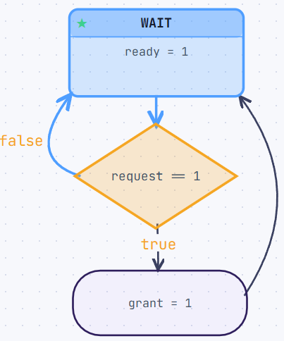{#fig-asm-elements width=30%}

::: {.callout-note title="ASM block definitions. Click me for more info." collapse="true"}

The top rectangle is a state box. The diamond in the middle is a decision box. The rounded rectangle at the bottom is a conditional box. Each box has one outgoing path (except the decision box which has two), which may lead to another box or back to the same box. A state box may contain assignments that are active whenever that state is current. A conditional box contains assignments that are active whenever the current path reaches that box. A decision box selects the outgoing path according to the condition's current value. 

`WAIT` is the state name, `ready = 1` is the state-box assignment, `request == 1` is the decision expression, the true/false branches are shown, `grant = 1` is the conditional-box assignment, and the connecting arrows show the flow. The start/reset marker (green star symbol) points to `WAIT`. The ASM block includes `WAIT`, its decision, and its conditional box. The return to `WAIT` is marked as the next clock boundary; there is only one state in this ASM. There is no implied clock edge between the decision and conditional box. This figure serves as a legend for box types and a complete small example.

:::

**The timing behavior of the ASM depends on the declared types of the variables, not on the box type.** A state box may contain both registered and combinational assignments. A conditional box may also contain both kinds of assignments. A decision box does not contain assignments, but it can select between paths that lead to different kinds of assignments.

### Following the active path

Exactly one state box within the ASM represents the **current state**. At the beginning of the simulation/execution, the current state would be the reset/initial state. Starting there, follow the branch selected by each decision and include every conditional box encountered **until the input of a next state box is reached.** This is the **active ASM path**. The next state, including a transition back to the same state, if applicable, is captured at the next active clock edge.

The current state box and all decision and conditional boxes connected to it before the next state form an **ASM block**. That block can contain several possible paths; current decisions select the active one.

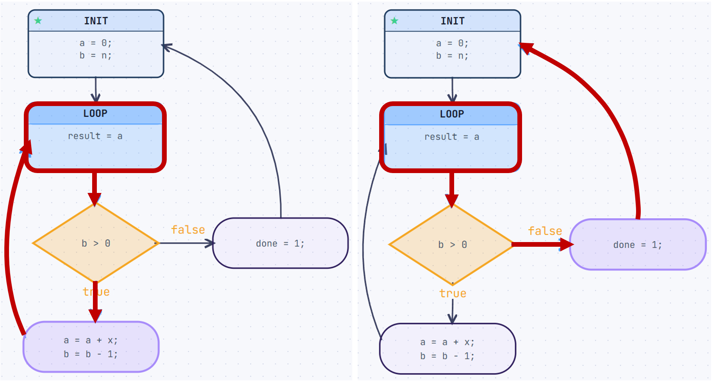{#fig-active-paths width=90%}

In this example, two active paths are shown starting from the current state `LOOP`. If `b` is greater than 0, the decision box selects the true branch, which leads to the conditional box to perform the assignment `a = a + x` and `b = b - 1`. The active path then ends at the input of the next state, which is still `LOOP`. However, if `b` is not greater than 0, the decision box selects the false branch, which leads to a different conditional box to perform the assignment `done = 1`. The active path ends at the input of the next state, which is `INIT`. In both of these cases, once the clock edge is reached, the next state becomes the new current state.

### Invalid paths leading to invalid ASMs

For fixed current inputs and register values, **the path must always resolve to one next state.** A loop through decision or conditional boxes that never reaches a state box is *invalid.* An invalid ASM can never be properly simulated and has no corresponding hardware interpretation.

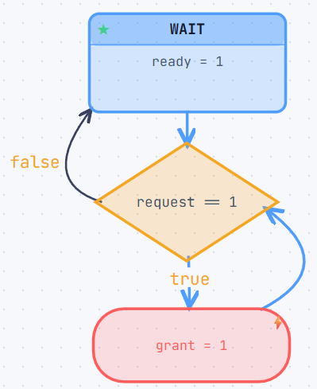{#fig-invalid-paths width=30%}

::: {.callout-note title="Invalid ASM path definitions. Click me for more info." collapse="true"}

From the given example, if the conditional box goes back to the decision box, the ASM path can loop indefinitely without reaching a state box if `request` is 1. This is invalid because the next state is not determined. The ASM must always resolve to one next state for fixed current inputs and register values. 

The ASM simulator can detect this situation and report an error (highlighted as a red box). The chart must be revised to ensure that all paths from the current state eventually reach a state box.

Other types of invalid paths include a decision box looping back to itself, or a conditional box looping back to itself. These situations also prevent the ASM from resolving to a next state and are invalid.

**The main idea here is that the ASM, after tracing the active path from a given current state, must always resolve to one next state for fixed current inputs and register values.**

:::

### Grouping assignments for readability {#grouping-assignments}

A conditional box may follow a state box, a decision box, or another conditional box. This freedom lets the author improve flowchart readability or visually separate groups of signals, such as register updates and interface outputs. For example, this entire path belongs to one ASM step:

```text
State S0 → Conditional C1 → Conditional C2 → State S1
```

Here both conditional boxes are active whenever `S0` is active. Their assignments could be combined into one conditional box or placed directly inside `S0`, as shown in the figure below. The three layouts have the same behavior and timing: visual grouping adds no clock boundary. With many assignments, separate boxes may make the flowchart easier to read than one crowded box.

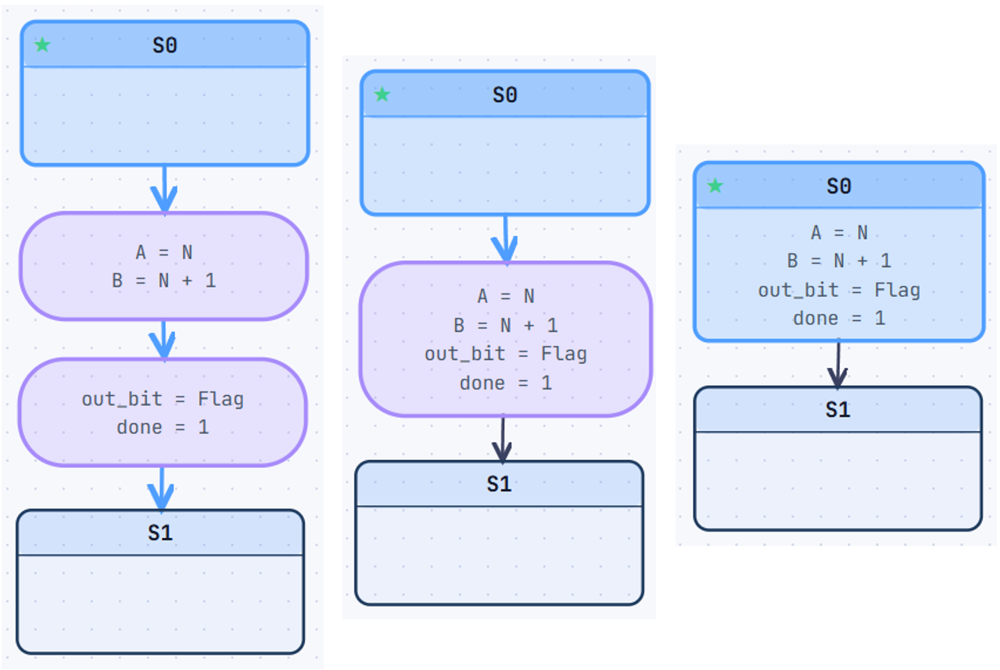{#fig-asm-grouping width=80%}

An ASM designer may opt to separate assignments into multiple conditional boxes for clarity, or combine them into one box for compactness. For example, a designer may opt separate register and combinational assignments into different conditional boxes to highlight their different timing behaviors. Alternatively, they may combine them into one box if the assignments are closely related and the designer wants to emphasize that relationship. Because the variable types are explicitly declared, the timing behavior is clear regardless of how the assignments are visually grouped, as long as the assignments are active under the same conditions and within the same ASM step.

This equivalence requires the same expressions, activation conditions, and state boundaries. Consecutive boxes reached on the same decision branch can be combined while keeping that branch. Moving those assignments into the state box would instead make them active on every path from that state. Whether a decision is the *immediate* predecessor is therefore not enough to determine whether such a move is valid.

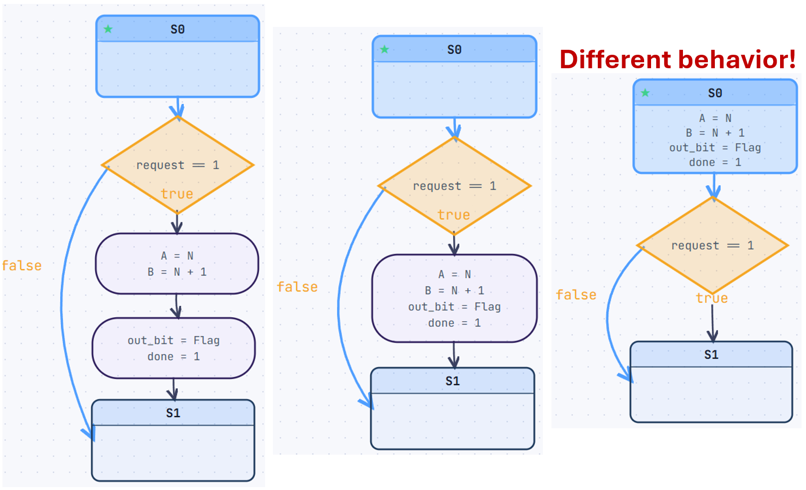{#fig-asm-wrong-grouping width=90%}

::: {.callout-note title="Conditional box merging on different paths. Click me for more info." collapse="true"}
The left layout shows two conditional boxes that are reached only if the decision box is true. The middle layout shows them combined into one box, which is still valid since the activation conditions are the same. The right layout attempts to combine them inside the state box, but this is invalid because the assignments in the conditional boxes are dependent on the decision. The combined assignment inside the state box would be active whenever S0 is active, regardless of the decision, which is not the intended behavior.
:::

### The values used by decisions

**Decisions read currently visible values.** For a register, this is its stored output, not the candidate value at its input. For an input or combinational variable, it is the current signal value after some logic propagation delay. If `B` stores 1 and the active path contains `B = B - 1`, a decision testing `B == 1` still sees 1 during that cycle. Preparing 0 for the next edge does not yet change the register output.

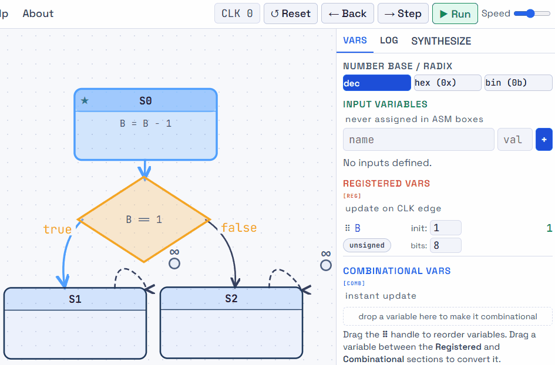{#fig-asm-visible-values width=80%}

The active path can change during a cycle if an input to a decision changes. Combinational assignments then respond to the newly selected path, while registered assignments prepare new candidates for capture at the edge. More details regarding the timing intricacies of combinational and registered assignments are discussed in [§3.4](03-semantics.qmd#timing-of-combinational-variables) and [§3.5](03-semantics.qmd#timing-of-registered-variables).

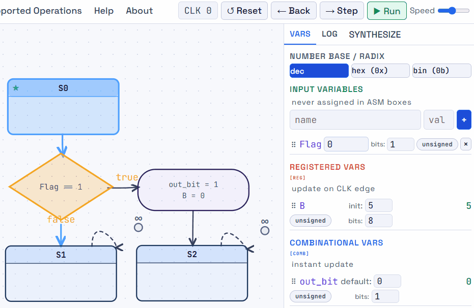{#fig-asm-active-path width=80%}

::: {.callout-note title="An input changes the active path. Click me for more info." collapse="true"}

In this example, B is declared as a **register** with a reset value of 5, and out_bit is declared as **combinational.** with a default value of 0. Changing `Flag` can redirect the active path during a clock period. The combinational output responds within the cycle; the register captures its selected next value at the active edge. Two assignments in the same conditional box therefore have different timing because their destinations have different declared types.

When `Flag` changes to 1, the active path selects the true branch, and `out_bit` is set to 1 after some logic propagation delay. The register `B` prepares its next value of 0, but it does not change its stored output until the next clock edge. When the clock edge occurs, the current state becomes `S2`, `B` captures the new value of 0, and `out_bit` goes back to its default value of 0 since it is combinational and is not explicitly assigned in state `S2`.

More details regarding the timing intricacies of combinational and registered assignments are discussed in [§3.4](03-semantics.qmd#timing-of-combinational-variables) and [§3.5](03-semantics.qmd#timing-of-registered-variables).

:::

## 3.3 Assignment rules {#assignment-rules}

### Assignment of combinational and registered variables

| Situation | Registered variable | Combinational variable |
| --- | --- | --- |
| An assignment is active | Prepare the selected value for the next active edge. | Produce the selected value during the current cycle after some logic propagation delay. |
| No assignment is active | Hold the current stored value. | Use the declared default. |
| Execution starts or is reset | Take the reset value as the controller enters its initial state. | Evaluate assignments active in the initial state; use the default if none is active. |

**Hold, default, and reset serve different purposes.** Hold preserves storage, a default completes the combinational definition, and reset establishes the stored starting values.

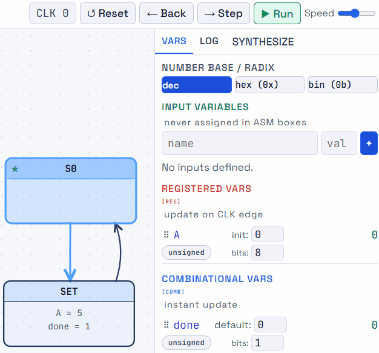{#fig-asm-hold-default-reset width=60%}

::: {.callout-note title="Hold, default, and reset" collapse="true"}

Here we show four moments: reset in `S0` gives `A = 0`, `done = 0`; entering `SET` makes `done` respond to 1 while `A` is still 0; the edge returning to `S0` captures `A = 5` and `done` returns to 0 after some logic propagation delay; reset restores `A = 0` in `S0`. Between entering and leaving `S0`, `A` holds 5 because no assignment is active there. 

Moving from `S0` to `SET` requires a clock edge, same as moving from `SET` back to `S0`. The combinational `done` responds to the active assignment in `SET` and returns to its default when leaving that state. The assignment to `A` is active only in `SET`, but the update is captured at the edge leaving that state since it is a register. `A` holds its value in `S0` until the next edge.

:::

### Mutual exclusion of assignments along the active path

Each destination may have **at most one assignment on an active path** in an ASM step. This applies to registered and combinational variables, including assignments spread across state and conditional boxes. Mutually exclusive branches may each assign the same destination because only one branch can be active.

```text
State S0:
    B = B - 1
    if clear:
        B = 0      // invalid: two assignments when clear is true
    Next state S1
```

Both assignments would select a value for `B` on the same path. Written order does not choose a winner. Express the alternatives through the decision structure instead:

```text
State S0:
    if clear:
        B = 0
    else:
        B = B - 1
    Next state S1
```

Now the chart selects exactly one assignment. A register's hold rule or a combinational variable's declared default covers the absence of an assignment; neither counts as a second active-path assignment. In particular, a declared default may be overridden, but a state-box assignment may not be overridden by another assignment later on the same path.

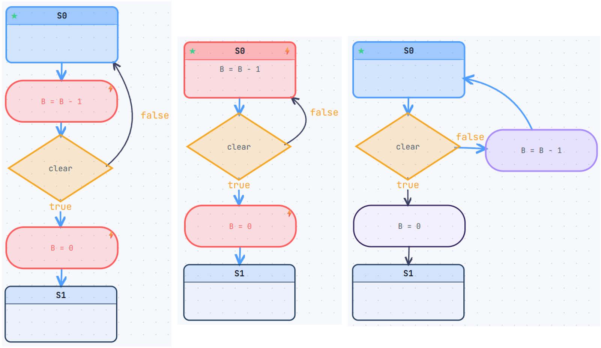{#fig-asm-assignment-rules width=90%}

::: {.callout-note title="One assignment per active path. Click me for more info." collapse="true"}

The figure on the left shows an invalid ASM with two assignments to `B` on the same active path once `clear` is true/1. The figure in the middle represents the same scenario but placing the update of `B` on the state box. This is still invalid because both assignments would end up on the same active path once `clear` is true/1. The simulator properly catches this double driver issue as shown by highlighting the conflicting assignments. ASMs with this problem are not implementable in hardware and the simulator will not allow them to run.

The figure on the right shows a valid ASM with mutually exclusive assignments to `B` based on the value of `clear`. The decision box ensures that only one assignment is active at any time, satisfying the rule of at most one assignment per active path. This is the correct way to express alternative assignments in an ASM.

:::

::: {.callout-warning title="The double driver problem."}

**This is a common mistake when converting a sequential algorithm into an ASM. This is also common for those just starting out with digital systems design.** 

Always remember that we are describing hardware behavior, not software execution. A register or combinational variable cannot be assigned two different values at the same time. The ASM must be designed to ensure that each destination has at most one assignment on the active path during any given ASM step. 

**Ensure that all assignments to a destination are mutually exclusive on the active path.**

:::

## 3.4 Combinational variables {#timing-of-combinational-variables}

An assignment to a combinational destination defines its current-cycle logic. Mutually exclusive paths can select different expressions; when no assignment is active, the declared default supplies the value. Consider the following example:

```text
input request
combinational grant default 0
combinational ready default 0
reset_state WAIT

State WAIT:
    ready = 1
    if request:
        grant = 1
    next state WAIT
```

If `ready` and `grant` are **both combinational**, `ready` is always set to 1 since we never leave the `WAIT` state. Even if `ready` has a default value of 0, the explicit assignment to 1 while in the `WAIT` state overrides the default. `grant` will only be set to 1 when `request` is 1, and goes back to its default value of 0 when `request` is 0. The default gives the signal a defined value on the inactive branch; it does not retain the previous 1 as **a combinational variable is not a memory element**.

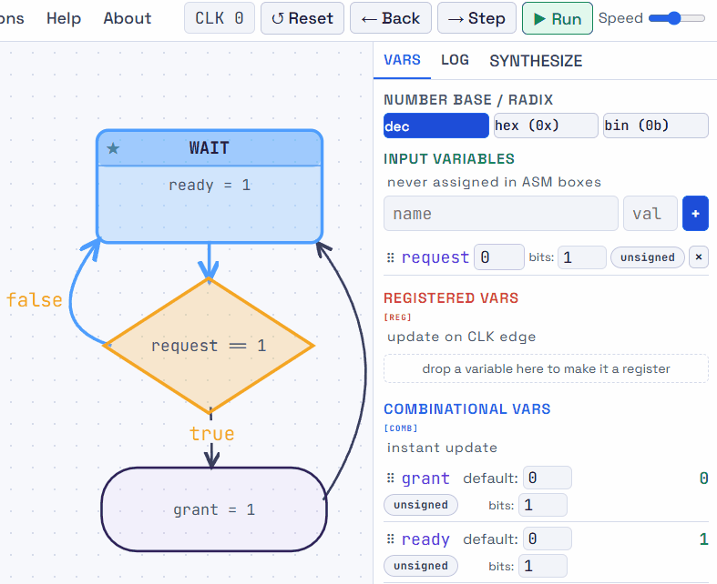{#fig-combinational-timing width=70%}

### Combinational dependencies must be acyclic
A signal must not feed back into itself through only combinational assignments or decisions. Consider:

```text
combinational flag default 0

State S1:
    if flag == 0:
        flag = 1          // invalid combinational feedback
        Next state S1
    else:
        Next state S0
```

With `flag = 0`, the decision selects the assignment that drives `flag` to 1. With `flag = 1`, the assignment becomes inactive and the default drives `flag` to 0. There is no stable value. This is a combinational feedback loop which is not implementable in hardware. A direct self-reference such as `toggle = ~toggle`, or an indirect chain such as `a = ~b` and `b = a`, has the same problem when those variables are combinational. When evaluating an ASM, the active path must resolve to a stable value for each combinational variable, or else the chart is deemed invalid. The ASM simulator can detect this situation and report an error (highlighted as a red box). The chart must be revised to ensure that all combinational paths are acyclic.

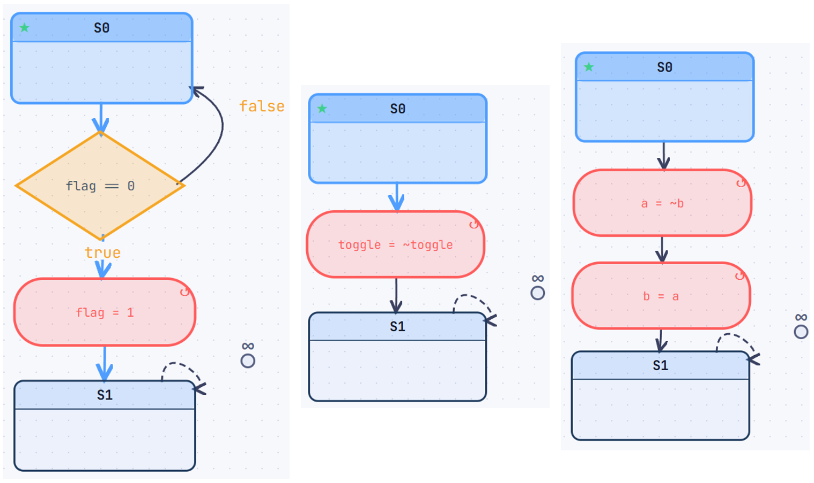{#fig-combinational-feedback  width=90%}

::: {.callout-warning title="A combinational path must settle"}

The active path and all combinational values must resolve from the current state, current register outputs, and external inputs through logic with no combinational dependency cycles. A declared default does not provide storage or break a feedback loop.

:::

Feedback through a **register** (see the next section) is permitted. In `count = count + 1`, a registered `count` supplies its current value to the adder and captures the result only at the edge. The register separates current and next values in time. For the same reason, a decision may test a register and select an assignment to that register without creating an immediate combinational loop.

## 3.5 Registered variables {#timing-of-registered-variables}

An active assignment to a registered destination prepares a candidate next value. During ordinary execution, its stored output remains unchanged until the active clock edge, when it captures the selected candidate. Without an active assignment, it holds its current value.

Consider the previous example from [§3.4](03-semantics.qmd#timing-of-combinational-variables) but with both variables declared as **registered** instead of combinational. If `ready` is **registered**, it will initially have its reset value of 0 and be set to 1 at the next clock edge and remain 1 until reset. If `grant` is **registered**, it will also have its initial reset value of 0 and be set to 1 at the next clock edge when `request` is 1, and remain 1 until reset. 

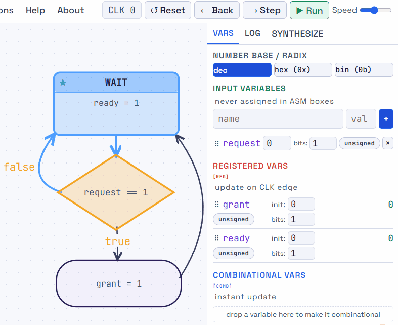{#fig-registered-timing width=70%}

Consider another example of a registered variable that counts up when enabled:

```text
input enable
register count[7:0] reset 0
reset_state RUN

State RUN:
    if enable:
        count = count + 1
    next state RUN
```

During `RUN`, an adder forms `count + 1`. When `enable` is 1, the sum is selected as the next value; otherwise the register holds its current value. The visible count changes only after an active edge at which the increment is selected. Changes in `enable` before the edge can change the candidate next value, but do not change the stored output. 

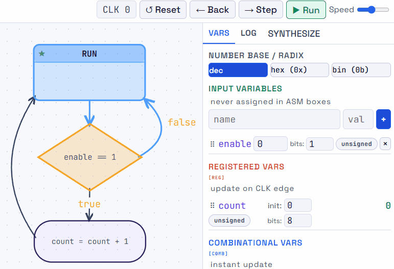{#fig-asm-register-enable width=70%}

### All register updates within an ASM step occur concurrently
Expressions read the current register outputs, and every register captures its selected next value together at the edge. For example, with `A` and `B` declared as 8-bit registers, these assignments swap their values:

```text
State SWAP:
    A = B
    B = A
    Next state DONE
```

Reversing their written order gives the same behavior:

```text
State SWAP:
    B = A
    A = B
    Next state DONE
```

If `A = 3` and `B = 9` before the edge, both versions compute `A_next = 9` and `B_next = 3`. At the edge, both produce `A = 9, B = 3`. Neither assignment overwrites a value needed by the other during the cycle.

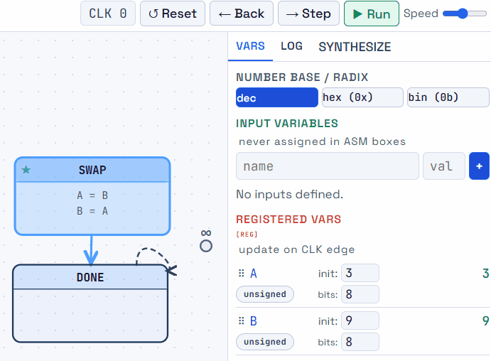{#fig-asm-concurrency width=60%}

This order independence applies to assignments selected in the same ASM step. Putting an assignment in a later state changes which stored values it reads, as shown in [Why Timing Matters](01-timing.qmd).

## Summary for the ASM evaluation

Finally, after covering the semantics of the ASM elements, the assignment rules, and the timing of combinational and registered variables, we can summarize how to evaluate an ASM chart during execution.

Execution begins in the initial state with the registers at their reset values. Each ASM step then proceeds as follows:

1. Use the current state, stored register outputs, and current inputs to resolve the active path and combinational logic.
2. For each combinational destination, use its active assignment or its declared default. For each register, prepare its selected next value or hold.
3. Allow the acyclic logic to settle during the cycle. If an input changes, resolve the affected decisions, outputs, and register candidates again.
4. At the active clock edge, capture the resolved next state and all selected register values concurrently.
5. Continue from the newly visible state and register values.

::: {.callout-tip title="Keep the rules nearby"}

Use the dedicated [Formal Specifications for ASM interpretation](formal-specification.qmd) as a compact reference. To see the rules execute cycle by cycle, continue to the [ASM SimulatEEE showcase](asm-simulateee.qmd).

:::
