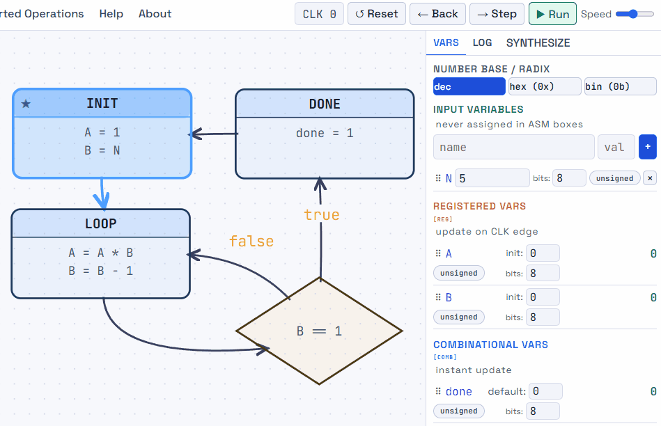
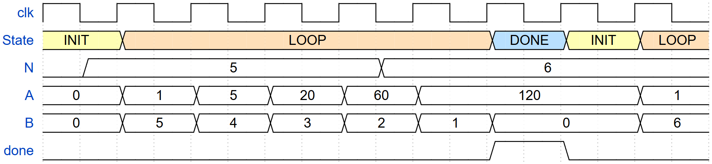
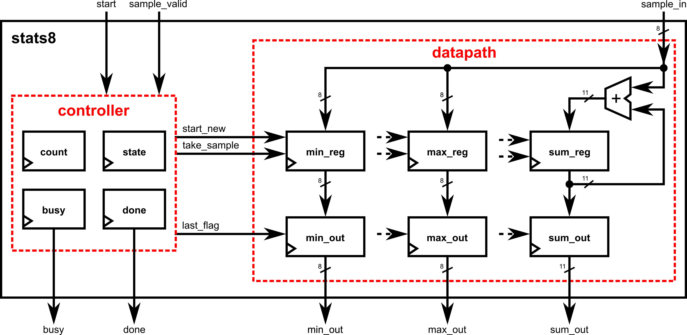
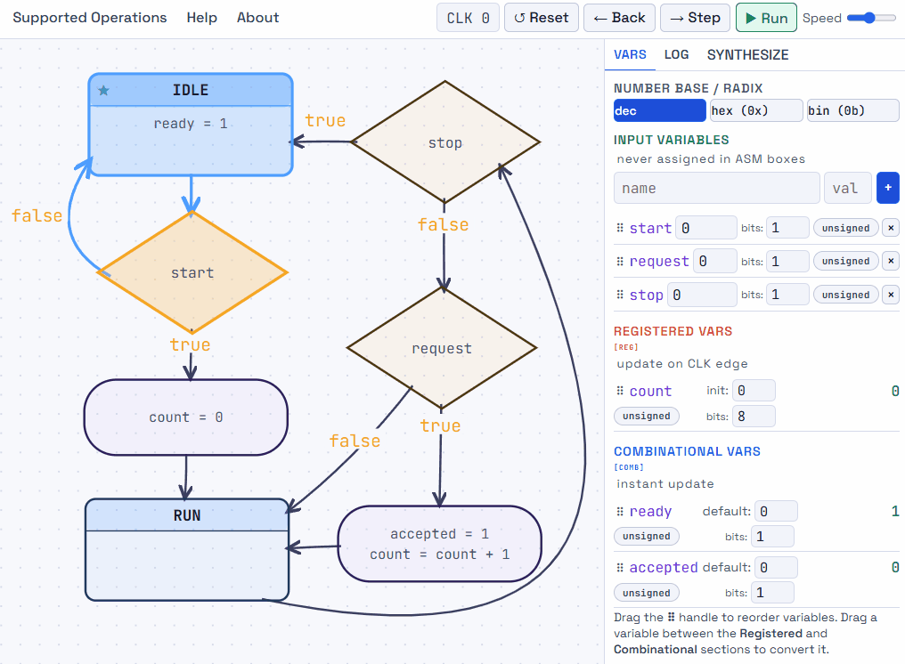
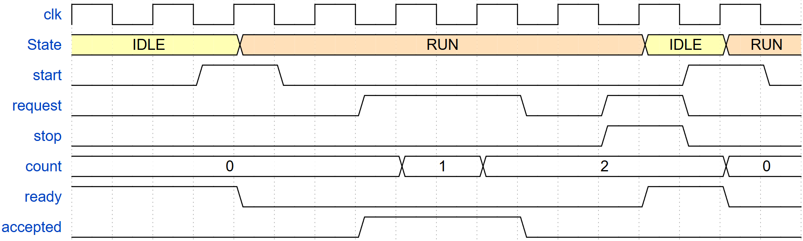
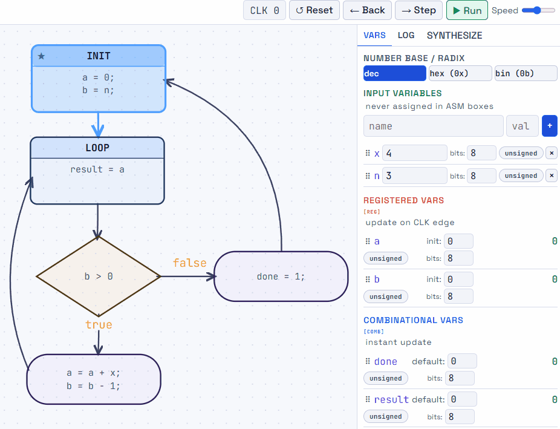
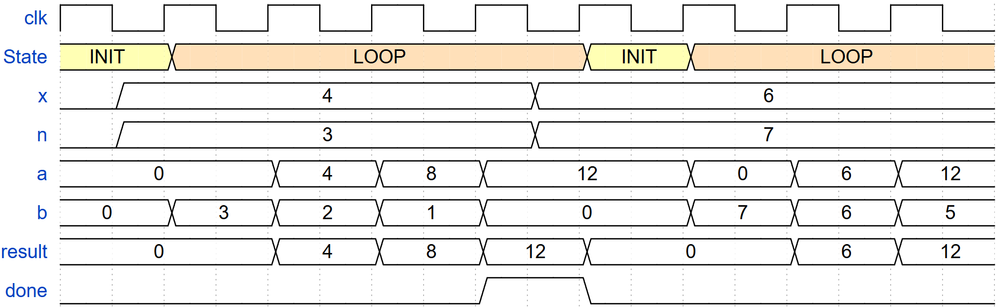

A timing-complete ASM becomes useful when the student can look at the chart and begin naming the hardware without inventing extra semantics. The mapping does not mean that there is only one possible optimized circuit. Synthesis can still share resources, simplify logic, alter state encodings, or choose different mux structures. The important point is that the required *behavioral categories* are already clear.

## A practical mapping methodology

| Read this in the ASM | Ask this hardware question | Typical hardware consequence |
| -- | --- | --- |
| Registered variable | What value must be stored from one cycle to the next? | A register or bank of flip-flops, including its declared reset value. |
| Several mutually exclusive assignments to one register | Which candidate value should reach the register input? | A multiplexer or an equivalent synthesized selection logic. |
| Arithmetic or logic expressions such as `A * B`, `B - 1`, `A | B`, or constants like `0` or `1` | What combinational function must form the candidate value? | Multiplier, adder, subtractor, shifter, comparator, constants, or general combinational logic. |
| Combinational variable | What logic should be visible during the current state and path? | State decode, input-dependent Boolean logic, multiplexer logic, or other combinational logic derived using truth tables or K-maps. |
| Decision expression | What Boolean condition selects a path? | Comparator, status flag, reduction logic, or external input feeding the controller. |
| State boxes and next-state transition arrows | What control state is stored and what state comes next? | State register plus combinational next-state logic, implemented using classical finite-state machine techniques or one-hot encoding. |
| Reset state and register resets | What known stored configuration must reset establish? | Controller and datapath reset behavior. |

The next three examples show the same mapping process from different directions. The factorial machine emphasizes register timing and the danger of a one-cycle error. The request counter adds live combinational outputs. The repeated-addition multiplier then combines registered and combinational assignments across state and conditional boxes, making the role of variable declarations explicit.

## Example 1: Factorial and the one-cycle trap

Suppose the machine computes `N!` using a running product `A` and a countdown value `B`. The stored variables are declared explicitly:

```text
input N[7:0]

register A[7:0] reset 0
register B[7:0] reset 0

combinational done default 0

reset_state INIT
```

The reset values establish a known electrical starting point. The algorithm then performs a separate initialization operation that loads `A = 1` and `B = N`. Reset and algorithmic initialization are deliberately distinct ideas. Reset says what the registers contain when the circuit is reset. The initialization state says what values the factorial operation needs when a new computation begins.

A compact ASM description is:

{#fig-asm-factorial  width=80%}

::: {.callout-tip title="Try it yourself!"}

[Download the factorial ASM JSON](files/factorial.json){download="factorial.json"}, open [ASM SimulatEEE](https://digital.eee.upd.edu.ph/ASM_simulatEEE.html), and choose **Load JSON** to load the downloaded file. Reset and step through the machine to watch the product and countdown registers update at each clock edge.

:::

::: {.callout-note title="Figure development note" collapse="true"}

**Insert the factorial ASM generated from ASM SimulatEEE here.** The intended flow is: `S0: INIT` assigns `A ← 1` and `B ← N`, then transitions to `S1: LOOP`. In `S1`, the active state operations are `A ← A * B` and `B ← B - 1`. A decision tests the currently visible register value `B == 1`. False returns to `S1`. True proceeds to `S2: DONE`, where the combinational output `done` is asserted.

A GIF can be especially useful here. One version may animate the highlighted active path and visible values of `A` and `B` for `N = 5`, emphasizing that the multiply and decrement become stored only at the clock edge.

**Suggested caption:** Factorial ASM with explicit register timing. The decision observes the current stored value of `B`, while `A * B` and `B - 1` are candidate next values until the edge.

:::

The critical detail is that `A` and `B` are registers. While the machine is in `LOOP`, the multiplier forms `A * B` and the decrementer forms `B - 1`, but those are candidate next values. The visible register outputs remain the old `A` and `B` until the edge. The decision `B == 1` therefore tests the current stored countdown value.

For `N = 5`, the machine can be read cycle by cycle:

| State | Visible A | Visible B | Datapath events during the cycle | What happens at the next edge |
| - | - | - | --- | --- |
| `INIT` | 0 | 0 | `A` input selects 1. `B` input selects `N` = 5. | `A` becomes 1, `B` becomes 5, state becomes `LOOP`. |
| `LOOP` | 1 | 5 | `A` input = 5. `B` input = 4. Decision sees `B` = 5. | `A` becomes 5, `B` becomes 4, state remains `LOOP`. |
| `LOOP` | 5 | 4 | `A` input = 20. `B` input = 3. Decision sees `B` = 4. | `A` becomes 20, `B` becomes 3. |
| `LOOP` | 20 | 3 | `A` input = 60. `B` input = 2. Decision sees `B` = 3. | `A` becomes 60, `B` becomes 2. |
| `LOOP` | 60 | 2 | `A` input = 120. `B` input = 1. Decision sees `B` = 2. | `A` becomes 120, `B` becomes 1. |
| `LOOP` | 120 | 1 | `A` input = 120 × 1 = 120. `B` input = 0. Decision sees `B` = 1, so the exit path is selected. | `A` remains 120, `B` becomes 0, state becomes `DONE`. |
| `DONE` | 120 | 0 | `done` is driven to 1 because it is a combinational output assigned in `DONE` state. | `A` and `B` hold, state goes back to `INIT`. |
| `INIT` | 120 | 0 | `A` input selects 1. `B` input selects `N` = 5. | `A` becomes 1, `B` becomes 5, state becomes `LOOP`. |

The machine stops when the *visible* value of `B` is 1. The loop still performs the multiply-by-1 and decrement-to-0 operations on the exit edge, but multiplying by 1 preserves the correct factorial result.

{#fig-asm-factorial-timing  width=100%}

::: {.callout-warning title="Why B = 0 is one cycle too late"}

If the decision waits for the visible register output `B` to become 0, then the circuit must first clock `B` from 1 to 0 while remaining in the loop. During the next state interval, the loop hardware sees `A = 120` and `B = 0`, so the multiplier forms `120 × 0`. If the loop assignment is still active at the exit edge, the register captures 0 and destroys the correct result. The error comes from register timing, not from the mathematical definition of factorial.

:::

This example is precisely where a software-flowchart intuition can mislead. A programmer may imagine decrementing `B`, immediately seeing that it became 0, and then exiting before another multiplication. The synchronous circuit cannot observe the newly stored `B = 0` until after the edge that captures it. A timing-explicit ASM makes the distinction visible while the algorithm is still being designed.

### Hardware mapping of the factorial ASM

Once the semantics are fixed, the datapath is almost a reading exercise:

- `A` and `B` are declared registers, so the datapath needs two register banks with reset values.
- `A = A * B` requires a multiplier producing a candidate input for `A`.
- `B = B - 1` requires a decrementer or subtractor producing a candidate input for `B`.
- `A = 1` requires a constant 1 as another possible input to the `A` register.
- `B = N` requires the external input `N` as another possible input to the `B` register.
- Because each register has several possible next values, selection logic is required. A mux-based implementation is the natural first drawing.
- The decision `B == 1` requires an equality comparator or equivalent Boolean logic.
- `done` is combinational and active in `DONE` state, so it can be produced by state decode rather than a separate data register.

The controller then produces the mux selects, enables, and next-state choice. One possible control table is:

| State | `B == 1` | A action | B action | `done` | Next state |
| --- | --- | --- | --- | --- | --- |
| `INIT` | x | load `1` | load `N` | 0 | `LOOP` |
| `LOOP` | 0 | load `A*B` | load `B-1` | 0 | `LOOP` |
| `LOOP` | 1 | load `A*B` | load `B-1` | 0 | `DONE` |
| `DONE` | x | hold | hold | 1 | `INIT` |

{fig-alt="Placeholder block diagram for image placeholder: factorial datapath + controller" width=80%}

::: {.callout-note title="Figure development note" collapse="true"}

**Insert the corresponding hardware implementation here.** A two-panel figure works well: one panel for the datapath and one for the controller. The datapath should visibly include registers `A` and `B`, their reset behavior, the `A * B` multiplier, the `B - 1` decrementer, constants or input sources for initialization, selection logic feeding each register, and the `B == 1` comparator. The controller panel should show the state register and the logic that produces the register controls, `done`, and next state.

It is useful to label the control lines so the reader can trace each line back to an ASM operation. If the simulator's synthesized view can be exported cleanly, that image is especially appropriate here.

**Suggested caption:** Datapath and controller realization of the factorial ASM. Once storage class, reset behavior, and edge timing are explicit, the major hardware blocks follow directly from the chart.

:::

The same chart could have written its assignments using `=` instead of `←`. The datapath would be identical because the declarations establish that `A` and `B` are clocked storage and `done` is combinational.

## Example 2: A request counter with live combinational outputs

Suppose the machine counts requests while running and produces two live interface signals: `ready` while idle and `accepted` while a request path is active. A `start` input clears the count and begins a run; a `stop` input ends it. Unlike the factorial machine, this example emphasizes the interaction between stored values and combinational outputs. The variables are declared explicitly:

```text
input start
input request
input stop

register count[7:0] reset 0

combinational ready    default 0
combinational accepted default 0

reset_state IDLE
```

Reset establishes `state = IDLE` and `count = 0`. Starting a run is a separate operation: the active `start` branch selects `count = 0` and the transition to `RUN` for the next edge. Returning to `IDLE` does not itself clear the count, so a completed run's value remains visible until another start or reset. The combinational outputs use their declared defaults unless an active assignment selects another value.

A compact ASM description is:

{#fig-asm-request  width=90%}

::: {.callout-tip title="Try it yourself!"}

[Download the request-counter ASM JSON](files/request.json){download="request.json"}, open [ASM SimulatEEE](https://digital.eee.upd.edu.ph/ASM_simulatEEE.html), and choose **Load JSON** to load the downloaded file. Reset the machine, then try changing `request` between clock steps to compare the live `accepted` output with the registered count.

:::

::: {.callout-note title="Figure development note" collapse="true"}

**Insert the request-counter ASM generated from ASM SimulatEEE here.** The intended flow is: in `IDLE`, assert combinational `ready = 1`. Test `start`. False loops to `IDLE`; true passes through a conditional box with registered `count = 0` and enters `RUN`. In `RUN`, test `stop` first. True returns to `IDLE`. False then tests `request`. False remains in `RUN`; true passes through a conditional box containing both combinational `accepted = 1` and registered `count = count + 1`, then remains in `RUN`.

If this is animated, follow the cycle-by-cycle example below, including a restart that clears the retained count. Let `request` change between clock edges so the reader can see `accepted` react before `count` changes. Also show `stop = 1` and `request = 1` together: the stop branch bypasses both request assignments.

**Suggested caption:** One conditional box can activate both a live combinational output and a next-edge register update. The declarations, rather than the assignment symbol or box shape, determine the timing.

:::

The critical detail is that `count` is registered, while `ready` and `accepted` are combinational. In `RUN`, the chart tests `stop` first. Only when `stop = 0` and `request = 1` does the active path select both `accepted = 1` and `count = count + 1`. The output responds after some logic propagation delay, but the visible count remains unchanged until the edge. One conditional box therefore controls two different timing behaviors without introducing an extra clock step.

Starting from the reset condition, the machine can be read cycle by cycle. Each row describes one state interval; the listed inputs remain stable through its closing edge. Combinational output values are those reached after some logic propagation delay. Inputs not listed do not affect that row's active path.

| State | Relevant inputs | Visible count | Datapath events during the cycle | What happens at the next edge |
| - | -- | - | --- | --- |
| `IDLE` | `start` = 0 | 0 | `count` input holds 0; `ready` = 1, `accepted` = 0. | `count` holds 0; state remains `IDLE`. |
| `IDLE` | `start` = 1 | 0 | `count` input selects 0; `ready` = 1, `accepted` = 0. | `count` captures 0; state becomes `RUN`. |
| `RUN` | `stop` = 0, `request` = 1 | 0 | `count` input = 1; `ready` = 0, `accepted` = 1. | `count` becomes 1; state remains `RUN`. |
| `RUN` | `stop` = 0, `request` = 1 | 1 | `count` input = 2; `ready` = 0, `accepted` = 1. | `count` becomes 2; state remains `RUN`. |
| `RUN` | `stop` = 0, `request` = 0 | 2 | `count` input holds 2; `ready` = 0, `accepted` = 0. | `count` holds 2; state remains `RUN`. |
| `RUN` | `stop` = 1, `request` = 1 | 2 | Stop bypasses the request branch; `count` input holds 2; `ready` = 0, `accepted` = 0. | `count` holds 2; state becomes `IDLE`. |
| `IDLE` | `start` = 1 | 2 | `count` input selects 0; `ready` = 1, `accepted` = 0. | `count` becomes 0; state becomes `RUN` for a new run. |

The two consecutive request rows illustrate that this machine counts **clock edges with an active request**, not distinct request pulses. A request held high across two eligible edges increments the count twice. The stop row also makes the priority explicit: even with `request = 1`, neither request assignment is active when the stop branch is selected.

{#fig-asm-request-timing  width=100%}

::: {.callout-warning title="Why accepted does not mean already counted"}

Suppose `count = 7` in `RUN` with `stop = 0`. If `request` rises between edges, `accepted` rises after some logic propagation delay and the `count` input selects 8, while the visible `count` remains 7. If the request pulse lasts long enough for the combinational logic to respond but falls and settles before the next edge, `accepted` returns to 0 and the `count` input returns to hold 7. The pulse can therefore be visible on `accepted` without producing a stored increment. Capture requires the request path to remain selected with the required timing around the active edge.

:::

This is the same distinction between a current-cycle value and a next-edge update that mattered in the factorial example. Here it explains why executing two assignments on the same ASM path does not mean their destinations become visible at the same time. Their declarations, not their shared box or assignment symbol, determine that timing.

### Hardware mapping of the request counter

Once the semantics are fixed, the hardware follows from the same reading process:

- `count` is a declared 8-bit register, so the datapath needs a register bank with reset value 0.
- `count = count + 1` requires an incrementer producing a candidate input for the register.
- `count = 0` requires a constant 0 as another possible register input.
- The register must select among zero, the incremented count, and its current value for hold. A mux-based implementation is the natural first drawing; an enable can implement the hold behavior instead.
- The decisions read single-bit inputs `start`, `stop`, and `request`, so these signals feed the controller's selection logic directly.
- `ready` is combinational and active in `IDLE`, so state decode produces it without a separate output register.
- `accepted` is combinational and active only in `RUN` with `stop = 0` and `request = 1`, so state decode and input-dependent logic produce it. The same condition selects the incremented count at the register input.

The controller then produces the mux selects, enables, combinational outputs, and next-state choice. One possible control table is shown below; `x` means that the input does not affect the action in that row. Reset separately establishes `state = IDLE` and `count = 0`.

| State | start | stop | request | Count action | ready | accepted | Next state |
| --- | --- | --- | --- | --- | --- | --- | --- |
| `IDLE` | 0 | x | x | hold | 1 | 0 | `IDLE` |
| `IDLE` | 1 | x | x | load 0 | 1 | 0 | `RUN` |
| `RUN` | x | 1 | x | hold | 0 | 0 | `IDLE` |
| `RUN` | x | 0 | 0 | hold | 0 | 0 | `RUN` |
| `RUN` | x | 0 | 1 | load count + 1 | 0 | 1 | `RUN` |

Reading across a row shows what happens together: the outputs describe the current cycle, while the `count` action and next-state choice take effect at the next edge. In particular, `ready` stays 1 during the `IDLE` interval that accepts `start`; it becomes 0 after some logic propagation delay once the edge changes the state to `RUN`.

{fig-alt="Placeholder block diagram for image placeholder: request-counter datapath + controller" width=80%}

::: {.callout-note title="Figure development note" collapse="true"}

**Insert the corresponding hardware implementation here.** The datapath should show the `count` register, its reset to 0, the incrementer, and selection among hold, zero, and `count + 1`. The controller should show the `IDLE`/`RUN` state register, next-state logic driven by `start` and `stop`, and combinational output logic for `ready` and `accepted`. The `request` condition should visibly influence both the live `accepted` path and the registered count-enable/next-value path.

A two-panel diagram is again recommended because it makes the central teaching point visible: one ASM path can simultaneously control combinational interface logic and a register update scheduled for the edge. Label the count selection controls with the table's hold, load-zero, and increment actions. Show the `stop` condition suppressing both `accepted` and the increment selection, so the diagram preserves the chart's priority.

**Suggested caption:** Hardware mapping of the request counter. `accepted` is current-cycle combinational logic, while `count` is stored datapath state, even though both are activated by the same ASM branch.

:::

This small example demonstrates why variable typing is more general than box typing. `ready` is a combinational state output. `accepted` is a combinational conditional output. `count` is a register that is assigned in conditional boxes. The timing of each signal follows its declaration consistently across all of those placements.

## Example 3: A multiplier with timing defined by declarations

Suppose the machine computes `n × x` by adding `x` to an accumulator `a` a total of `n` times. A countdown register `b` tracks the remaining additions. The combinational output `result` exposes the accumulator while the machine is in `LOOP`, and `done` indicates that no additions remain. The variables are declared explicitly:

```text
input n[7:0]
input x[7:0]

register a[15:0] reset 0
register b[7:0]  reset 0

combinational done         default 0
combinational result[15:0] default 0

reset_state INIT
```

For this implementation, take `n` and `x` as unsigned 8-bit inputs. The 16-bit accumulator and result can represent their full product. The circuit samples `n` when leaving `INIT`, but it does not store `x`: keep `x` unchanged throughout the additions if the result is to equal one fixed product `n × x`.

Reset establishes `state = INIT`, `a = 0`, and `b = 0`. Algorithmic initialization is separate: the assignments in `INIT` prepare `a = 0` and `b = n` for capture at the edge entering `LOOP`. Both combinational outputs remain at their defaults in `INIT`, because neither is assigned there.

A compact ASM description is:

{#fig-asm-multiplier  width=90%}

::: {.callout-tip title="Try it yourself!"}

[Download the multiplier ASM JSON](files/multiplier.json){download="multiplier.json"}, open [ASM SimulatEEE](https://digital.eee.upd.edu.ph/ASM_simulatEEE.html), and choose **Load JSON** to load the downloaded file. Reset and step through the additions, keeping `x` stable, and watch when `done` asserts and when `result` returns to its default.

:::

The critical detail is that **box placement does not determine timing**. The assignments to `a` and `b` are registered whether they appear in the `INIT` state box or the true-branch conditional box. The assignment to `result` is combinational even though it appears in a state box. The assignment to `done` is also combinational, this time in a conditional box. Every assignment uses `=`, yet its destination's declaration determines when the value becomes visible.

For `n = 3` and `x = 4`, the machine can be read cycle by cycle. Output values shown below are those reached after some logic propagation delay:

| State | Visible a | Visible b | Datapath events during the cycle | What happens at the next edge |
| - | - | - | --- | --- |
| `INIT` | 0 | 0 | `a` input = 0; `b` input = 3; `result` = 0, `done` = 0. | `a` captures 0, `b` captures 3; state becomes `LOOP`. |
| `LOOP` | 0 | 3 | `result` = 0; `b` > 0 is true; `a` input = 4, `b` input = 2; `done` = 0. | `a` becomes 4, `b` becomes 2; state remains `LOOP`. |
| `LOOP` | 4 | 2 | `result` = 4; `b` > 0 is true; `a` input = 8, `b` input = 1; `done` = 0. | `a` becomes 8, `b` becomes 1; state remains `LOOP`. |
| `LOOP` | 8 | 1 | `result` = 8; `b` > 0 is true; `a` input = 12, `b` input = 0; `done` = 0. | `a` becomes 12, `b` becomes 0; state remains `LOOP`. |
| `LOOP` | 12 | 0 | `result` = 12; `b` > 0 is false; `done` = 1; `a` and `b` inputs select hold. | `a` holds 12, `b` holds 0; state becomes `INIT`. |
| `INIT` | 12 | 0 | `result` = 0, `done` = 0; `a` input = 0; `b` input selects the current `n`. | `a` becomes 0, `b` captures `n`; state becomes `LOOP` for another run. |

The decision reads the current stored `b`, not the pending value `b - 1`. When `b = 1`, the true branch still selects the final addition and decrement. Only after that edge does `b` become 0, making the false branch active. During this final `LOOP` interval, `result` exposes the completed product and `done` becomes 1 without waiting for another edge. For `n = 0`, the machine enters `LOOP` with `a = b = 0`, immediately selects the completion branch after some logic propagation delay, and performs no additions.

{#fig-asm-multiplier-timing  width=100%}

::: {.callout-warning title="The completed result is not held at the output"}

`result` is combinational, not a separate result register. It shows partial sums during `LOOP`; treat it as the completed product only while `done = 1`. At the edge returning to `INIT`, `a` still holds the product, but `result` and `done` return to their defaults after some logic propagation delay because their assignments are no longer active. A receiving register can capture the product at that edge, using `done` as its enable and meeting the required timing. Waiting until the following `INIT` interval to read `result` instead yields 0.

The machine also restarts automatically: there is no start input or wait-for-acknowledgment state. The next edge leaving `INIT` clears `a` and loads a new `b` from `n`.

:::

This example separates storage from visibility. An assignment inside a state box need not wait for an edge, and an assignment inside a conditional box need not take effect immediately. Even a stored accumulator can be hidden by a combinational output returning to its default. The declarations and active path explain all three behaviors.

### Hardware mapping of the multiplier ASM

Once the semantics are fixed, the datapath follows directly:

- `a` and `b` require 16-bit and 8-bit register banks, respectively, both with reset value 0.
- `a = a + x` requires an adder, with unsigned `x` extended to the accumulator width. This repeated-addition implementation does not require a dedicated multiplication operator in the datapath.
- `b = b - 1` requires a decrementer. The `b > 0` decision requires a nonzero detector for the unsigned countdown value.
- Initialization adds constant 0 as a candidate input to `a` and external `n` as a candidate input to `b`.
- Selection logic chooses initialization, arithmetic update, or hold for each register. Muxes and/or register enables implement these choices.
- `result = a` requires combinational selection between the current accumulator output in `LOOP` and default 0 in `INIT`; it does not require another register bank.
- `done` requires combinational logic for `state == LOOP` and `b == 0`. Its false-branch placement selects its activation condition, not storage.

The controller produces the register controls, output selection, and next-state choice. One possible control table is shown below; `—` means that the decision does not affect that row. It avoids using `x` as a don't-care marker because `x` is an input name here.

| State | `b > 0` | a action | b action | result | done | Next state |
| --- | --- | --- | --- | --- | --- | --- |
| `INIT` | — | load 0 | load `n` | 0 | 0 | `LOOP` |
| `LOOP` | true | load `a + x` | load `b - 1` | `a` | 0 | `LOOP` |
| `LOOP` | false | hold | hold | `a` | 1 | `INIT` |

The last row captures the timing distinction particularly clearly: `result = a` and `done = 1` describe current-cycle outputs, while the transition to `INIT` waits for the edge. The two registers receive no active assignment on that branch, so both hold at the transition.

{#fig-asm-multiplier-hardware fig-alt="Placeholder for accumulator and countdown registers, adder, decrementer, selection logic, and combinational result and done outputs." width=80%}

::: {.callout-note title="Figure development note — Multiplier hardware" collapse="true"}

Use two panels for datapath and controller. Show the `a` and `b` registers, reset-to-zero connections, `a + x` adder, `b - 1` decrementer, and input selection among initialization, arithmetic, and hold. Connect `n` to the initialization input of `b`; connect `x` directly to the adder through unsigned width extension, without inventing an input register.

Feed the `b > 0` detector into the controller. Show the `INIT`/`LOOP` state register and label its controls using the three table rows. Draw the `result` mux selecting `a` in `LOOP` and 0 otherwise, and the logic asserting `done` only in `LOOP` when `b = 0`. Keep both output paths visibly combinational. Highlight that the return to `INIT` removes the product from `result` even while the `a` register still stores it.

:::

The same declaration controls `a` in a state box and a conditional box; the same combinational timing applies to `result` in a state box and `done` in a conditional box. **The boxes tell us which assignments are active. The variable declarations tell us what hardware those assignments describe.**

## What “straightforward hardware mapping” really means

A hardware-mappable ASM does not claim that a student can draw one fixed gate-level circuit by tracing every line literally. Hardware synthesis still has choices. A multiplier might be a dedicated DSP block or synthesized logic. A register mux might become a clock enable. State encoding might be binary, one-hot, or tool-selected. Boolean logic can be minimized.

The stronger and more useful claim is that the chart already determines the **required synchronous behavior**. A compliant implementation must preserve:

- which values are stored across cycles,
- which values are combinational,
- the reset contents of every register,
- the default behavior of every combinational destination,
- the currently active path for each input condition,
- the register next values selected at each edge,
- the concurrency of register captures, and
- the state transition selected at the edge.

That is enough to connect an ASM chart, a timing diagram, next-value equations, a datapath/controller block diagram, and a simulation waveform. Each representation describes the same machine.

## Bonus: From explicit semantics to executable hardware

The semantics in this article were deliberately defined so that translating an ASM into a **hardware description language (HDL)** is straightforward. The translator should not have to guess whether an arrow means “change now” or “store at the next edge,” whether an omitted assignment means hold or default, or whether moving an operation into a conditional box adds a cycle. The declarations and active-path rules already answer those questions.

Registered destinations become clocked storage with reset values. Combinational destinations become current-cycle logic with defaults. Decisions select output expressions, register next values, and the next state. The one-assignment-per-active-path rule removes conflicting writes, while the prohibition on combinational cycles permits an acyclic logic implementation. Translation still needs concrete choices such as signal widths, signedness, clock edge, and reset mechanism, but it does not need to invent the machine's timing behavior.

### A small chart, a direct Verilog translation

Consider a single-state counter with a live `accepted` output:

```text
input request
register count[7:0] reset 0
combinational accepted default 0
reset_state WAIT

WAIT:
    if request == 1:
        accepted ← 1
        count ← count + 1
    next_state WAIT
```

Both assignments occupy the same conditional box. Nevertheless, `accepted` responds after some logic propagation delay, while `count` changes only at an active clock edge for which `request` is asserted. Otherwise, `accepted` takes its default 0 and `count` holds.

{#fig-asm-verilog-export fig-alt="Placeholder for an ASM with a WAIT state, a request decision, and a conditional box assigning accepted and count." width=80%}

::: {.callout-note title="Figure development note — ASM to Verilog" collapse="true"}

Draw the declarations beside an initial-state arrow pointing to the `WAIT` state box. Below it, place a decision diamond labeled `request == 1?`. Its true branch enters one conditional box containing `accepted ← 1` and `count ← count + 1`; its false branch bypasses that box. Both branches return to `WAIT`. Identify `accepted` as combinational and `count` as an 8-bit register; do not separate their assignments into different clock steps.

Pair the chart with the Verilog below, using matching colors to connect the default/active assignment for `accepted` to the combinational block and the reset/conditional update for `count` to the clocked block. An optional GIF can start at `count = 7`, raise `request` between edges to show `accepted = 1` while `count` remains 7, and then show `count = 8` at the next rising edge. A final frame can show the simulator's **Export Verilog** menu command and downloaded code; that generated code need not have the same formatting or structure as this hand-written example.

:::

Here is one equivalent Verilog implementation. This example chooses unsigned 8-bit arithmetic (so the counter wraps from 255 to 0), a rising-edge clock, and an active-high synchronous reset. Reset must therefore be asserted across a rising edge to establish the starting value. These implementation choices are explicit rather than inferred from the chart's assignment punctuation.

```verilog
module request_counter (
    input  wire       clk,
    input  wire       reset,
    input  wire       request,
    output reg  [7:0] count,
    output reg        accepted
);
    // Current-cycle logic: default unless the request path is active.
    always @(*) begin
        accepted = 1'b0;
        if (request)
            accepted = 1'b1;
    end

    // Stored value: reset, update at the edge, or hold.
    always @(posedge clk) begin
        if (reset)
            count <= 8'd0;
        else if (request)
            count <= count + 8'd1;
    end
endmodule
```

There is no explicit state register here because `WAIT` is the only state: the controller is constant. A multi-state chart additionally needs state storage and next-state logic, as in the preceding request-counter example. Also, Verilog's `reg` keyword does not by itself mean a physical register: `accepted` is assigned in a complete combinational block, while `count` is assigned in a clocked block.

Unlike the ASM notation, Verilog distinguishes blocking (`=`) and nonblocking (`<=`) procedural assignments. This implementation uses blocking assignments for combinational logic and nonblocking assignments for clocked updates, following the convention explained in [UC Berkeley's Verilog primer](https://www-inst.eecs.berkeley.edu/~eecs151/fa25/static/asic/lab1/docs/verilog/) and this site's [Verilog Crash Course](https://digital.eee.upd.edu.ph/pages/verilogCrashCourse/). The translator selects those constructs from the ASM declarations; the chart author does not need to encode that distinction in every assignment symbol.

This is a behavioral description, not a model of physical gate delays: no artificial delay statements are needed to express the intended hardware. The implemented circuit must still meet clock timing and input setup/hold requirements. Those implementation checks remain necessary even when the chart's logical behavior is unambiguous.

### Try the export in ASM SimulatEEE

[ASM SimulatEEE](asm-simulateee.qmd) includes an **Export Verilog** command. Build and step an ASM, then export it to inspect how its declarations and active paths become hardware-description code. The example above is an illustrative translation, not a verbatim sample of the exporter's output; equivalent implementations may organize their logic differently.

[Open ASM SimulatEEE and try Export Verilog](https://digital.eee.upd.edu.ph/ASM_simulatEEE.html){.btn .btn-primary target="_blank"}

*For students who want to go further into HDL coding, the [Verilog Crash Course](https://digital.eee.upd.edu.ph/pages/verilogCrashCourse/) on this same site develops the connection from algorithms to hardware descriptions, covering combinational logic, sequential logic, and testbenches. It is complemented by the free, browser-based [Verilog IDE](https://digital.eee.upd.edu.ph/verilog), where you can write and simulate Verilog in a workflow similar to [EDA Playground](https://edaplayground.com/). The [Verilog-based labs](https://digital.eee.upd.edu.ph/exercises) offer further practice in HDL coding and hardware implementation; that collection is intended to grow as more exercises are added.*

That is the payoff of defining the semantics first. The chart, its simulation, and its hardware description need not be three interpretations of an informal drawing. They can be three representations of the same specified machine.

**The ASM is no longer just a picture of the algorithm. It is a specification that can become hardware.**
