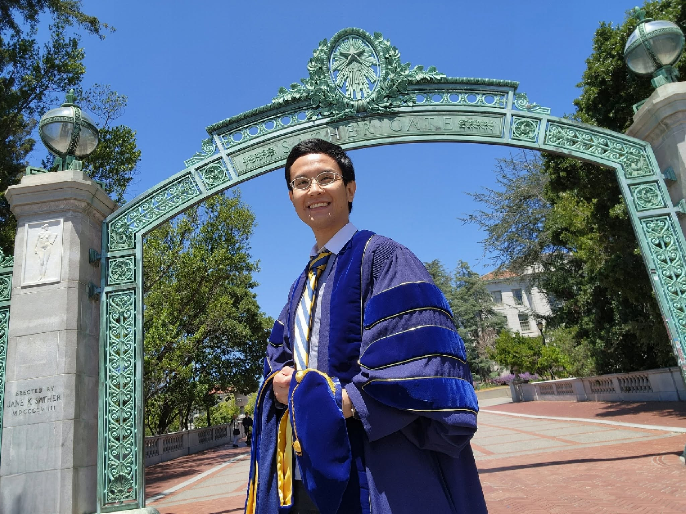

After teaching introductory digital design for several years, I became increasingly aware of a gap in the way we introduce students to digital systems. We spend a great deal of time on truth tables, flip-flop excitations, Karnaugh maps, and classical synthesis techniques. Those foundations are essential, but circuits can begin to feel like isolated diagrams rather than machines with behavior, purpose, and flow.

At some point, a student who wants to understand processors, accelerators, controllers, or other larger architectures has to make a conceptual jump. A state diagram can describe control, but it says very little about the arithmetic and data movement happening alongside that control. A software algorithm can describe those operations, but it does not naturally express the clocked storage behavior that makes the algorithm into hardware. I wanted students to encounter a representation that could sit between those worlds and let them see digital design as the process of describing how hardware thinks, decides, stores, and acts over time.

Introducing Algorithmic State Machines (ASMs) was the first step. I proposed adding ASMs to EEE 143, Switching Theory and Digital Logic Design, in early 2024. Lawrence then developed the instructional treatment that explicitly carried ASM flowcharts into datapath and controller architectures. That mapping made the value of ASMs immediately clearer: a chart could become more than a flow description. It could become an architectural plan.

There was still an unresolved detail. Exact timing sometimes depended on assumptions about what an assigned variable represented. Was it a register? Was it a combinational output? Did the assignment symbol itself imply the distinction? Those questions could be handled informally on a whiteboard, but they became impossible to ignore once we tried to make the ASM executable.

In early 2026, I began planning an ASM simulator. I had looked for an existing simulator suitable for this style of instruction and could not find one that matched what we needed, which was surprising for a notation taught specifically for digital-system design. I recruited Isaac Sy as a student assistant to develop the simulator I had in mind. The moment the simulator had to decide exactly when every variable changed, the ambiguities that had previously been easy to gloss over became concrete software and hardware questions.

That development led to many discussions between Lawrence and me about what an instructional ASM should mean if every chart is expected to simulate predictably and map cleanly to hardware. The specification in this article grew from those discussions and from Isaac's work turning the rules into an executable tool.

The goal became simple: **make the semantics explicit, unambiguous, and syntax-independent.** A student should be able to look at a declaration and know whether a value is stored or combinational, look at a chart and know when an assignment is active, step the machine and predict what changes at the edge, and then carry the same interpretation into a datapath, controller, timing diagram, or simulator.

*- Adelson Chua*

## Adelson Chua

{width=80%}

**Concept, specification, and main author**

The main author of this document and the one who conceptualized an ASM-based simulator (ASM SimulatEEE) for instructional purposes. Initiated the effort to bring ASMs into the introductory digital-design course and later pushed for a timing-complete interpretation when the notation had to become executable in a simulator. Faculty-in-charge of EEE 143, Switching Theory and Digital Logic Design, and EEE 153, Computer Organization and Embedded Systems, at the University of the Philippines Diliman.

## Lawrence Roman Quizon

{width=80%}

**ASM and hardware-mapping consultant**

Lawrence developed the instructional mapping from ASM flowcharts into explicit datapath and controller architectures for EEE 143, as a preparation to the subsequent EEE 153 course. His hardware-mapping work and later discussions on cycle semantics were central to shaping the specification presented here.

## Isaac Sy

{width=80%}

**Lead developer, ASM SimulatEEE**

Isaac served as the main developer of ASM SimulatEEE. Implementing the simulator forced the timing rules to become precise enough for software to execute them deterministically, turning previously implicit teaching assumptions into explicit semantics that could be tested and refined.
