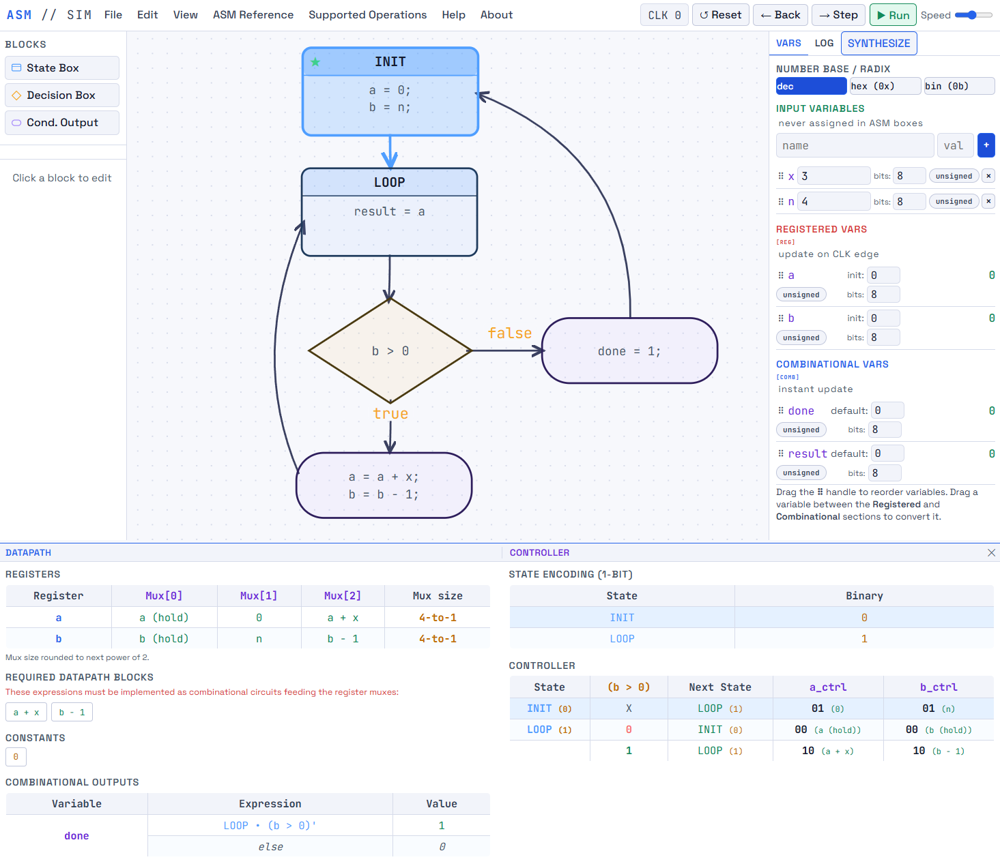

We built **ASM SimulatEEE** around this interpretation so that the rules can be experienced as behavior rather than memorized as prose. The editor uses the familiar state, decision, and conditional-output blocks. A design can then be reset, stepped one clock at a time, or run continuously. The variables panel and execution log expose what the machine is doing as the clock advances.

[Open ASM SimulatEEE](https://digital.eee.upd.edu.ph/ASM_simulatEEE.html){.btn .btn-primary .btn-lg target="_blank"}

The simulator is particularly useful for timing questions. A registered assignment becomes visible when a clock step commits the register update. A combinational assignment follows the active path during the current cycle. Changing a decision input can redirect the path before the next edge. This allows the student to ask, “What is visible now?” and “What is merely waiting to be captured?” while watching the same chart execute.

The **SYNTHESIZE** view then carries the exercise one step further by separating the result into a **DATAPATH** and a **CONTROLLER**. Designs can also be saved or loaded as JSON. The ASM semantics used for drawing and simulation are the same semantics used to reason about the hardware structure.

**Available simulator tools:** State / Decision / Conditional Blocks, Reset, Step, Run, Variables, Execution Log, Synthesize, Datapath, Controller, Save / Load.

{width=100%}

For the concise rules implemented by the simulator, see the [Formal Specifications for ASM interpretation](formal-specification.qmd).
