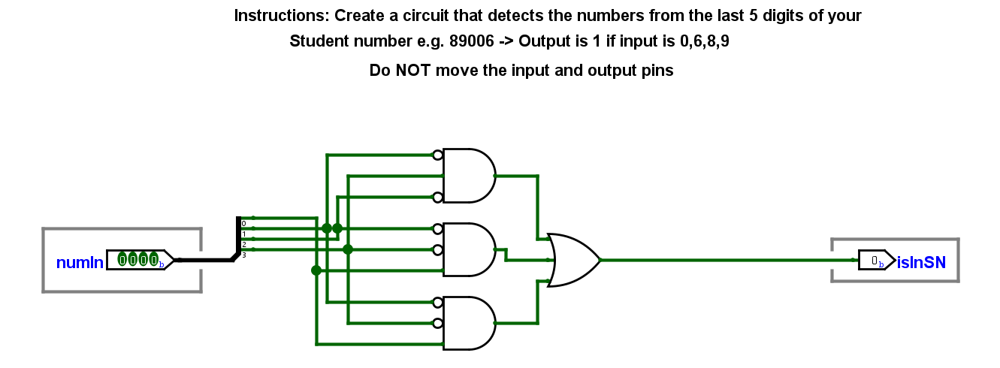

::: {.lab-nav}
[Logic Labs](index.qmd) | [Lab 1](lab1.qmd) | [Lab 2](lab2.qmd) | [Lab 3](lab3.qmd) | [Lab 4](lab4.qmd) | [Lab 5](lab5.qmd) | [Lab 6](lab6.qmd)
:::

# Instructions

In this lab exercise, you will create a logic circuit that detects the last 5 digits of your student number, as follows:

1. Download the template file in UVLe.
2. Using the techniques taught in class, obtain a minimal sum-of-products (SOP) solution for detecting the last 5 digits of your student number.
3. Create the minimal SOP circuit and connect it to the inputs and outputs in the template file.
4. Save your work as LASTNAME_STUDENTNUMBER.circ
5. Submit in the UVLe submission bin.

## Notes

- You must NOT move the input and output pins. Doing so means your circuit will not be checked properly.
- To change the input in the input pin (for testing), you can use the *hand tool*. Click the hand tool and then click the input pin to have an input dialog box pop up.
