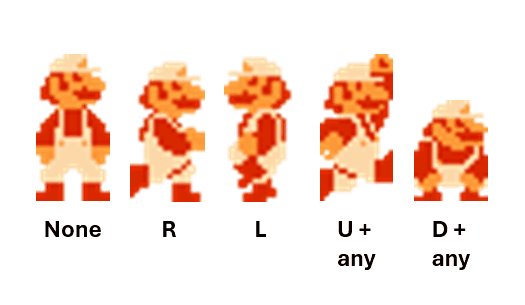
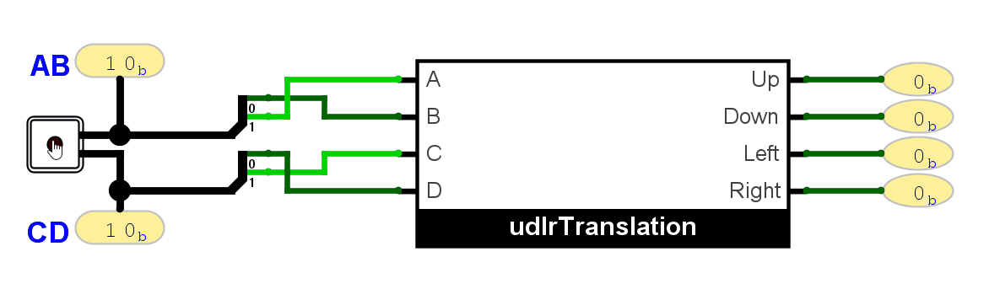

::: {.lab-nav}
[Logic Labs](index.qmd) | [Lab 1](lab1.qmd) | [Lab 2](lab2.qmd) | [Lab 3](lab3.qmd) | [Lab 4](lab4.qmd) | [Lab 5](lab5.qmd) | [Lab 6](lab6.qmd)
:::

## Background

Analog sticks or "joysticks" are input devices that encode a direction, like in game controllers. While aircraft had originally had rudder sticks that are purely mechanical in nature, the latest aircraft are too heavy to control via mechanical advantage alone and so such analog sticks also find use in them.

Knowing the direction being output by an analog stick such as U(p) D(own) L(eft) R(ight) or any combination thereof is important for a lot of things, like knowing which sprite animation to give Mario.

However, some analog sticks, like the one that can be found in Logisim, have a different encoding that do not necessarily correspond to U/D/L/R. This is because they can encode more than just the direction but also the magnitude of the displacement along a specific direction.

## Instructions

Your assignment is as follows:

1. Download the **logisim template** in UVLe.
2. Translate the encoding of the Logisim joystick **as shown in the GIF in this page with the ABCD input order** into the U(p) D(own) L(eft) R(ight) encoding with a truth table.
3. Translate the truth tables of the U/D/L/R outputs into K-Maps.
4. Obtain minimal SOP and POS expressions for the U/D/L/R outputs using the K-Maps.
5. Fill in the "udlrTranslation" subcircuit with a circuit that works.

Notes:

- Your actual template is the "udlrTranslation" subcircuit! You need to change into it by double-clicking the chip icon beside the name in the *library panel*.
- Again, do not move any input or output pins in the udlrTranslation subcircuit.
- There are a bunch of impossible input combinations. Use *don't cares* for these. Otherwise, the circuits you create will be suboptimal and are wrong.

