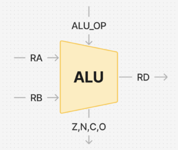

::: {.lab-nav}
[Logic Labs](index.qmd) | [Lab 1](lab1.qmd) | [Lab 2](lab2.qmd) | [Lab 3](lab3.qmd) | [Lab 4](lab4.qmd) | [Lab 5](lab5.qmd) | [Lab 6](lab6.qmd)
:::

## Background

Arithmetic Logic Units, or ALUs, are blocks in our computer processors that are the main components responsible for computing binary arithmetic. It isn't a stretch to say that ALUs are responsible for the most computations in the modern world.

An ALU has three inputs: the two operands, and an operation type (ALU_OP in the Figure). The ALU_OP tells the ALU what to do to the operands, like add, subtract, multiply, or divide. It has one output which is the output of the ALU operation.

Additionally, the ALU has special outputs called flags (STATUS in the Figure). Some examples include:

- Zero flag (Z): 1 if the result is zero.
- Negative flag (N): 1 if the result is negative.
- Carry flag (C): Carry out of the ALU operation. *Example: 1100 + 1001 will cause the carry flag to be set.*
- Overflow flag (O): 1 if the result has an **overflow** or an **underflow**. That is, the binary output arithmetic is not correctly representable in the current bitwidth. *Example: 0111 (7) + 0001 (1) = 1000 (-8), or 1000 (-8) + 1110 (-2) = 0110 (6) will cause the overflow flag to be set.*

## Instructions: Part 1

In the first part of the assignment, you must create a 4-bit ALU block. For this part, you may use any component under *Wiring, Gates, and Plexers*.

1. Download the **ALU template** in UVLe.
2. Enter the alu block provided in Logisim.
3. Implement a 4-bit ALU that can perform ADD, SUBTRACT, Bitwise AND, and Bitwise OR, depending on the input ALU_OP. Make sure it follows the table below.
4. Implement the 4 flags Z, N, C, O.
5. Note that the input to the ALU is *signed* but the inputs to main are *unsigned*. Design the ALU such that it works regardless.

| Operation | ALU_OP | Expression |
|---|---|---|
| ADD | 00 | RA + RB |
| SUB | 01 | RA - RB |
| Bitwise AND | 10 | RA & RB |
| Bitwise OR | 11 | RB |

## Instructions: Part 2

In the second part, you are to create the `double_dec_decoder` block. You may use any components from Wiring, Gates, Plexers, and Arithmetic. Do NOT use anything from BFH mega functions.

This decoder block decodes the 4-bit ALU output into a two-digit decimal 7-segment display.

1. Enter the double_dec_decoder block.
2. You may use any decoders, arithmetic blocks, muxes, or logic gates to create the output.
3. Use a splitter in reverse to merge the outputs you create into the decoded_top and decoded_bot signals. The decoded_top signals control the top segments of the 7-segment display, while the decoded_bot signals control the bottom segments. A toy double-digit seven segment is provided in the template file for you to play with and test which bits correspond to which segment.
4. You may check if your circuit is correct by going back to the main circuit.
5. You may leave the decimal points unconnected (as also shown in the sample Figure). decoded_bot[4] and decoded_bot[0] are the decimal points.
6. Displayed numbers on the seven-segment displays will be as follows: "00, 01, 02, ..., 09, 10, 11, 12, ..., 15"

## Notes

- Again, do not move any input or output pins in the template.
- A bitwise OR example: 0011 | 1000 = 1011
- A bitwise AND example: 0111 & 0101 = 0101
