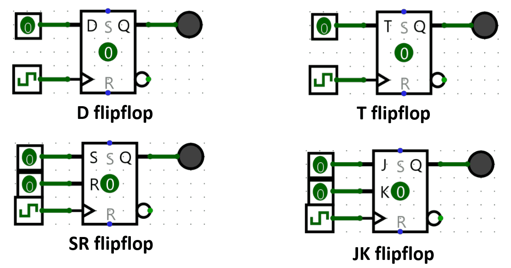
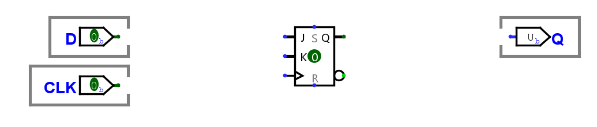

::: {.lab-nav}
[Logic Labs](index.qmd) | [Logisim Tutorial](logisim-tutorial.qmd) | [Lab 1](lab1.qmd) | [Lab 2](lab2.qmd) | [Lab 3](lab3.qmd) | [Lab 4](lab4.qmd) | [Lab 5](lab5.qmd) | [Lab 6](lab6.qmd)
:::

## Background

In the lectures, we have discussed the different types of flip-flops, as shown in the figure.

Connecting with other classes, flip-flops are more generally considered bistable multivibrators! They have two stable states and can switch between them based on input signals. The only two conditions to become a fully functioning flip-flop useful to implement any synchronous circuit is to be triggerable relative to a clock signal, and to be able to switch states between 1 and 0 (flip-flopping).

## Sequential Circuits in Logisim

Refer back to [Lab 0: Introduction to Logisim](https://classes.up-microlab.org/index.php/Lab_0:_Introduction_to_Logisim) for a more complete (but still not exhaustive) rundown of all sequential blocks in Logisim.

Aside from the **Plexers**, **Gates**, and **Wiring** we have already familiarized with, we also have components specific to sequential circuits in Logisim like flipflops. Flipflops are contained inside the **Memory** folder. Flipflops, aside from their excitation input like D, J, K, or T, have 2 special inputs. One of them is the clock input, indicated with a triangle. All flipflops need a 1-bit input pin for the clock. When the positive edge of the clock arrives, the flipflop changes its output value depending on its excitation input as described by the characteristic tables below. The other special input is the reset input. When reset is ON, the flipflop switches to 0 and stays at 0 regardless of any other input.

The characteristic tables of each flavor of flipflop is as follows:

| D | Q(t+1) |
|---|---|
| 0 | 0 |
| 1 | 1 |

| J | K | Q(t+1) |
|---|---|---|
| 0 | 0 | Q(t) |
| 0 | 1 | 0 |
| 1 | 0 | 1 |
| 1 | 1 | Q'(t) |

| T | Q(t+1) |
|---|---|
| 0 | Q(t) |
| 1 | Q'(t) |

| S | R | Q(t+1) |
|---|---|---|
| 0 | 0 | Q(t) |
| 0 | 1 | 0 |
| 1 | 0 | 1 |
| 1 | 1 | Undefined/Invalid |

Aside from that, one of the most important blocks for sequential circuit design is the **clock** (Wiring > Clock). It is the squares connected to the clock input of the flip-flops in the above GIF. While it is ok to use a regular pin or button as the clock input, the Clock element is special in Logisim in that it can have special control methods. To control the Logisim Clock, you have two options:

1. Trigger it once with *Ctrl + T* (Alternatively, Simulation > Manual Tick Half-Cycle)
2. Have Logisim continuously trigger it with *Ctrl + K* (Alternatively, Simulation > Auto-tick Enabled)

To change the frequency of the continuous triggering, go to Simulation > Auto-tick Frequency and select the frequency that you want.

## Instructions

Due to the fact that flip-flops only need to be able to switch between 1 and 0 to be able to implement any logic, it is possible to create any flip-flop flavor from any other flip-flop flavor. For this assignment, you are asked to implement D flip-flops using the three other flavors of flip-flops.

1. Download the <a href="export/templates/lab4_143_2s2425_template.circ" download>Lab 4 template</a>.
2. Inside the *dffButJK* block, implement a D flip-flop with a JK flip-flop adding only logic gates.
3. Inside the *dffButT* block, implement a D flip-flop with a T flip-flop adding only logic gates.
4. Inside the *dffButSR* block, implement a D flip-flop with a SR flip-flop adding only logic gates.

## Notes

- Again, do not move any input or output pins in the template.
- Hint: *You can easily implement any of these methodically by writing down the characteristic table of a D-flip flop, and then inferring extra columns for the available excitations (like J and K), and then filling those up based on that flip-flop's own characteristic table.*
