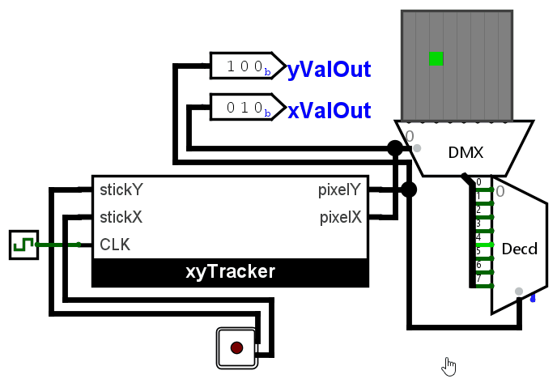

::: {.lab-nav}
[Logic Labs](index.qmd) | [Lab 1](lab1.qmd) | [Lab 2](lab2.qmd) | [Lab 3](lab3.qmd) | [Lab 4](lab4.qmd) | [Lab 5](lab5.qmd) | [Lab 6](lab6.qmd)
:::

## Background

Now that we've familiarized ourselves with basic sequential circuits in Lab 4, let's create something large! Synthesis techniques have been taught in the lecture as a process like the following:

1. Describing the behavior
2. Draw the state diagram
3. Minimize states
4. Construct excitation tables
5. Design the combinational logic using KMaps or logic blocks.
6. Construct circuits

Most of this process (3-6) is almost completely mechanical in nature, and in fact, can be automated. However, what remains the engineer's job until today is to describe the appropriate behavior and drawing the correct state diagram accordingly.

## Instructions

Your activity for this lab is to implement the sequential controller of a moving dot controlled by a joystick as demonstrated in the figure. Your restrictions are as follows:

- It is heavily recommended to use your Lab 2 submission as a block in this lab (the UDLR joystick decoder).
- You may not use blocks from *Plexers* or *Arithmetic*.

You may use your previous lab submissions to implement this lab.

1. Download the **Lab 4 template** in UVLe.
2. Enter the xyTracker block provided in Logisim.
3. Implement the xyTracker block via Regular Synthesis. Submit in UVLe in the Logisim Lab 5A - Regular Synthesis submission box.
4. Implement the xyTracker block via One-hot Synthesis. Submit in UVLe in the Logisim Lab 5B - Onehot Synthesis submission box.

**IMPORTANT NOTE: PLEASE CONNECT THE RST INPUT TO YOUR FLIP-FLOPS. TO R IF DESIRED RESET STATE IS 0, TO S IF DESIRED RESET STATE IS 1. FOR CLASSICAL SYNTHESIS, CONNECT ALL RST TO R. FOR ONE-HOT, CONNECT THE INITIAL STATE FLIPFLOP'S S TO RST AND THE REST CONNECT R TO RST.**

In detail, the xyTracker performs the following:

- If the joystick is pointing left (top left, mid left or bottom left), then *pixelX* is decremented by 1 every clock cycle.
- If the joystick is pointing up (top left, top mid or top right), then *pixelY* is incremented by 1 every clock cycle.
- If the joystick is pointing right (top right, mid right or bottom right), then *pixelX* is incremented by 1 every clock cycle.
- If the joystick is pointing down (bottom right, bottom mid or bottom left), then *pixelY* is decremented by 1 every clock cycle.
- The xyTracker has no need to account for values that the joystick **cannot possibly provide** (like left and right at the same time).

## Hint

"The specs basically tell me to synthesize a massive 1024-row truth table based on the required 4 inputs (two 2-bits) and 6 states (3 for each xPos and yPos). However, this is too long! I can't keep track of such a massive table even with Excel. This problem is massive! The lab is impossible!" - *Level 1 Digital Designer Noob*

"When faced with a massive problem, we should always cut it into smaller problems. Since the X-position only depends on whether the joystick is pointing left or right, and the Y-position only depends on whether the joystick is pointing up or down, then maybe we can get away with synthesizing two smaller sequential circuits instead...?" - *Level 100 Digital Design Demigod*

## Notes

- Again, do not move any input or output pins in the template.
