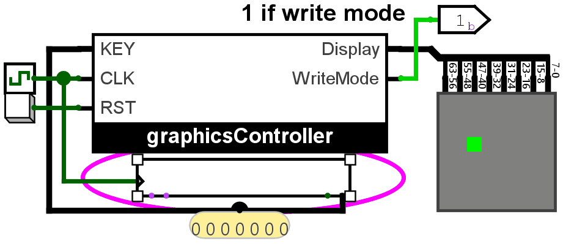
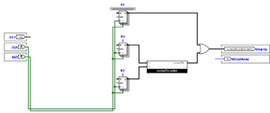

::: {.lab-nav}
[Logic Labs](index.qmd) | [Lab 1](lab1.qmd) | [Lab 2](lab2.qmd) | [Lab 3](lab3.qmd) | [Lab 4](lab4.qmd) | [Lab 5](lab5.qmd) | [Lab 6](lab6.qmd)
:::

## Background

We have practiced classical and one-hot synthesis in Lab 5. Now, we introduce the concept of **Register transfers**. Register transfers are instructions like `RA <- 5`, or `RA <- RB + 1` where we specify **operations** (usually arithmetic) to be done on **integer memories**, called registers (sets of flip-flops). We design cycle-accurate machines around register transfers by extending our concept of **Finite State Machines/State Diagrams** to include register transfers- they then become **Algorithmic State Machines**.

Take the simple concept of Lab 5 Moving Dot, for example. Synthesizing such a circuit from the ground up turned out to be a difficult task, yet by thinking of X and Y as registers and the action as simply `X <- X + R - L` and `Y <- Y + U - D`, then the task becomes infinitely easier to implement. You only need 3-bit registers X and Y, and a bunch of adders along with the *UDLR translation subcircuit*.

Algorithmic State Machines make it possible to organize impossibly complex systems of ridiculously many states and inputs by utilizing binary arithmetic.

Now that we have register transfers, however, there is now ambiguity in the use of + for arithmetic vs as OR. Because of this, we provide the following table which are globally considered the proper symbols for register arithmetic.

**Bitwise, Logical, and Arithmetic Operations**

| Operation | Symbol | Type | Description | Example (Binary) | Example (Decimal/Boolean) |
|---|---|---|---|---|---|
| Bitwise OR | `|` | Bitwise | Sets a bit to 1 if at least one corresponding bit is 1. | `1010 | 1100 = 1110` | `10 | 12 = 14` |
| Logical OR | `||` | Logical | Returns 1 if at least one operand is non-zero. | `1100 || 0001 = 1` | `12 || 1 = 1` |
| Bitwise AND | `&` | Bitwise | Sets a bit to 1 only if both bits are 1. | `1010 & 1100 = 1000` | `10 & 12 = 8` |
| Logical AND | `&&` | Logical | Returns 1 only if both operands are non-zero. | `1100 && 0000 = 0` | `12 && 0 = 0` |
| Bitwise XOR | `^` | Bitwise | Sets a bit to 1 if bits are different. | `1010 ^ 1100 = 0110` | `10 ^ 12 = 6` |
| Multiplication | `*` | Arithmetic | Multiplies two numbers. | `1100 * 0010 = 11000` (12×2=24) | `12 * 2 = 24` |
| Addition | `+` | Arithmetic | Adds two numbers. | `1100 + 0001 = 1101` (12+1=13) | `12 + 1 = 13` |
| Subtraction | `-` | Arithmetic | Subtracts the second number. | `1100 - 0001 = 1011` (12-1=11) | `12 - 1 = 11` |
| Division | `/` | Arithmetic | Divides the first number by the second. | `1100 / 0011 = 0100` (12÷3=4) | `12 / 3 = 4` |
| Modulo | `%` | Arithmetic | Returns the remainder after division. | `1101 % 0011 = 0001` (13%3=1) | `13 % 3 = 1` |

## Instructions

In this lab, let's put together everything we've learned this semester. The following are the specs for this lab:

1. Your task is to create a circuit using which you can draw using dots on an 8x8 pixel array (let's call this the display).
2. The input is a keyboard. To use the keyboard, use the hand tool and click the keyboard, then press keys on your keyboard.
3. Using `w, a, s, d` on the keyboard should move the cursor UP, LEFT, DOWN, RIGHT respectively. IMPORTANT: the lab should react to ONLY LOWERCASE LETTERS.
4. The cursor should loop over to the other side when it goes out of bounds, just like in [Lab 5: Moving Dot](lab5.qmd).
5. In WRITE MODE, when SPACE is pressed, the pixel in the position of the cursor dot should remain 1 even after the cursor has left it.
6. In ERASE MODE, when SPACE is pressed, the pixel in the position of the cursor dot should remain 0 even after the cursor has left it.
7. Pressing `e` on the keyboard switches between ERASE MODE and DRAW MODE.
8. On reset, a cursor marked by an active pixel should be at the bottom left of the display and R1 must be empty.
9. On reset, the circuit must be in WRITE MODE.

For the ASM specifically:

- You must keep track of the **current display** with the "drawing" to remember which pixels should be on. We have the 64-bit register R1 for this.
- You also must keep track of where the current cursor is using X and Y position registers. We have 3-bit registers RX and RY for this.
- You have a 7-bit input KEY from the keyboard.

Specific instructions:

1. Download the **Lab 6 template** in UVLe.
2. **Turn the clock up to at least 32Hz**
3. Create an ASM to-spec for this lab. Submit the ASM in the Lab 6 ASM submission bin in UVLe.
4. Complete the datapath/controller circuit in the graphicsController block provided in Logisim. All the necessary registers are already provided and you do not have to add any registers except flip-flops for the controller. The output decoding is also already provided, so you only need to work with R1, RX, and RY.
5. You are free to choose any method to synthesize the controller.

**IMPORTANT NOTE: PLEASE CONNECT THE RST INPUT TO YOUR FLIP-FLOPS. TO R IF DESIRED RESET STATE IS 0, TO S IF DESIRED RESET STATE IS 1. FOR CLASSICAL SYNTHESIS, CONNECT ALL RST TO R. FOR ONE-HOT, CONNECT THE INITIAL STATE FLIPFLOP'S S TO RST AND THE REST CONNECT R TO RST.**

## Hint

- The output of the keyboard that goes into your ASM is a 7-bit number in [ASCII](https://www.ascii-code.com/ASCII) format. For example, if the KEY value is `1000001` then A has been pressed.
- Only one key is being transmitted from the keyboard at any given time.
- You can use conditionals with more than just 0 or 1 to shorten the ASM. For example, you can use a conditional \<KEY?\> with outgoing arrows corresponding to different letters, and just provide an "else" option to account for everything unspecified.
- More specifically, `R1[0]` controls the bottom-right pixel of the display. `R1[7:0]` controls the rightmost column of the display. `R1[63:56]` controls the leftmost column of the display. `R1[63]` controls the top-left pixel of the display.
- A block is provided, cursorDecoder, which turns the RX and RY values into a 64-bit number corresponding to the display with only the cursor.
- When setting a pixel to 1, you can simply do `R1 <- R1 | cursorDisplay`.
- When setting a pixel to 0, you can simply do `R1 <- R1 & cursorDisplay'`.

## Notes

- Again, do not move any input or output pins in the template.
