::: {.lab-nav}
[Logic Labs](index.qmd) | [Logisim Tutorial](logisim-tutorial.qmd) | [Lab 1](lab1.qmd) | [Lab 2](lab2.qmd) | [Lab 3](lab3.qmd) | [Lab 4](lab4.qmd) | [Lab 5](lab5.qmd) | [Lab 6](lab6.qmd)
:::

::: {.tutorial-intro}
This tutorial walks you through installing, navigating, and troubleshooting **Logisim Evolution** — the circuit simulator used in all logic lab exercises. **Read this before starting any lab.**
:::

::: {.callout-note title="PDF Version"} 
This tutorial was originally created as a PDF. If you prefer a PDF version, you can download it here: [Logisim Tutorial PDF](export/logisim-tutorial.pdf).
:::

## Setting Up

### 1. Download Logisim Evolution

Go to the [Logisim Evolution releases page](https://github.com/logisim-evolution/logisim-evolution/releases) and get the latest **`.jar`** file (not the `.rpm`, `.msi`, `.dmg`, or `.deb` — the plain `.jar` works on all platforms).

### 2. Install Java 16 or Higher

Logisim Evolution requires **Java 16 or higher** to run. We recommend [Adoptium OpenJDK 17](https://adoptium.net/temurin/releases/).

- **Windows:** Download and run the `.msi` installer.

  

- **macOS:** Download and run the `.pkg` installer.

  

### 3. Run Logisim

Once Java is installed, double-click the downloaded `.jar` file to launch Logisim Evolution. If your OS warns you about an unrecognized file, you can safely proceed — as long as the JAR came directly from the link above.

---

## Navigating Logisim

When you open Logisim, you will see a toolbar at the top and a component library panel on the left.

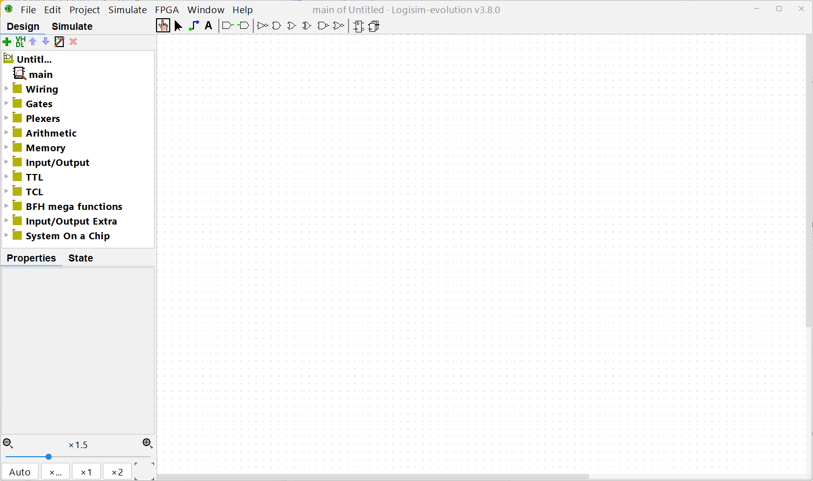

### Toolbar: Two Key Tools

| Tool | Purpose |
|---|---|
| **Finger pointer** (left) | Click circuit elements to toggle their values (0 ↔ 1); inspect wire values during simulation |
| **Cursor pointer** (right) | Move circuit elements around the canvas; draw wire connections |

Remember to switch between these two tools as needed — the cursor tool creates circuits, the finger tool interacts with them.

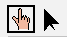

---

## Component Library

### Wiring

Found under the **Wiring** folder. The four most-used elements are:

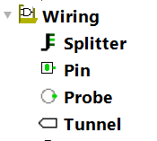

::: {.component-grid}
::: {.component-card}
**Splitter**

Combines or splits wires. Wires in Logisim can represent multiple bits; a splitter lets you break a multi-bit wire into individual (or smaller) groups of bits, or merge them back together.

In multi-bit wires, the **MSB (leftmost/highest-numbered bit)** is always at the top.
:::
::: {.component-card}
**Pin**

Introduces inputs to your circuit. Click it with the finger pointer to toggle between 0 and 1. Pins can be configured as input or output pins.
:::
::: {.component-card}
**Probe**

Reads and displays the current value of any wire in your circuit. Works on multi-bit wires too — useful for debugging.
:::
::: {.component-card}
**Tunnel**

Creates a named "portal" so you can connect two distant points in the circuit without drawing a long wire. Two tunnels with the **same name** are electrically connected.
:::
:::

**Common options** (shown in the lower-left Properties panel when a component is selected):

- **Data Bits** — controls how many bits wide the element's input/output is.
- **Facing** — rotates the element to make wiring more concise.

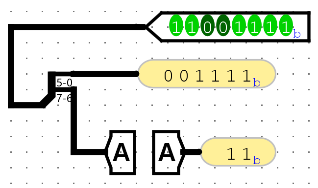

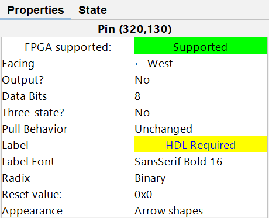

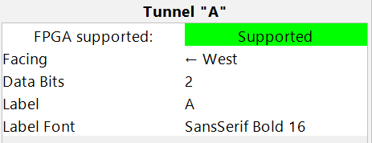

---

### Gates

Found under the **Gates** folder. Standard logic gates (NOT, Buffer, AND, OR, XOR, NAND, NOR, XNOR) are all available.

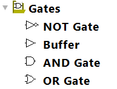

Key options per gate:

- **Data Bits** — sets the bit width of the gate's inputs and output.
- **Number of Inputs** — sets how many inputs the gate has.

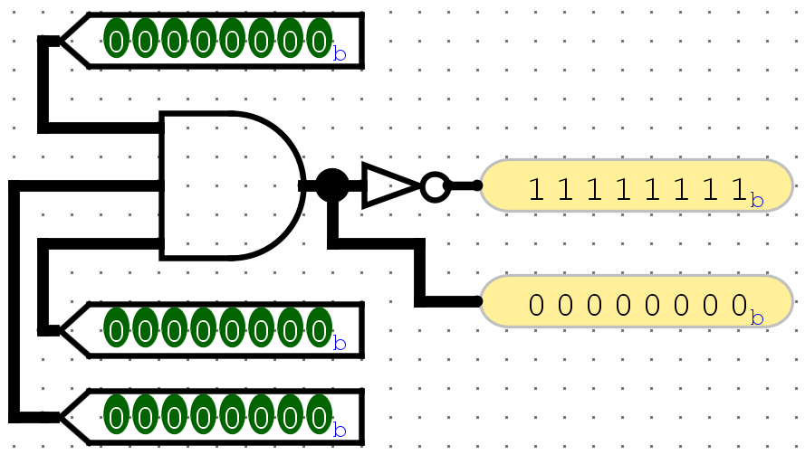

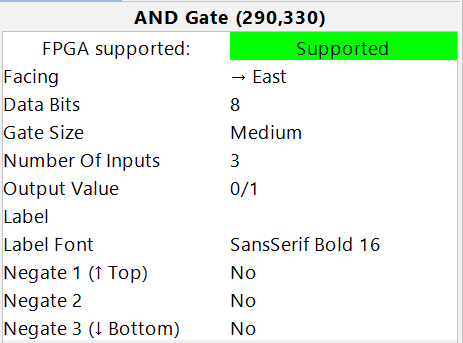

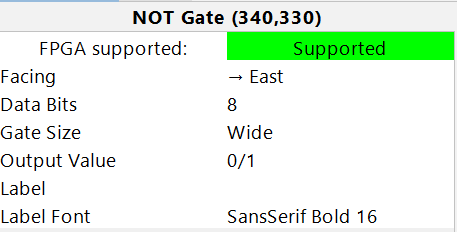

---

### Plexers

Found under the **Plexers** folder. Includes:

- **Multiplexer (MUX)** — selects one of several inputs based on a select signal.
- **Demultiplexer** — routes one input to one of several outputs.
- **Decoder** — activates one output line based on a binary input.
- **Priority Encoder**, **Bit Selector**

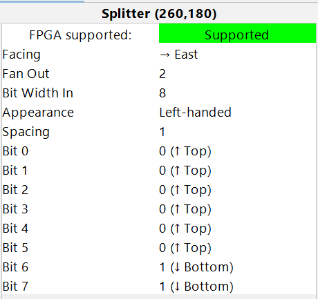

For a multiplexer, the **Select Bits** option determines how many select lines there are, which in turn determines the number of data inputs ($2^{\text{Select Bits}}$ inputs).

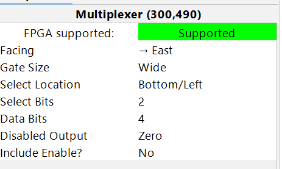

---

### Arithmetic

Found under the **Arithmetic** folder. Includes ready-made blocks for:

- **Adder, Subtractor, Multiplier, Divider, Negator, Comparator**

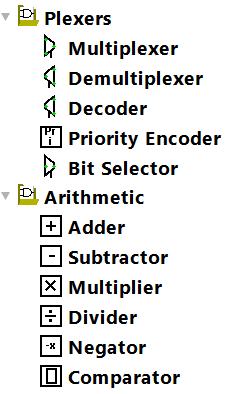

These are useful for higher-level designs without needing to build arithmetic from scratch.

---

### Memory

Found under the **Memory** folder.

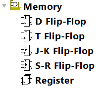

::: {.component-grid}
::: {.component-card}
**Flip-Flops**

D, T, J-K, and S-R flip-flops are available for 1-bit sequential storage. Each requires a 1-bit clock input.
:::
::: {.component-card}
**Register**

A multi-bit storage element — the most commonly used sequential block in these labs. It captures its input on every positive clock edge (when _WE = 1_). If _WE = 0_, it ignores the clock and holds its current value.

The _WE (Write Enable)_ input defaults to 1 when left unconnected.

:::
::: {.component-card}
**RAM / ROM**

Addressable memory blocks. Both the number of address bits and data bits are configurable.

To preset memory contents: _right-click_ the RAM/ROM block → _Edit Contents…_ A hex editor will open. You can also _Save_ the contents to a file and later _Load Image…_ to restore them.
:::
:::

::: {.grid}
::: {.g-col-6}
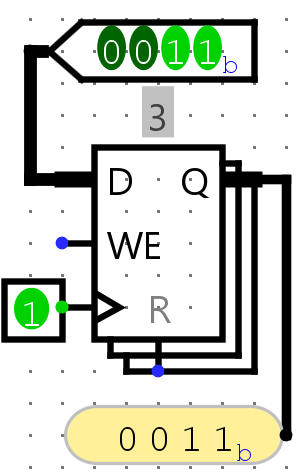
:::
::: {.g-col-6}
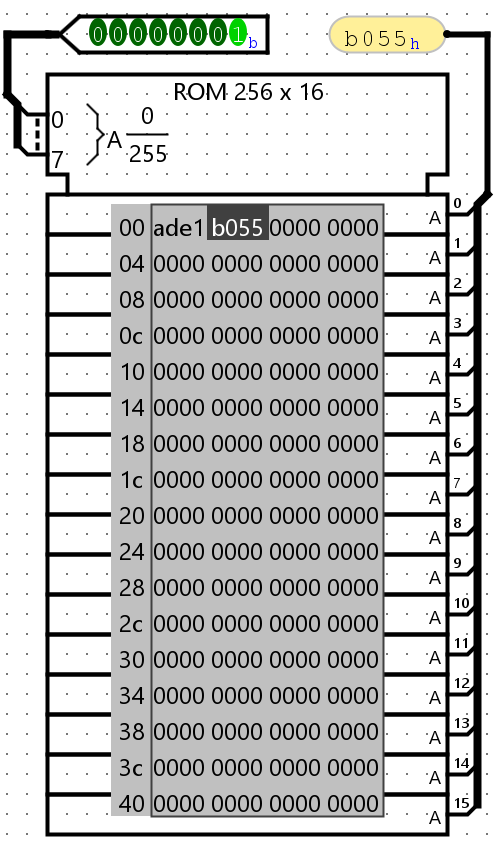
:::
:::

::: {.grid}
::: {.g-col-6}
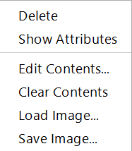
:::
::: {.g-col-6}
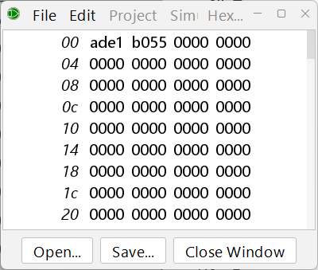
:::
:::

---

### Input/Output

Found under the **Input/Output** folder. Includes displays, keyboards, buttons, LED arrays, and more. Try connecting logic to these elements to see your circuits come to life.

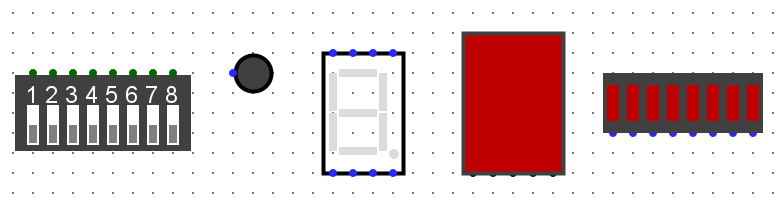

---

## Navigation Tips

- Logisim has an **almost infinite workspace** — zoom in and out freely using the zoom scrollbar (bottom-left) or **Ctrl + scroll wheel**.
- **Switch tools often:** use the cursor pointer to build, the finger pointer to test.
- **Hover over pins** of complex blocks (MUX, Register, ROM/RAM) to see a small pop-up identifying each pin's purpose.
- **Save regularly** (Ctrl + S) — Logisim may occasionally crash.

---

## Debugging Common Problems

Logisim uses **wire color** to indicate the state of every connection. If a wire is not green or black, something is wrong — you cannot simulate correctly until all wires are green or black.

| Wire Color | Meaning | How to Fix |
|---|---|---|
| **Dark green** | 1-bit wire carrying value **0** | ✓ Normal |
| **Bright green** | 1-bit wire carrying value **1** | ✓ Normal |
| **Black** | Multi-bit wire | ✓ Normal |
| **Red** (`EEEE`) | **Double-driver conflict** — two outputs are trying to drive the same wire to different values | Remove the extra connection; only one driver per wire |
| **Blue** (`uuuu`) | **Floating wire** — nothing is driving this wire | Connect an output pin, gate output, or input pin to this wire |
| **Orange** | **Width mismatch** — wires of two different bit-widths are connected | Make sure both sides of the connection have the same Data Bits setting; check tunnel widths too |

::: {.debug-note}
**Accessibility:** If you have difficulty distinguishing these wire colors, you can customize them via **File → Preferences → Simulation Tab**.
:::

### Red Wires (Double Driver)

A wire can only carry one value (0 or 1) at a time. When two output ports or input pins are connected together — especially if they drive different values — Logisim shows a **red wire**. Fix this by ensuring only **one driver** feeds each wire.

### Blue Wires (Floating)

A floating wire has no driver. Connect it to an output from a gate, block, register, or an input pin.

### Orange Wires (Width Mismatch)

A black (multi-bit) wire cannot connect to a wire of a different width. Check that all connected elements have matching **Data Bits** settings, and that any **tunnels** carrying the signal also have the same width.

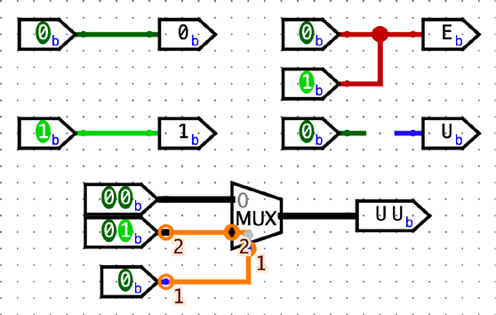
