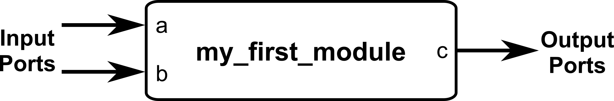
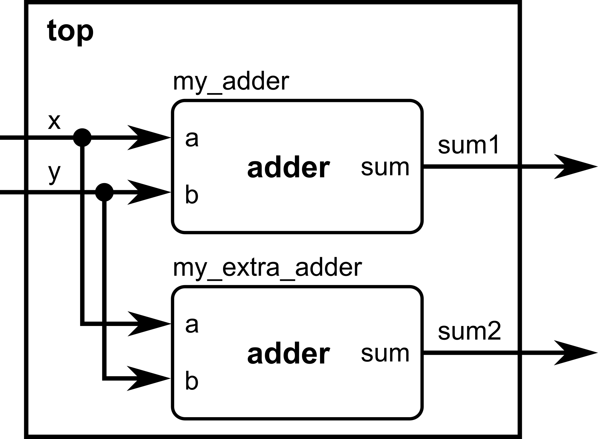
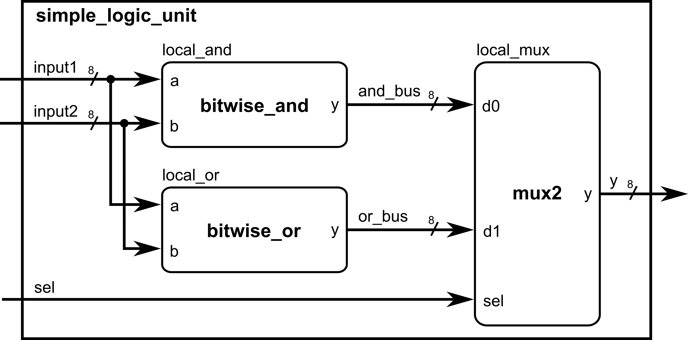

::: {.vcc-nav}
[Overview](index.qmd) | [M000](00-fundamentals.qmd) | [M001](001-combinational.qmd) | [M010](01-combinational.qmd) | [M011](02-sequential.qmd) | [M100](100-advanced-sequential.qmd) | [M101](03-verification.qmd) | [M110](110-advanced-verification.qmd) | [M111](04-practices.qmd) | [Extras](05-extras.qmd) | [Credits](credits.qmd)
:::
# Module 000: Basic Structure and Syntax

In this first module, we’ll set the foundation for writing Verilog code. Just like every program in a traditional language begins with a certain structure (e.g., `main()` in C), every Verilog design starts
with a **module definition**.

## The `module` and `endmodule` Keywords

A Verilog design is always wrapped between a `module` and an `endmodule`.
 Inside, we declare **inputs** (signals that come into the module) and **outputs** (signals the module drives). These declarations are done inside a parenthesis right after the module name. Each port declaration is separated by commas.

Example:

---

```verilog
module my_first_module(
    input a,
    input b,
    output c
);

// Design will go here

endmodule
```



---

::: {.callout-note title="Additional notes when naming modules"}

- Names are **case-sensitive**: `A` and `a` are different signals.
- You may use underscores (`_`), but not spaces.
- Names **cannot** begin with a number. For example, `data1` is valid, but `1data` is not.

:::

## Comments

Verilog supports two styles of comments:

- `//` for single-line comments
- `/* ... */` for multi-line comments

Example:

---

```verilog
// This is a single-line comment
/*
   This is a
   multi-line comment
*/
```

---

::: {.callout-note}
Always put comments on your code for better readability and portability.
:::

## Declaring Wires and Vectors

By default, all inputs and outputs are **wires** (a wire is a connection between components).
 If you need an internal signal, you can declare it explicitly:

---

```verilog
wire my_signal;
```

---

For multiple-bit signals, we use vectors:

---

```verilog
wire [7:0] data_bus;   // 8 bits wide: from bit 7 down to bit 0
```

---

::: {.callout-note}
While `[0:7]` is also legal, the common and recommended practice is `[7:0]` so that the most significant bit (MSB) is written first.
:::

You can also declare multiple wires and vectors in a single line for code compactness:

---

```verilog
wire my_signal1, my_signal2;
wire [3:0] data_bus1, data_bus2, data_bus3;
```

---

This creates two 1-bit wires named **my_signal1** and **my_signal2**, and three 4-bit wires named **data_bus1**, **data_bus2**, and **data_bus3**.

## Module Instantiation

Modules can be reused by instantiating them inside other modules. Think of this like calling a function, but instead of execution, it’s wiring up hardware.

Consider the example below, where one module is instantiated inside another module. Instantiation can be in **two ways**:



### Ordered Port Connection

---

```verilog
module adder(
    input a,
    input b,
    output sum
);
// Continuous assignment (will be discussed in Module 0x1)
assign sum = a ^ b; // pretend XOR (^ operator) is our adder
endmodule

module top(    input x,
    input y,
    output sum1,    output sum2
);

    // We will now instantiate the adder module and give it a local name, my_adder
    adder my_adder(x, y, sum1); // ports connected in the same order as defined
    // We can instantiate more than one copy of the same module as long as it has a different local name.    // This time, we will instantiate the adder module again and give it a local name, my_extra_adder
    adder my_extra_adder(x, y, sum2); // ports connected in the same order as defined

endmodule
```

---

### Named Port Connection (preferred for clarity)

---

```verilog
module adder(
    input a,
    input b,
    output sum
);
// Continuous assignment (will be discussed in Module 0x1)
assign sum = a ^ b; // pretend XOR (^ operator) is our adder
endmodule

module top(    input x,
    input y,
    output sum1,    output sum2
);
    // We will now instantiate the adder module and give it a local name, my_adder
    adder my_adder(    // Note the order of assignment here:
        .a(x),         // port a of the adder submodule is assigned to the input x of top module
        .b(y),         // port b of the adder submodule is assigned to the input y of top module
        .sum(sum1)     // port sum of the adder submodule is assigned to the output sum1 of top module
    );
    // We can instantiate more than one copy of the same module as long as it has a different local name.    // This time, we will instantiate the adder module again and give it a local name, my_extra_adder    adder my_extra_adder( // Note the order of assignment here:
        .a(x),         // port a of the adder submodule is assigned to the input x of top module
        .b(y),         // port b of the adder submodule is assigned to the input y of top module
        .sum(sum2)     // port sum of the adder submodule is assigned to the output sum2 of top module
    );

endmodule
```

---

::: {.callout-note}
Named connections make your code easier to read and maintain, especially if modules have many ports. You can easily keep track of which wires connect to the submodule ports straight from the module instantiation.
:::

## Putting It All Together

Here’s a complete example demonstrating a very simple logic unit, combining everything you have learned so far:

---

```verilog
module simple_logic_unit(
    input  [7:0] input1,    // 8-bit input vector input1
    input  [7:0] input2,    // 8-bit input vector input2
    input        sel,       // 1: pick OR, 0: pick AND
    output [7:0] y          // selected output
);

    // ---------------------------------------------------------
    // Internal signal declarations for inter-module interconnections
    // ---------------------------------------------------------
    wire [7:0] and_bus;      // output of bitwise_and -> goes to mux
    wire [7:0] or_bus;       // output of bitwise_or -> goes to mux

    // ---------------------------------------------------------
    // Submodule 1: Bitwise AND (ORDERED port connection)
    // ---------------------------------------------------------
    bitwise_and local_and(
        input1,           // will be connected to port a of bitwise_and module
        input2,           // will be connected to port b of bitwise_and module
        and_bus           // will be connected to port y of bitwise_and module
    );

    // ---------------------------------------------------------
    // Submodule 2: Bitwise OR (NAMED port connection)
    // ---------------------------------------------------------
    bitwise_or local_or(
        .a     (input1),  // input1 connects to port a of bitwise_or module
        .b     (input2),  // input2 connects to port b of bitwise_or module
        .y     (or_bus)   // or_bus connects to port y of bitwise_or module
    );

    // ---------------------------------------------------------
    // Submodule 3: 2:1 MUX (NAMED port connection)
    // Selects between AND result and OR result.
    // ---------------------------------------------------------
    mux2 local_mux(
        .d0  (and_bus),  // internal wire and_bus connects to d0 port of mux2 module
        .d1  (or_bus),   // internal wire or_bus connects to d1 port of mux2 module
        .sel (sel),      // input sel connects to sel port of mux2 module
        .y   (y)         // output y connects to y port of mux2 module
    );

endmodule

// ====================== Submodule definitions ==============================

// Bitwise AND module
module bitwise_and (
    input  [7:0] a,
    input  [7:0] b,
    output [7:0] y
);
    assign y = a & b;    // operators will be covered in the next module!
endmodule

// Bitwise OR module
module bitwise_or (
    input  [7:0] a,
    input  [7:0] b,
    output [7:0] y
);
    assign y = a | b;    // operators will be covered in the next module!
endmodule

// 2:1 vector multiplexer
module mux2 (
    input  [7:0] d0,
    input  [7:0] d1,
    input        sel,
    output [7:0] y
);
    assign y = sel ? d1 : d0;    // operators will be covered in the next module!
endmodule
```

---

This Verilog code would have a corresponding hardware equivalent as shown below.



Notice how we needed to declare internal wires for the **bitwise_and** and **bitwise_or** module outputs to be later connected to the **mux2** module. As the number of submodules to be instantiated increases, more
internal wires needs to be declared. Always be careful when assigning wires to ports, as they need to be of the same size to avoid unintentional truncation problems!

::: {.callout-note title="Summary"}

At this point, you should understand:

- How to define a module with `module ... endmodule`
- How to write comments
- Declaring inputs, outputs, and wires
- How to instantiate modules (by order or by name)

:::

### Module Activity : The Structural ALU

This module's activity is in this **[Jupyter Notebook](https://colab.research.google.com/github/Lawrence-lugs/microlabverilogcrashcourse/blob/main/notebooks/structural/structural.ipynb).** Line by line, you can execute the code in order to see how the environment works. I recommend pressing the **Run all** button at the top and giving it about 2 minutes to download all of the requirements. In the middle of the notebook, you'll find a section where you need to fill in some verilog code. *Time to show your stuff.*

ALUs perform operations on inputs A and B, but you can choose which operation to perform by choosing the **opcode** input**.**
Your task in this activity is to implement an ALU (Arithmetic Logic Unit) with structural instantiation of the existing modules.

::: {.vcc-nextprev}
[← Overview](index.qmd){.vcc-prev} [M001 →](001-combinational.qmd){.vcc-next}
:::
