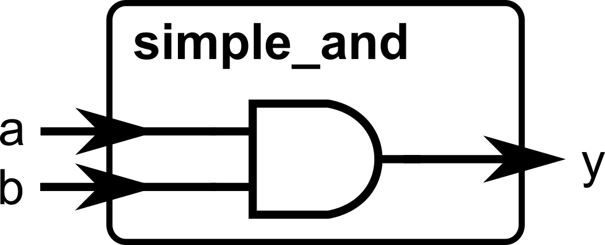
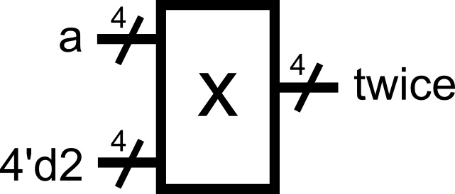
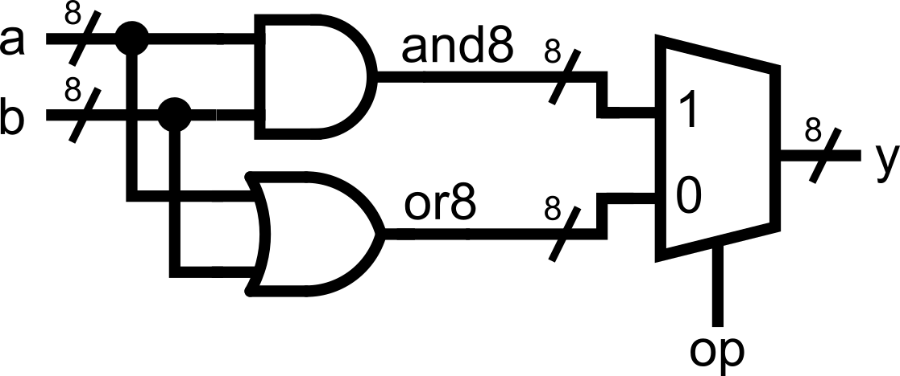
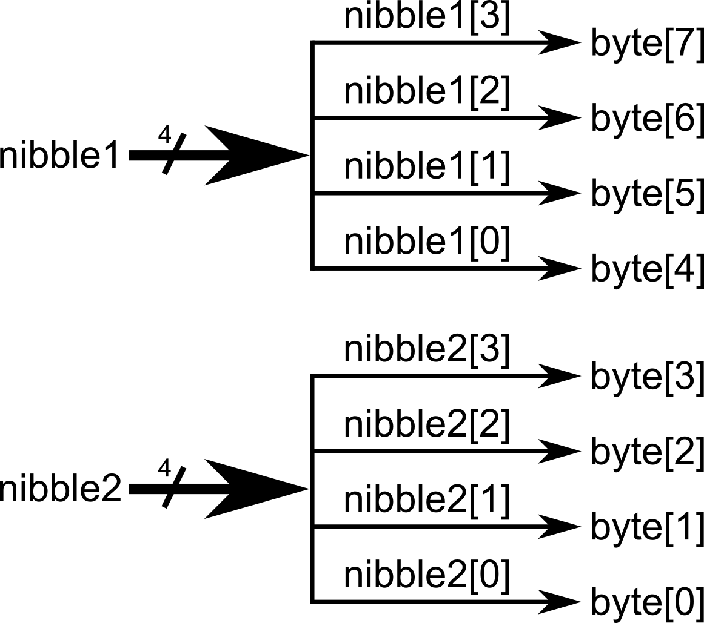
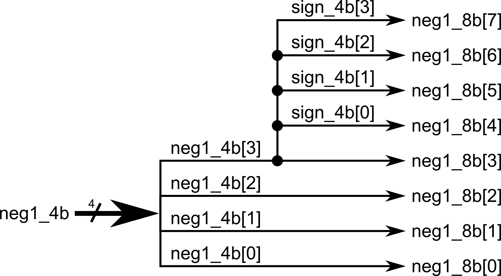
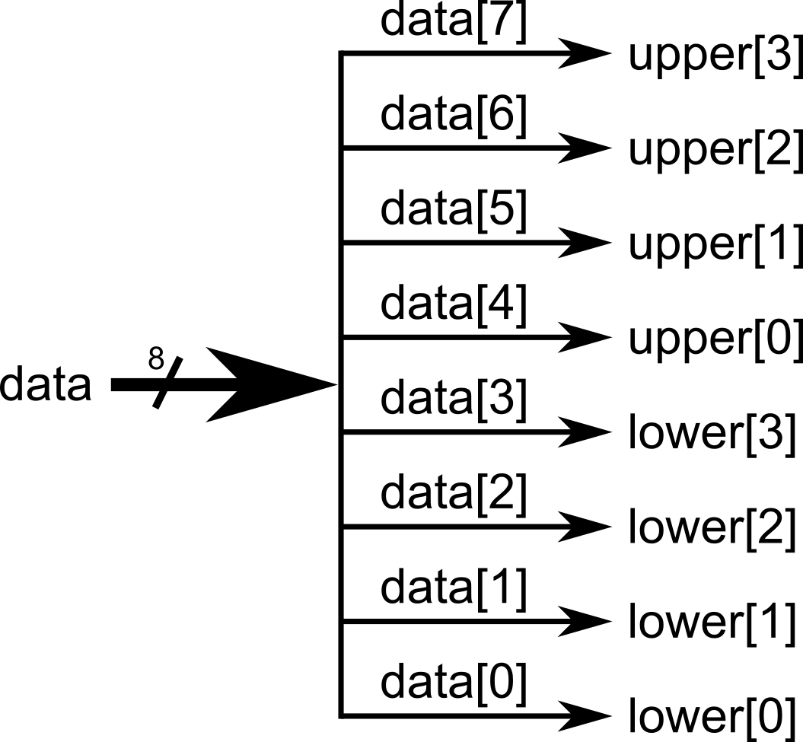
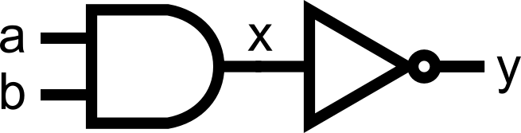

::: {.vcc-nav}
[Overview](index.qmd) | [M000](00-fundamentals.qmd) | [M001](001-combinational.qmd) | [M010](01-combinational.qmd) | [M011](02-sequential.qmd) | [M100](100-advanced-sequential.qmd) | [M101](03-verification.qmd) | [M110](110-advanced-verification.qmd) | [M111](04-practices.qmd) | [Extras](05-extras.qmd) | [Credits](credits.qmd)
:::
# Module 001: Writing Combinational Logic

In programming, you often write a sequence of instructions that run in order. In hardware, however, **combinational logic evaluates everything at the same time**. Verilog models this with the `assign` keyword and logical/arithmetic operators.

## The `assign` Keyword

The `assign` statement ties a wire to an expression. Think of it like drawing a wire between logic gates: once defined, it is always true.
**Note: all `assign` statements must be done inside the module declaration
(within the `module ... endmodule` declaration).**

---

```
module simple_and(
    input a,
    input b,
    output y
);
    assign y = a & b; // y will always be the AND of a and b
endmodule
```



---

::: {.callout-note title="Note on modeling combinational logic behavior"}

- The value of `y` updates immediately whenever `a` or `b` changes. You are describing combinational logic here, and
    the output will always be reevaluated for every change in inputs.

:::

## Operators

Verilog supports many operators that can be used for `assign` statements. Here are the most useful ones at this stage:

### Arithmetic

---

```
assign sum = a + b;    // addition

```

.png)

assign diff = a - b;   // subtraction

.png).png)

assign twice = a * 2;  // multiply by constant 

---

::: {.callout-warning title="Note regarding the use of `*` (multiplication) operator"}

- **This is typically not recommended to be used by beginners for module definitions.** This is because a multiplier might not be available for the target hardware implementation. The operator is typically used in testbenches (more on this in Module 0x5) where hardware mapping is not a concern. A typical exercise for beginners is to implement multiplication algorithms using only basic operations to guarantee hardware translation.

:::

### Bitwise

---

```
assign and_bits = a & b;  // bitwise AND

```

.png)

assign or_bits  = a | b;  // bitwise OR

.png).png)

assign xor_bits = a ^ b;  // bitwise XOR

.png).png)

assign not_a    = ~a;     // bitwise NOT (inverts every bit)

.png).png)

---

If `a = 4'b1100` and `b = 4'b1010`:

- `a & b = 1000`
- `a | b = 1110`
- `a ^ b = 0110`
- `~a = 0011`

### Shifts

---

```
assign left_shift  = a << 1; // shifts left by 1 (like multiply by 2); 0 padding, upper bit(s) truncated
```

.png)

assign right_shift = a >> 2; // shifts right by 2 (like divide by 4); 0 padding, lower bit(s) truncated.png).png)

---

If `a = 4'b1010`:

- `a << 1 = 0100 (logical shift to the left, upper bit is truncated)`
- `a >> 2 = 0010 (logical shift twice to the right, lower bits are truncated)`

### Conditional (Ternary)

---

```
assign max = (a > b) ? a : b;
```

---

Reads: “If `a > b`, then max = a; otherwise, max = b.” This is similar to a multiplexer-type behavior, where the selector value depends on the condition inside the parentheses.

.png).png)

## Tip: Assignment upon Declaration

You could actually perform the assignment upon the wire declaration. This skips the additional `assign` statement for the same signal that was declared.

---

```
module example_block (
    input  [7:0] a,
    input  [7:0] b,
    input  op,       // operation selector
    output [7:0] y
);
    // skip the assign statement by directly putting the operation upon the wire declaration    wire [7:0] and8 = a & b;  // bitwise AND
    wire [7:0] or8  = a | b;   // bitwise OR
    assign y = (op) ? and8 : or8;

endmodule
```



---

::: {.callout-note}
This saves you a line of code per merged assignment. Use your best judgement whether this approach still makes your code readable.
:::

## Constants and Number Formats

Verilog allows you to specify numbers in **binary, decimal, or hexadecimal** with a size.
 The format is:

```
<size>'<base><value>
```

- `'b` = binary
- `'d` = decimal
- `'h` = hexadecimal

Examples:

---

```
4'b1010   // 4-bit binary 1010
8'd25     // 8-bit decimal 25, equivalent to 0001 1001 in 8-bit binary (0 padded)
16'hFF    // 16-bit hexadecimal FF, equivalent to 0000 0000 1111 1111 in 16-bit binary (0 padded)
```

---

::: {.callout-note title="Note regarding constants"}

- If you don’t specify a size, Verilog assumes 32 bits. **Typically, when you perform an operation with mismatched widths (for example, a 4-bit vector with a 32-bit constant), the upper bits of the longer vector (in this case, the constant) are truncated.** This
    is usually fine if you know what you are doing. It does not hurt to always declare constant sizes explicitly.

:::

---

```
wire [3:0] sum_1, sum_2, a;assign sum_1 = a + 4'b1;    // adds 4-bit vector a to 4-bit constant 0001 (0 padded)assign sum_2 = a + 1;       // adds 4-bit vector a to 32-bit constant 000...001 (upper bits are truncated during operation)// sum_1 and sum_2 are essentially equal
```

---

## Concatenation, Replication, and Bit Slicing

### Concatenation

Verilog provides a powerful `{}` operator for **joining signals together**.

---

```
wire [3:0] nibble1 = 4'b1010;     // Note: We can perform assignments right on the wire declarations!
wire [3:0] nibble2 = 4'b1100;
wire [7:0] byte;

assign byte = {nibble1, nibble2}; // byte = 10101100
```



---

### Replication

You can replicate 1-bit signals into several bits using the `{multiplier{signal}}` syntax. When combined with the concatenation operation from earlier, this is especially helpful for sign-extending vectors (extending/replicating the sign-bit
to fix a desired vector length)

---

```
wire [3:0] neg1_4b = 4'b1111;   // -1 in 4-bit twos complement is 1111
wire [7:0] neg1_8b;wire [3:0] sign_4b;

assign sign_4b = {4{neg1_4b[3]}};    // copy the sign bit of neg1_4b, then replicate it 4 times
assign neg1_8b = {sign_4b, neg1_4b}; // concatenate the 4-bit sign with the 4-bit number earlier to make it 8 bits. This is now -1 in 8-bit twos complement.
// Alternatively, you can just perform and concatenation in a single line. Take care of readability!// assign neg1_8b = {{4{neg1_4b[3]}}, neg1_4b};

```



---

### Bit Slicing

You can also **take slices** of vectors:

---

```
wire [7:0] data = 8'b11011010;

wire [3:0] upper = data[7:4]; // top 4 bits
wire [3:0] lower = data[3:0]; // bottom 4 bits
```



---

**Note: Be careful when assigning between different-width signals.**

---

```
wire [7:0] wide = 8'b11111010;
wire [3:0] narrow;

assign narrow = wide; // Danger! Mismatched widths. Only the bottom 4 bits are kept in this case: 1010
```

---

::: {.callout-warning}
This is legal, but may not be what you intended. Only do so if you know what you are doing.
The best practice is to explicitly slice:
:::

---

```
assign narrow = wide[3:0]; // intentional truncation
```

---

## Important Note: Concurrency in Hardware

In software, the order of statements matters. In hardware, multiple `assign` statements run **at the same time**. We are essentially describing hardware connections in Verilog, so the order of how we are assigning values to wires should not matter!

Example:

---

```
module concurrent_example(
    input a,
    input b,
    output x,
    output y
);
    assign x = a & b;
    assign y = a | b;
endmodule
```

---

::: {.callout-note}
Whether you write `assign x` before `assign y`, or flip them, **the hardware is identical**.
This is the essence of **concurrency**.
:::

To *really see* concurrency, let’s make one wire depend on another:

---

```
module concurrency_example(
    input a,
    input b,
    output x,
    output y
);
    assign x = a & b;    // x is AND of a and b
    assign y = ~x;       // y is the NOT of x
endmodule
```

---

Now here’s the key:

Even though `y` depends on `x`, the order of the two `assign` statements **does not matter**.

If you swap them:

---

```
assign y = ~x;
assign x = a & b;
```

---

The result is exactly the same hardware. Both assignments are always active, so `y` is always the NOT of the AND of `a` and `b`.



::: {.callout-note}
This is different from software, where order defines execution. In hardware, assignments represent physical connections that exist all at once.
:::

## Putting It All Together

Here’s a complete example demonstrating a simple arithmetic and logic unit (ALU), combining everything you have learned so far:

---

```
module alu_demo (
    input  [7:0] a,
    input  [7:0] b,
    input  [2:0] op,     // 3-bit operation selector = 8 possible choices
    output [7:0] y       // 8-bit ALU output
);

    // -----------------------------
    // Arithmetic with explicit width extension (to accommodate the carry out without being truncated away)
    // -----------------------------
    wire [8:0] add9;                          // 8-bit number + 8-bit number = 8-bit number with possible carry out (9 bits total)     assign add9 = {1'b0, a} + {1'b0, b};      // zero-extend the operands (making them 9 bits long) through concatenation, add them

    // Remember that for simple assign statements, we can have the wire declaration and assignment in one line.
    wire [7:0] add8 = add9[7:0];              // truncate the 9-bit result and take only the lower 8 bits for the sum.     wire carry_add = add9[8];                 // declare carry_add wire to handle carry out (internal signal only)

    // -----------------------------
    // Bitwise operations and shifts:
    // -----------------------------
    wire [7:0] and8  = a & b;
    wire [7:0] xor8  = a ^ b;
    wire [7:0] or8   = a | b;    wire [7:0] nota  = ~a;

    wire [7:0] shl1  = a << 1;                // left shift (msb discarded)
    wire [7:0] shr1  = a >> 1;                // right shift (lsb discarded)

    // -----------------------------
    // Ternary-based operation selection (a big multiplexer):
    // -----------------------------
    assign y =                                // we can chain the ternary operation together, we can also separate it into multiple lines
        (op == 3'b000) ? add8    :
        (op == 3'b001) ? and8    :
        (op == 3'b010) ? xor8    :
        (op == 3'b011) ? or8     :
        (op == 3'b100) ? nota    :
        (op == 3'b101) ? shl1    :
        (op == 3'b110) ? shr1    :
                          ((a > b) ? a : b);  // we go here if op == 3'b111

endmodule
```

---

This Verilog code would have a corresponding hardware equivalent as shown below.

.png).png)

Our module is getting bigger and more complex! Notice how there are different assignments happening within the single module. All arithmetic and logic were declared, and all of the corresponding outputs would connect to a final multiplexer (declared as
a ternary `(condition) ? (true) : (false)` operation).

::: {.callout-note}
**Note that all assignments are happening concurrently.** We are describing hardware in Verilog, and we are merely describing the interconnections between wires and the logic happening between those wires.
:::

::: {.callout-note title="Summary"}

Now you've seen:

- How to use `assign` to describe combinational logic
- Common operators (`+`, `-`, `&`, `|`,
  `^`, `? :`, `<<`, `>>`)
- How to write constants in different formats
- How to concatenate and slice vectors safely
- How **concurrency** means order of `assign` doesn't matter

:::

### Module Activity : The Assign ALU

This module's activity is in this **[Jupyter Notebook](https://colab.research.google.com/github/Lawrence-lugs/microlabverilogcrashcourse/blob/main/notebooks/combinational/combinational.ipynb).** Line by line, you can execute the code in order to see how the environment works. I recommend pressing the **Run all** button at the top and giving it about 2 minutes to download all of the requirements. In the middle of the notebook, you'll find a section where you need to fill in some verilog code. *Time to show your stuff.*

Like in the previous activity, we'll be implementing an ALU. But this time, **NONE OF THE MODULES ARE PROVIDED.** Hence, you'll have to write all the logic yourself using *assign statements.*

Good luck!

::: {.vcc-nextprev}
[← M000](00-fundamentals.qmd){.vcc-prev} [M010 →](01-combinational.qmd){.vcc-next}
:::
