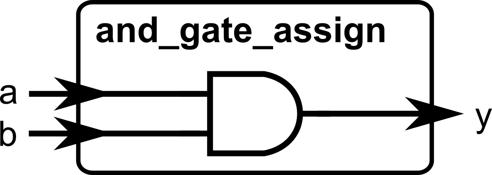
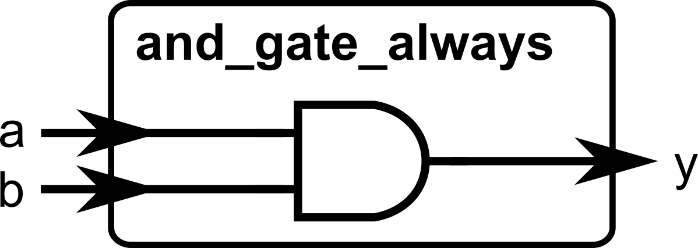
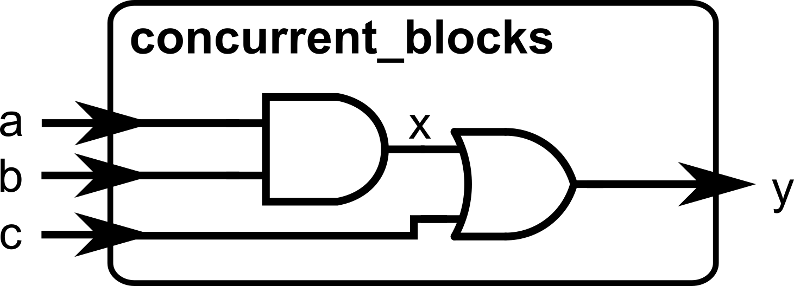
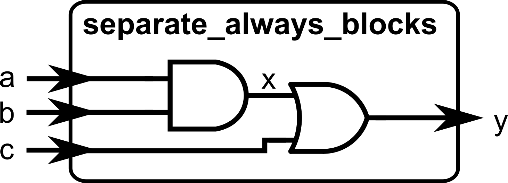
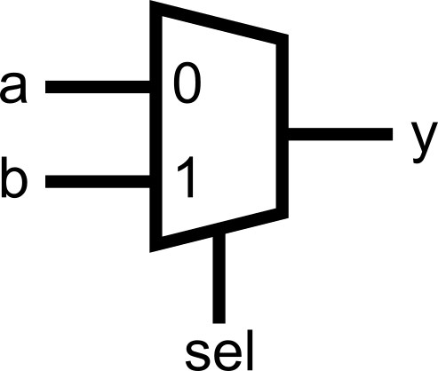
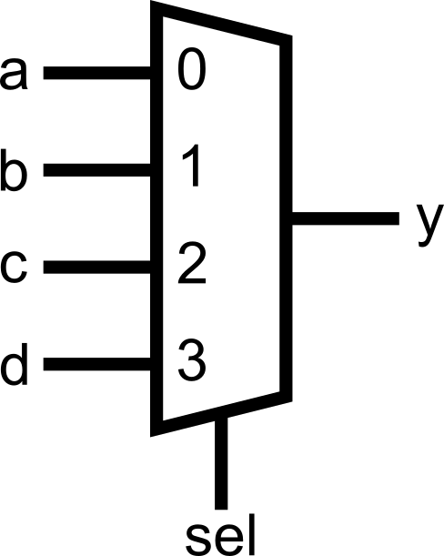
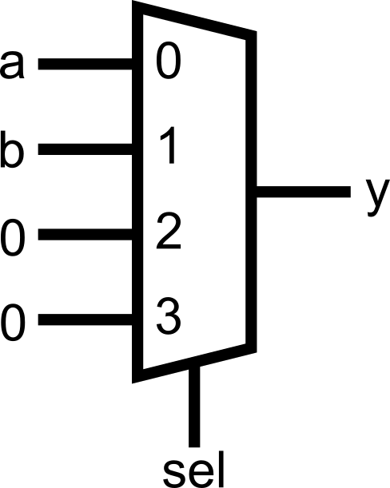
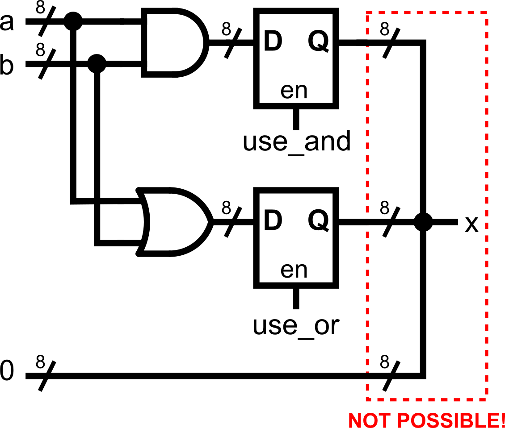
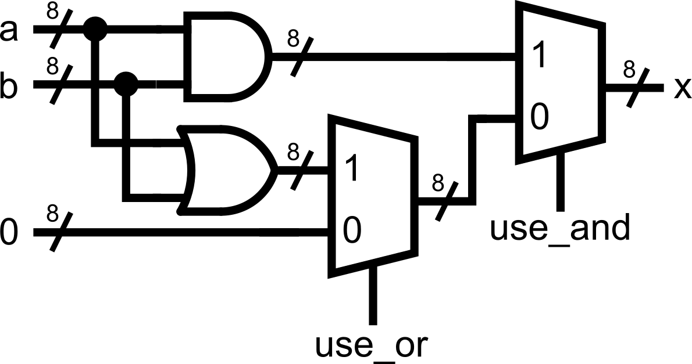

::: {.vcc-nav}
[Overview](index.qmd) | [M000](00-fundamentals.qmd) | [M001](001-combinational.qmd) | [M010](01-combinational.qmd) | [M011](02-sequential.qmd) | [M100](100-advanced-sequential.qmd) | [M101](03-verification.qmd) | [M110](110-advanced-verification.qmd) | [M111](04-practices.qmd) | [Extras](05-extras.qmd) | [Credits](credits.qmd)
:::
# Module 010: Advanced Combinational Logic

So far, we’ve used `assign` to build combinational logic. That works great for simple expressions, but as soon as you want more complicated *conditional statements* (`if`, `else`, `case`), you’ll need another construct: the **`always @(*)` block**.

## The `always @(*)` Block

The `assign` statement is great for simple connections, but as soon as you want to describe more complex logic (like multiple conditions), `assign` quickly becomes messy.

That’s where the **`always @(*)` block** comes in.

- It is used to describe **combinational logic.**
- The `(*)` means “whenever any input changes, reevaluate all statements inside the block.”

::: {.callout-note}
Note that any assignments done inside the `always` block must have a datatype `reg` instead of `wire`. As the module input and output ports are, by default, `wire`s, adding a modifier `reg` will allow the port name to be assigned inside the `always` block. This can be seen in the example below.
:::

Example: Rewriting Assign with Always

---

```verilog
module and_gate_assign(
    input a,
    input b,
    output y
);
    assign y = a & b; // As covered in Module 0x1, assign statements create combinational logic behavior
endmodule

module and_gate_always(
    input a,
    input b,
    output reg y       // Note how we added a reg modifier to y, since it will be assigned inside the always block
);    // You can also declare the same port as a reg here. Already commented since it was modified in the port declaration earlier.    // reg y;
    always @(*) begin // A good practice is to use begin...end statements to mark the start and end of the declaration
        y = a & b;    // No need to use the assign keyword if we are inside the always block.
    end
endmodule
```

---

Both modules, **and_gate_assign** and **and_gate_always**, describe the same hardware.

       

The difference:

- `assign` → simpler, best for single expressions (typically one-liner expressions).
- `always @(*)` → more flexible, lets us use more complicated (and hierarchical) conditional logic. Again, the port being assigned must be declared as a `reg`, if it is assigned inside the
  `always` block.

### Concurrency Reminder

Just like with `assign`, **all `always @(*)` blocks run at the same time**.

Example:

---

```verilog
module concurrent_blocks(
    input a, b, c,
    output reg x, y
);
    always @(*) begin
        x = a & b;
        y = x | c;
    end
endmodule
```



---

Even though `y` depends on `x`, the hardware works fine regardless of the order these lines of code appear. Both blocks are continuously active as we are describing
hardware.

You can also declare two separate always blocks. Of course, those two blocks are also concurrently operating with each other.

Example:

---

```verilog
module separate_always_blocks(
    input a, b, c,
    output reg x, y
);
    always @(*) begin
        x = a & b;
    end

    always @(*) begin
        y = x | c;
    end
endmodule
```



---

 Again, just like earlier, the order of these `always@(*)` blocks does not matter in the order of evaluation. We are describing hardware and the interconnection of different wires.Conditional logic for `always@(*)` blocks

The main benefit of using `always@(*)` blocks is that we can use the `if-else` and `case-endcase` constructs inside, which are similar to programming languages. The previous module described a multiplexer using only
ternary
`(condition) ? (true) : (false)` operations. While this is fine for single-level selection, it becomes harder to read if we want to have hierarchical conditional statements (e.g., nested `if-else` statements)

### The `if-else` Statement

Inside `always @(*)`blocks, you can use `if-else` just like in programming.

Example: 2-to-1 Multiplexer

---

```verilog
module mux_if(
    input a,
    input b,
    input sel,
    output reg y      // output y must be declared as reg to be used inside the always block
);
    always @(*) begin
        if (sel == 0) begin
            y = a;
        end else begin
            y = b;        end
    end
endmodule
```



---

This describes the same as:

---

```verilog
assign y = (sel == 0) ? a : b;
```

---

### The `case-endcase` Statement

For larger choices, `case-endcase` is clearer than chaining `if-else`.

Example: 4-to-1 Multiplexer

---

```verilog
module mux_case(
    input [1:0] sel,
    input a, b, c, d,
    output reg y            // output y must be declared as reg to be used inside the always block
);
    always @(*) begin
        case (sel)
            2'b00: begin    // Note: if there are multiple assignments per case, put a begin...end enclosure               y = a;             end
            2'b01: y = b;   // If there is only a single assignment to be evaluated, you can opt not to enclose with begin...end
            2'b10: y = c;
            2'b11: y = d;
        endcase
    end
endmodule
```

---

Compare with the equivalent `if-else` chain:

---

```verilog
always @(*) begin
    if (sel == 2'b00) begin           // Note: if there are multiple assignments per case, put a begin...end enclosure
        y = a;
    end else if (sel == 2'b01)        // If there is only a single assignment to be evaluated, you can opt not to enclose with begin...end
        y = b;
    else if (sel == 2'b10)
        y = c;
    else
        y = d;end
```

---

::: {.callout-note}
Both `if-else` and `case-endcase` variants would map to the same hardware. Whichever you use is a matter of readability.
:::



## Avoid combinational loops

Avoid creating **combinational loops** (signals feeding back through purely combinational logic), because they can oscillate, produce unknown `X` values in simulation, and confuse synthesis/timing tools, often leading to unstable hardware. The assignment where the output depends on the same signal, such as **count = count + 1;****should not**be done in the combinational logic domain (when using `always@(*)`), as this would infer a combinational loop, which is not realizable in hardware.

---

```verilog
always @(*) begin
    count = count + 1; // bad: combinational loop
end
```


---

## Common Pitfalls

Now that you’re writing combinational logic, there are **two major mistakes beginners make**.

### Inferred Latches (Dangerous)

In combinational logic, every output must have a defined value for **all input conditions**.
If you forget a case, the tool will try to “remember” the old value →
it creates a **latch** (unintended memory element).

---

```verilog
always @(*) begin
    if (sel == 0)
        y = a;
    // What happens if sel == 1? y keeps its old value → latch!
end
```


---

The fix: **always cover all cases**.

---

```verilog
always @(*) begin
    if (sel == 0)
        y = a;
    else
        y = b; // defined for all inputs
end
```


---

Or add a `default` in a `case`:

---

```verilog
case (sel)
    2'b00: y = a;
    2'b01: y = b;
    default: y = 0; // avoids latch
endcase
```



---

::: {.callout-note}
Inferred latches might be fine for sequential logic (more about this in the next module), as memory that holds the previous value can be safely inferred using flip-flops. However, in the combinational logic domain, there is no place for memory. **Therefore, the rule of thumb is to always fully cover all possible cases when assigning signals for combinational logic.** This can be done either through the `else` statement for `if-else` constructs, or the `default` statement for `case-endcase` constructs.
:::

### Double Drivers (Illegal)

If you drive the same signal in two places, the resulting hardware equivalent can be unpredictable.

::: {.callout-warning}
The simulation tool may or may not warn you about double driver issues. Sometimes, it will just consider the last assignment done on the signal towards the end of the file. Sometimes, it will consider the assignment that will lead to a simpler hardware implementation. **Therefore, avoid double drivers as much as possible!**
:::

Example:

---

```verilog
always @(*) begin
    x = a & b;
end

always @(*) begin
    x = a | b;       // ERROR: x driven in two places
end
```


---

::: {.callout-note}
Always remember the simple rule:
A signal should only be assigned in **one `assign` OR one `always` block**, never both.
:::

Double driver issues can happen in different ways, particularly when writing the code in a programming mindset. Consider the following example.

---

```verilog
// Problematic: conditional overwrites inside one always block
module conditional_overwrite_example (
    input  [7:0] a, b,
    input  use_and,
    input  use_or,
    output reg  [7:0] x
);
    always @(*) begin
        x = 8'h00;                // 'default' value?

        if (use_and) x = a & b;   // write #1 (may execute if use_and = 1)
        if (use_or)  x = a | b;   // write #2 (may also execute if use_or = 1)
    end
endmodule
```



---

::: {.callout-warning}
There are a bunch of double-driver problems in this code. While it may look fine in a programming mindset (where every line is sequentially executing), this is problematic if we're thinking in the hardware domain.

- The assignment **x = 8'h00** that is not inside any conditional statement is problematic since it basically says "*No matter what happens, **x** is fixed to **8'h00***".
- The assignment **if (use_and) x = a & b;** assigns **x** to something else if the condition is met. However, remember that the previous statement says that **x** is always fixed to **8'h00**.
    What happens now? Double driver issue!
- The assignment **if (use_or) x = a | b;** assigns **x** to another thing if a separate, non-related condition is met. As with the previous one, this conflicts with the **8'h00** assignment earlier.
    Moreover, what happens if **use_and** and **use_or** both become 1? That's another double driver issue!

:::

::: {.callout-note}
A better solution is to think about **mutual exclusivity**. **All assignments to the same signal must always be mutually exclusive!** A fixed version of the previous code that guarantees mutual exclusivity (with explicit priority) is shown below.
:::

---

```
    always @(*) begin
        if (use_and) x = a & b;        // write #1 (will execute if use_and = 1)
        else if (use_or)  x = a | b;   // write #2 (will execute if use_and = 0 and use_or = 1)        else x = 8'h00;                // 'default' value (will execute if use_and = use_or = 0)
    end
```



## Putting It All Together

Here’s a complete example demonstrating a simple arithmetic and logic unit (ALU), combining everything you have learned so far:

---

```verilog
module alu_demo_conditional (
    input  [7:0] a,
    input  [7:0] b,
    input  [2:0] op,             // 3-bit operation selector = 8 possible choices
    output reg [7:0] y           // 8-bit ALU output (must be declared as a reg type now!)
);

    // -----------------------------
    // Creating a large multiplexer using nested if-else and case-endcase statements
    // -----------------------------
    always@(*) begin      if(op[2]) begin            // Check if op[2] (the MSB of 3-bit op) is 1         case(op[1:0])           // Using the lower 2 bits of op, select the corresponding arithmetic/logic operation            2'b00: y = a + b;            2'b01: y = a - b;
            2'b10: y = a & b;
            2'b11: y = a | b;    // can also use 'default:', but every value of op[1:0] is already fully covered
         endcase      end else begin             // If op[2] (the MSB of 3-bit op) is 0, do the following         case(op[1:0])           // Using the lower 2 bits of op, select the corresponding shift operation            2'b00: y = a << 1;            2'b01: y = b << 1;
            2'b10: y = a >> 1;
            2'b11: y = b >> 1;    // can also use 'default:', but every value of op[1:0] is already fully covered         endcase      end    end
endmodule
```

.png)

---

::: {.callout-note}
Just like in programming, you can create nests of conditional logic. You can even combine `if-else` and `case-endcase` statements if you prefer. But remember to always aim for code readability.

You can flatten nested `if-else` chains by combining guards with logical operators (e.g., `if (en && (mode==ADD) && (a>b)) ...` instead of `if(en) if(mode==ADD) if(a>b) ...`), which reduces indentation and nesting of conditional statements, but can hurt code readability as expressions grow.

Note how we avoided the common pitfalls. All assignments to `y` are mutually exclusive (no double driver issues), covering all possible values of the 3-bit `op` signal (no inferred latch problems).
:::

::: {.callout-note title="Summary"}

By the end of this module, you should understand:

- How `always @(*)` is a more flexible alternative to `assign`
- Using `if-else` and `case-endcase` for conditional combinational logic
- Pitfalls: double drivers and inferred latches, and how to avoid them

:::

### Module Activity : The Reg ALU

This module's activity is in this **[Jupyter Notebook](https://colab.research.google.com/github/Lawrence-lugs/microlabverilogcrashcourse/blob/main/notebooks/adv_comb/adv_comb.ipynb).** Line by line, you can execute the code in order to see how the environment works. I recommend pressing the **Run all** button at the top and giving it about 2 minutes to download all of the requirements. In the middle of the notebook, you'll find a section where you need to fill in some verilog code. *Time to show your stuff.*

Again, we're implementing an ALU. **I promise this is the last time.**
However, we have another twist this time. This time, you will have to implement the ALU with the **outputs defined as reg!** The **reg** statement is, in fact, incompatible with **assign** statements. Hence, you'll have to use an **always** block.

Good luck!

::: {.vcc-nextprev}
[← M001](001-combinational.qmd){.vcc-prev} [M011 →](02-sequential.qmd){.vcc-next}
:::
