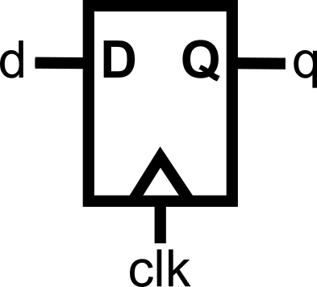
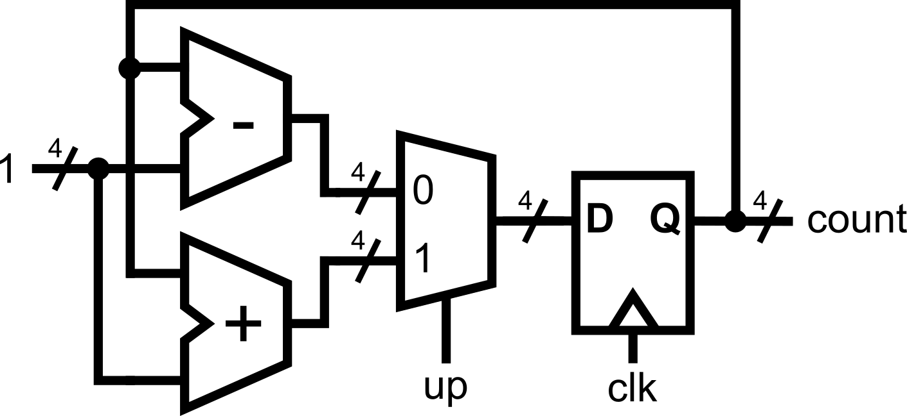
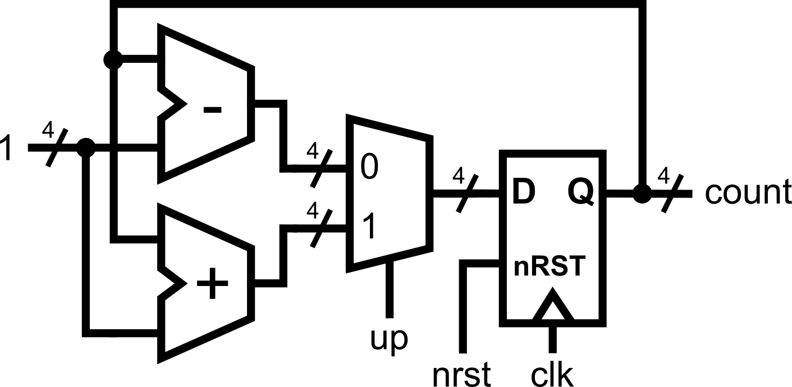

::: {.vcc-nav}
[Overview](index.qmd) | [M000](00-fundamentals.qmd) | [M001](001-combinational.qmd) | [M010](01-combinational.qmd) | [M011](02-sequential.qmd) | [M100](100-advanced-sequential.qmd) | [M101](03-verification.qmd) | [M110](110-advanced-verification.qmd) | [M111](04-practices.qmd) | [Extras](05-extras.qmd) | [Credits](credits.qmd)
:::
# Module 011: Writing Sequential Logic

The previous module already covered how we can implement *complex* combinational logic. Now, move from **combinational logic** (no memory, outputs depend only on inputs) into **sequential logic** (where outputs depend on both current inputs and stored past values). This is where we introduce **flip-flops**, **registers**, and the all-important **clock**. We will use a similar-looking construct from the previous module: the **`always @(posedge clk)` block**.

## The `always @(posedge clk)` Block

Digital systems often need to remember information and update it **in steps**, synchronized to a clock signal (`clk`).
 In Verilog,
this is described with the **`always @(posedge clk)` block**, which means: “Run this block whenever the clock has a **rising edge**.”
Whenever
we have a logic element that gets evaluated only during the edge of a signal, we are modelling a flip-flop, the basic storage element in sequential circuits.

::: {.callout-note}
`posedge` is a keyword indicating the sensitivity to the rising edge of the signal named after the keyword (in this case, `clk`). `negedge` is also another keyword that can be used to signify sensitivity to the falling edge of the same signal.
:::

Example: Simple Register

---

```verilog
module dff(
    input clk,
    input d,
    output reg q      // q is assigned inside always block, therefore, it must be of type 'reg'
);
    always @(posedge clk) begin
        q <= d;       // On each rising edge, q takes the value of d
    end
endmodule
```



---

::: {.callout-note title="Notice two things"}

- `q` is declared as `reg` (because it is being assigned inside an always block).
- We use `<=` instead of `=` for the signal assignment.

:::

### `<=` vs. `=` Assignments

Inside a sequential (`always @(posedge clk)`) block, we use a different assignment (`<=`).

::: {.callout-note title="Rule to remember"}

- Use `<=` in **sequential** (`always @(posedge clk)`) blocks.
- Use `=` in **combinational** (`always @(*)`) blocks.

:::

You could *technically* use the assignments interchangeably; however, there are intricate details regarding how assignments are evaluated that differentiate the two forms. For this crash course, to keep things simple and to maintain the concurrent
timing model, just **follow the guidelines above as the golden rule. No exemptions**.

This keeps your design consistent and avoids timing bugs.

## More Complex Sequential Logic

We already know `if-else` from combinational logic, as presented in the previous module. Now let’s see it inside a clocked block.

Here’s an **up-down counter**:

---

```verilog
module updown_counter(
    input clk,
    input up,                      // 1 = count up, 0 = count down
    output reg [3:0] count         // 4-bit output to hold the current count
);
    always @(posedge clk) begin
        if (up)
            count <= count + 1;
        else
            count <= count - 1;
    end
endmodule
```



---

For every positive edge of the clock, the module updates the `count` output by +1 or -1, depending on the input signal `up`.
Since the update happens on every positive edge of the clock,
flip-flops are inferred by the module description.

::: {.callout-note}
Since we are now in the sequential logic domain, assignments such as **count <= count + 1;** where the same signal appears in both the left (output) and right (input) side, are possible. Loops within sequential logic are possible because the path propagation is being controlled by the clock trigger.
:::

::: {.callout-warning}
On the contrary, **count = count + 1; should not** be done in the combinational logic domain (when using `always@(*)`), as this would infer a combinational loop, which is not realizable in hardware.
:::

.png).png)

## Inferred Latches in Sequential Logic

In **combinational logic** (`always @(*)`), forgetting to assign a signal in all cases leads to an inferred latch, as described in Module 0x2. This is usually
**unintentional and dangerous** because latches can create feedback loops and unpredictable timing. Combinational feedback loops should not exist in a properly designed digital system.

But in **sequential logic** (`always @(posedge clk)`), **holding the old value is expected behavior**. In fact, it’s
how registers naturally work! Typical registers have *write enable* ports that allow them to either capture new data or hold the previous value every clock trigger. This can be properly modeled in Verilog.

**Example A: Implicit Register Hold (Inferred Latch)**

---

```verilog
always @(posedge clk) begin
    if (enable)
        q <= d;
    // else: no assignment, q keeps its value
end
```


---

Even though `q` is not assigned in the `else`, this is **fine** in sequential logic:

- If `enable` is 0, the register `q` simply doesn’t update — it keeps its old value.

**Example B: Explicit Register Hold**

---

```verilog
always @(posedge clk) begin
    if (enable)
        q <= d;
    else
        q <= q; // explicit "keep value"
end
```

---

This synthesizes to the **same hardware** as Example A.
 In sequential logic, both versions are correct and safe, because registers naturally remember their value across
clock cycles.

::: {.callout-note title="The key difference"}

- In **combinational logic**, missing assignments → unintended latches (bad).
- In **sequential logic**, missing assignments → "hold register value" (fine).

:::

## Resetting Values

Registers/flip-flops don’t have defined values at power-up. If you don’t set them, simulators may show them as “X” (unknown). This can be problematic since we are now allowing looped assignments, such as **count <= count + 1;** from
earlier.
If the value of `count` is not initially defined, the assignment will also not be defined, no matter how many clock triggers pass. Therefore, there is a need to properly **reset** the sequential logic.

We usually add a **reset input** that forces signals to known values.
 This can be done **synchronously** (with the clock)
or **asynchronously** (immediately).

### Example: Synchronous Reset

---

```verilog
module counter_with_reset(
    input clk,
    input reset,
    output reg [3:0] count
);
    always @(posedge clk) begin
        if (reset)
            count <= 4'b0000; // reset value
        else
            count <= count + 1;
    end
endmodule
```


---

### Example: Asynchronous Reset

---

```verilog
always @(posedge clk or posedge reset) begin
    if (reset)
        count <= 4'b0000;
    else
        count <= count + 1;
end
```


---

::: {.callout-note}
Always put reset at the **top** of the `if-else` hierarchy, so it takes the highest priority. In sequential `always @(posedge clk)` blocks, put the reset check at the top (**and alone,** that is, no other logic should be present aside from reset) of the `if-else` hierarchy: write `if (reset)` to initialize state, and place **all** other behavior under the `else` (nest further `if/else` as needed). This makes reset dominant and prevents any peer logic at the top level.
:::

Here's the up/down counter from the previous
section with the additional asynchronous reset to illustrate the described reset hierarchy.

**---

```verilog
module updown_counter(
    input clk,    input nrst,                         // low-asserted reset
    input up,                           // 1 = count up, 0 = count down
    output reg [3:0] count              // 4-bit output to hold the current count
);
    always @(posedge clk or negedge nrst) begin
        if (!nrst) begin               // negedge reset -> low-asserted reset
            count <= 4'b0000;
        end else begin                  // the rest of the logic is under 'else'
            if (up)
               count <= count + 1;
            else
               count <= count - 1;
        end
    end
endmodule
```



---**

## Concurrency Reminder

When we write an `always @(posedge clk)` block, every assignment inside that block **describes a register**. Each of those registers updates its value **once per clock edge**. Since the positive edge of the clock is a single time instant, therefore, all the registers will update at the same time.

Consider the following example:

---

```verilog
always @(posedge clk) begin
    a <= b;
    b <= a;
end
```

.png)

---

At first glance, this might look like programming, where instructions run one after another. You might expect `a` to become `b`, and then `b` to immediately become that new value of `a`.
**But that’s not how hardware works.**

Here's what really happens:

1. At the rising edge of `clk`, all **right-hand sides** (`b` and `a`) are
   read **at the same time**. These are the **old values** of `a` and `b` from before the clock edge.
2. Each register (`a` and `b`) schedules its update to the new value.
3. After the clock edge, all updates are applied **concurrently**.

So if `a = 4'b1010` and `b = 4'b0101` just before the clock edge:

- The new `a` becomes `0101` (old `b`).
- The new `b` becomes `1010` (old `a`).
   And yes, this means they swap values,
  but only because the **old values** were both checked before either was updated.

Because of concurrency in the evaluation of assignments

---

```verilog
always @(posedge clk) begin
    a <= b;
    b <= a;
end
```

---

is equivalent to:

---

```
always @(posedge clk) begin
    b <= a;    a <= b;
end
```

---

The order of the statements inside the block **does not change the hardware**. Each line creates a register, and all registers are updated together on the clock edge.

### Key Points

- **Every assignment in an `always@(posedge clk)` block infers a register.**
   Each `<=` line creates a
  storage element that holds its value until the next clock edge.
- **All registers check inputs at the same time.**
   That’s why it’s the *old values* that get used for every assignment.
- **All updates happen together.**
   No one register updates “before” another; they all change in lockstep with the clock.

## Putting It All Together

Here’s a complete example demonstrating pipelined multiplication, combining everything you have learned so far. Note how this example combines both combinational logic, assigned using `always@(*)`, and sequential logic, assigned using `always@(posedge clk)`.

---

```verilog
module pipelined_mult4 (
    input  clk,
    input  rst,         // synchronous, active-high
    input  [3:0] a,     // multiplicand
    input  [3:0] b,     // multiplier
    output reg [7:0] p  // product (registered)
);

    // ---------------------------
    // Pipeline registers (current state). These will be assigned inside always@(posedge clk)
    // ---------------------------
    reg [7:0] a0, a1, a2, a3;    // shifted/extended multiplicand (8-bit)
    reg [3:0] b0, b1, b2, b3;    // shifting multiplier bits
    reg [7:0] s0, s1, s2, s3;    // running partial sums

    // ---------------------------
    // Next-state signals (combinational). These will be assigned inside always@(*).
    // ---------------------------
    reg [7:0] a1_n, a2_n, a3_n;
    reg [3:0] b1_n, b2_n, b3_n;
    reg [7:0] s1_n, s2_n, s3_n, s4_n;  // s4_n is the final sum for this cycle
    reg [7:0] p_n;
    reg [7:0] pp0, pp1, pp2, pp3; // partial products

    // -----------------------------------------------------------------
    // COMBINATIONAL: compute next-stage values from current registers
    // - Use '=' for assignments in combinational logic
    // - Each stage: form partial product (pp#) and update running sum (s#_n)
    // -----------------------------------------------------------------
    always @(*) begin
        // Stage 0 -> Stage 1
        pp0  = b0[0] ? a0 : 8'h00;
        s1_n = s0 + pp0;
        a1_n = a0 << 1;
        b1_n = b0 >> 1;

        // Stage 1 -> Stage 2
        pp1  = b1[0] ? a1 : 8'h00;
        s2_n = s1 + pp1;
        a2_n = a1 << 1;
        b2_n = b1 >> 1;

        // Stage 2 -> Stage 3
        pp2  = b2[0] ? a2 : 8'h00;
        s3_n = s2 + pp2;
        a3_n = a2 << 1;
        b3_n = b2 >> 1;

        // Stage 3 -> Final (s4)
        pp3  = b3[0] ? a3 : 8'h00;
        s4_n = s3 + pp3;

        // Registered product next value
        p_n  = s4_n;
    end

    // -----------------------------------------------------------------
    // SEQUENTIAL: register transfer on the rising edge
    // - Use '<=' for assignments in sequential logic. Every assignment creates a flipflop.
    // - New inputs are loaded into stage 0 while older data advances
    // -----------------------------------------------------------------
    always @(posedge clk) begin
        if (rst) begin           // synchronous reset for all flipflops
            a0 <= 8'h00; a1 <= 8'h00; a2 <= 8'h00; a3 <= 8'h00;
            b0 <= 4'h0;  b1 <= 4'h0;  b2 <= 4'h0;  b3 <= 4'h0;
            s0 <= 8'h00; s1 <= 8'h00; s2 <= 8'h00; s3 <= 8'h00;
            p  <= 8'h00;
        end else begin
            // Load fresh inputs into stage 0 each cycle
            a0 <= {4'b0000, a};  // zero-extend to 8 bits
            b0 <= b;
            s0 <= 8'h00;         // running sum starts at 0 for new inputs

            // Advance the pipeline (all happen together at this edge)
            a1 <= a1_n; b1 <= b1_n; s1 <= s1_n;
            a2 <= a2_n; b2 <= b2_n; s2 <= s2_n;
            a3 <= a3_n; b3 <= b3_n; s3 <= s3_n;

            // Final product register
            p  <= p_n;           // equals s4_n from this cycle’s combinational work
        end
    end

endmodule

```

.png)

---

::: {.callout-note}
**Combinational blocks (`always @(*)`)** are always assigned with `=`.

**Sequential blocks (`always @(posedge clk)`)** are always assigned with `<=`. Every assignment will create a flipflop.

**Note that all assignments are happening concurrently.** We are describing hardware in Verilog, and we are merely describing the interconnections between wires and the logic happening between those wires.
:::

::: {.callout-note title="Summary"}

In this module, we learned:

- `always @(posedge clk)` for sequential logic.
- Use `<=` inside sequential blocks (Golden Rule).
- Registers need reset values.
- If-else chains work for sequential decisions.
- All registers update **together** on the clock edge (concurrency still holds!).

:::

### Module Activity : The LFSR

This module's activity is in this **[Jupyter Notebook](http://githubtocolab.com/Lawrence-lugs/microlabverilogcrashcourse/blob/main/notebooks/seq/seq.ipynb).** Line by line, you can execute the code in order to see how the environment works. I recommend pressing the **Run all** button at the top and giving it about 2 minutes to download all of the requirements. In the middle of the notebook, you'll find a section where you need to fill in some verilog code. *Time to show your stuff.*

In programming, we usually take randomness for granted. It is simple to use programming libraries and packages to generate random numbers. However, under the hood, generating random numbers is really really difficult.
**[Linear Feedback Shift Registers (LFSRs)](https://en.wikipedia.org/wiki/Linear-feedback_shift_register)** allow hardware engineers to efficiently generate "random numbers".

In this activity, your task is to implement a 4-bit Galois-type LFSR using the knowledge you've gained about writing sequential logic.

::: {.vcc-nextprev}
[← M010](01-combinational.qmd){.vcc-prev} [M100 →](100-advanced-sequential.qmd){.vcc-next}
:::
