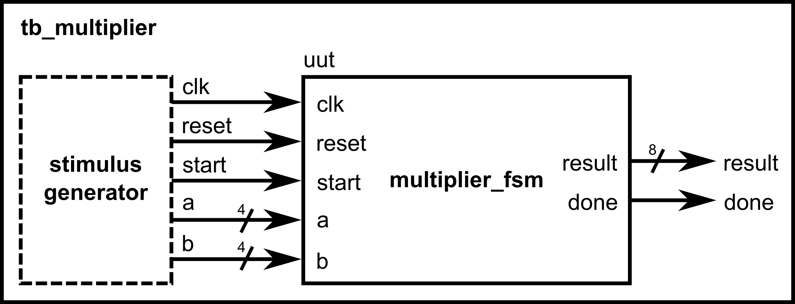

::: {.vcc-nav}
[Overview](index.qmd) | [M000](00-fundamentals.qmd) | [M001](001-combinational.qmd) | [M010](01-combinational.qmd) | [M011](02-sequential.qmd) | [M100](100-advanced-sequential.qmd) | [M101](03-verification.qmd) | [M110](110-advanced-verification.qmd) | [M111](04-practices.qmd) | [Extras](05-extras.qmd) | [Credits](credits.qmd)
:::
# Module 101: Testbench Basics and Verification

So far, we’ve been writing synthesizable Verilog — the kind that represents hardware. But before we ever put a design on an FPGA or chip, we **must test it in simulation**. That’s where **testbenches** come in.

A **testbench** is just another Verilog module, but:

- It doesn’t describe hardware.
- It drives inputs and monitors outputs of the design under test.
- It uses special non-synthesizable constructs (like delays and printing) that only exist in simulation.

## Basic Testbench Structure

A testbench usually has three parts:

1. **Design Under Test (DUT) instantiation** — we create an instance of our design module.
2. **Clock generation** — a process that toggles `clk` so the design can run.
3. **Stimulus and checking** — use `initial` blocks to provide input values and monitor outputs.

Let’s walk through these step by step.

### Timescale

At the top of the testbench file, we write a **timescale directive**:

---

```verilog
`timescale 1ns/1ps
```

---

This means:

- 1 time unit = 1 nanosecond. We’ll use this to define delays (e.g., `#10` means wait 10 ns). More on this later.
- Simulation precision (how granular the logic gate delays would be represented) = 1 picosecond.

### Instantiating the Design Under Test (DUT)

For this part, let's say we want to simulate and verify the **multiplication via repeated addition** FSM that we have implemented in the previous module.

First, we declare signals for the testbench to drive:

---

```verilog
module tb_multiplier;         // module declaration. A testbench does not have explicit input and output ports!
    // declare internal signals that will be used by the testbench    // these are the input and output ports of the design we are planning to test
    reg clk;
    reg reset;
    reg start;
    reg [3:0] a, b;
    wire [7:0] result;
    wire done;

    // Instantiate the design under test (DUT)
    multiplier_fsm uut (
        .clk(clk),
        .reset(reset),
        .start(start),
        .a(a),
        .b(b),
        .result(result),
        .done(done)
    );
```

---

::: {.callout-note title="Take note of the following when writing testbenches"}

- `reg` is used for inputs (since testbench drives them).
- `wire` is used for outputs (since DUT drives them).

:::

### Clock Generation

We need a free-running clock. We can make one by toggling clk, which was declared as `reg`, every 5 ns:

---

```verilog
    // Clock generation: 10 ns period (100 MHz)
    initial clk = 0;
    always #5 clk = ~clk;
```

---

::: {.callout-note title="Here"}

- `initial` sets `clk = 0` at time 0.
- `always #5` toggles `clk` every 5 ns. We are using nanoseconds because that is what was defined in the **timescale** directive earlier.
- So the clock period that will be provided to clock our design is 10 ns.

:::

### Stimulus with `initial begin`

To control inputs, we use an `initial begin ... end` block:

---

```verilog
    initial begin
        // Initialize signals
        reset = 1;
        start = 0;
        a = 0;
        b = 0;

        // Hold reset for 20 ns before setting it to 0
        #20 reset = 0;

        // Start multiplication: 3 * 5
        a = 4'd3;
        b = 4'd5;
        start = 1;     // set start to 1
        #10 start = 0; // after 10 ns, set start to 0 (pulse start)

        // Wait for completion by waiting for the posedge of done to happen        // The testbench essentially halts at this point and will only proceed once done becomes 1        @(posedge done);
        // Display result
        $display("3 * 5 = %d (expected 15)", result);

        // Wait for 20ns more then finish simulation
        #20 $finish;
    end
```

.png)

---

::: {.callout-note title="We introduced three new Verilog keywords here"}

- **`#delay`**: Wait a given amount of simulation time (non-synthesizable). Time units are defined using the **timescale** directive.
- **`$display`**: Print messages during simulation (like `printf`). This message shows up in the console.
- **`$finish`**: End the simulation.

:::

::: {.callout-warning}
**These are non-synthesizable constructs (i.e., no hardware equivalent).**

- **You can't tell the hardware to delay an output at exactly x nanoseconds.** Logic gates have delays due to their non-idealities, but you can't specifically assign a delay for them.
- **You can't tell the hardware to print out messages** (where is it going to print out anyway?).
- **Hardware always runs.** It is a circuit. You can't just halt it.

They only exist in the simulator, and that is perfectly fine for a testbench.
:::

## Putting It All Together

Here’s the complete testbench for the multiplier FSM:

---

```verilog
`timescale 1ns/1ps             // timescale directive for time units
module tb_multiplier;          // module declaration. A testbench does not have explicit input and output ports!

    // declare internal signals that will be used by the testbench    // these are the input and output ports of the design we are planning to test    reg clk;
    reg reset;
    reg start;
    reg [3:0] a, b;
    wire [7:0] result;
    wire done;

    // Instantiate DUT
    multiplier_fsm uut (
        .clk(clk),
        .reset(reset),
        .start(start),
        .a(a),
        .b(b),
        .result(result),
        .done(done)
    );

    // Clock generation
    initial clk = 0;
    always #5 clk = ~clk;  // toggle every 5 ns, so 10 ns clock period

    // Test sequence    initial begin
        // Initialize signals
        reset = 1; start = 0; a = 0; b = 0;
        #20 reset = 0; // Hold reset for 20 ns before setting it to 0

        // Start multiplication: 3 * 5
        a = 4'd3; b = 4'd5;
        start = 1;     // set start to 1
        #10 start = 0; // after 10 ns, set start to 0 (pulse start)

        // Wait for completion by waiting for the posedge of done to happen        // The testbench essentially halts at this point and will only proceed once done becomes 1        @(posedge done);        $display("3 * 5 = %d (expected 15)", result); // Display result

        // Wait for 20ns more then finish simulation
        #20 $finish;
    endendmodule
```



---

- A **testbench is not hardware** — it’s a simulation driver.
- Use `initial` blocks to define test sequences.
- Use `always #delay` to make clocks.
- Use `$display`, `$finish`, `$dumpfile`, `$dumpvars` for simulation-only
  tasks.

## Viewing Waveforms

Most simulators let you save signals into a **waveform file** (like `.vcd`) that you can view in tools such as GTKWave. For example:

---

```verilog
initial begin
    $dumpfile("tb_multiplier.vcd");
    $dumpvars(0, tb_multiplier);
end
```

---

This records all signals so you can open them in a waveform viewer.

Waveforms let you see the step-by-step values of `a`, `b`, `result`, `state`,
and `done`.

.png)

If you insert the code above into the testbench for the multiplier FSM and run it on a simulator tool, you would see the following waveforms:

.png)

::: {.callout-note}
For Verilog simulations using Vivado, you don't need to add these lines anymore, as Vivado automatically sets up the waveform viewer using your testbench signals.
:::

::: {.vcc-nextprev}
[← M100](100-advanced-sequential.qmd){.vcc-prev} [M110 →](110-advanced-verification.qmd){.vcc-next}
:::
