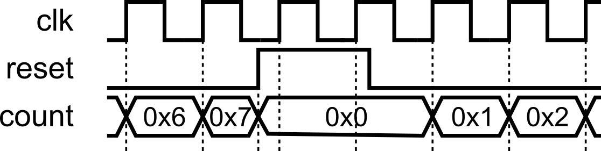
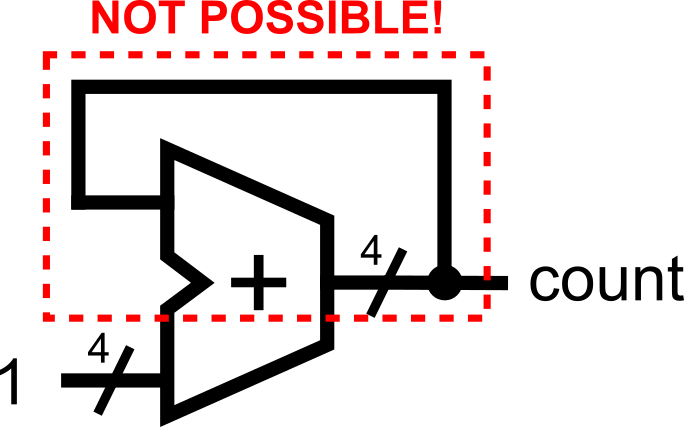
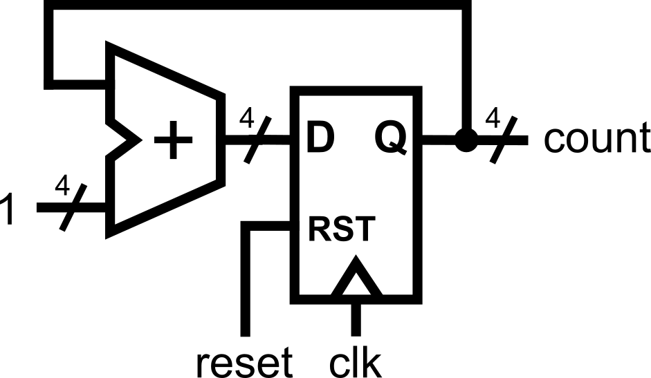
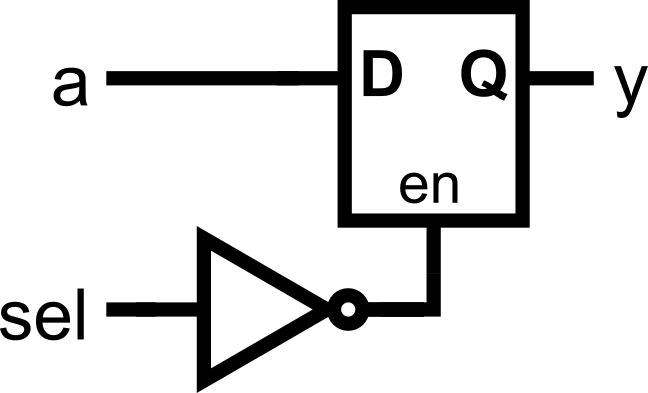
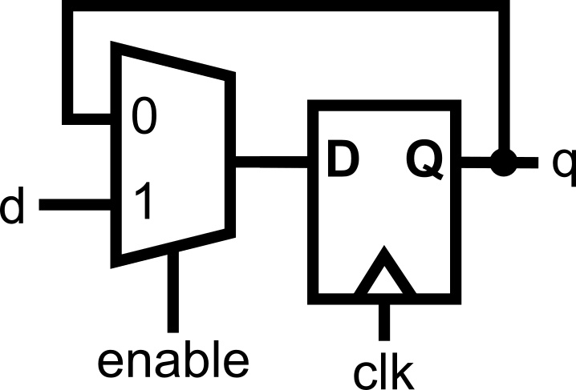
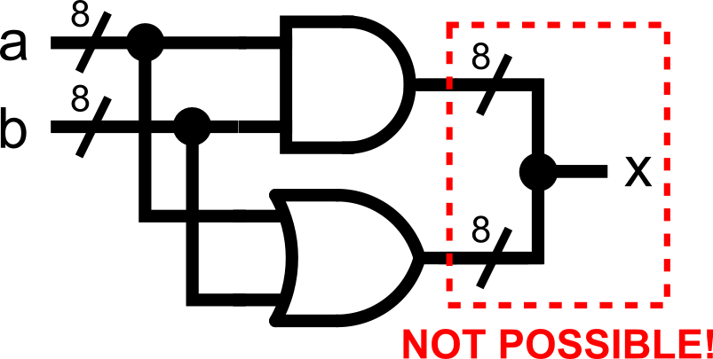
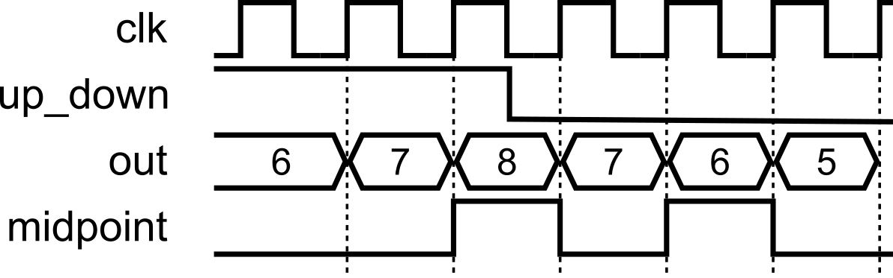
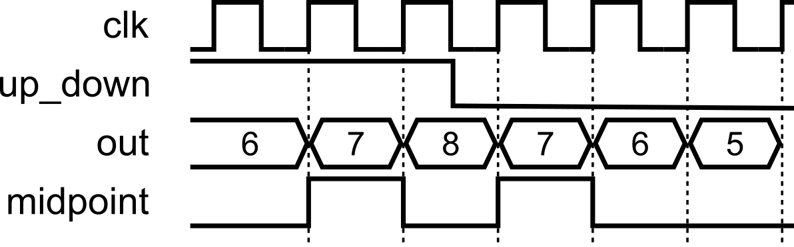

::: {.vcc-nav}
[Overview](index.qmd) | [Foundations](00-fundamentals.qmd) | [Combinational](01-combinational.qmd) | [Sequential](02-sequential.qmd) | [Verification](03-verification.qmd) | [Practices](04-practices.qmd) | [Extras](05-extras.qmd)
:::
## Module 111: Best Coding Practices and Wrap-up

We're at the end of this crash course. Let's summarize what we have covered so far. This module distills the habits that keep your “algorithm → single `always @(posedge clk)` block” designs readable, predictable, and bug-resistant: clear names, the golden assignment rule, reset priority, width discipline, no double drivers, and keeping simulation-only tricks in the testbench. Think of these as the guardrails that let you prototype fast **without** stepping on classic HDL landmines like accidental latches, off-by-one flags, or hidden truncations. We’ll illustrate each rule with small, descriptive examples and call out the pitfalls they prevent, so your first-pass hardware works more like your mental model, with fewer surprises later.

## 1) Use clear, descriptive names (ports, regs, states)

Good names make your algorithm read like a story. Prefer full words, consistent casing/underscores, and `localparam` state names instead of raw binaries.

##### **❌Bad:**

---

```
module m(input c, input s, input r, output y);
    reg [1:0] st;
    ...
endmodule
```

---

##### **✅Better:**

---

```
module controller(
    input  clk,
    input  start,
    input  reset,
    output busy
);
    localparam IDLE = 2'b00,
               LOAD = 2'b01,
               RUN  = 2'b10,
               DONE = 2'b11;
    reg [1:0] state;
    ...
endmodule
```

---

## 2) The golden assignment rule

- Inside `always @(posedge clk)`: **use `<=`** .
- Inside `always @(*)`: **use `=`** .

  This keeps your mental model
  aligned with **concurrency** and avoids subtle timing bugs. No need to dive into semantics here, just stick to the rule.

##### ✅Example (sequential):

---

```
always @(posedge clk) begin
    if (reset)
        count <= 0;
    else
        count <= count + 1;
end
```

---

##### ✅Example (combinational):

---

```
always @(*) begin
    if (sel)
        y = a;
    else
        y = b;
end
```

---

 ⚠️⚠️⚠️
**Don't ever mix assignments! Always follow the golden rule.** One more time for emphasis:

- Inside `always @(posedge clk)`: **use `<=`** .
- Inside `always @(*)`: **use `=`** .

## 3) Remember: hardware is concurrent

Assignments scheduled on the same clock edge **update together**. Order in the source doesn’t create a sequence; the **clock does**. This is true across modules
and across separate `always` blocks.

Swap example (both update on the same edge):

---

```
always @(posedge clk) begin
    a <= b;  // gets old b
    b <= a;  // gets old a
end
```

---

That will have the same hardware as this:

---

```
always @(posedge clk) begin    b <= a;  // gets old a
    a <= b;  // gets old b
end
```

---

.png).png)

The order of the statements inside the block **does not change the hardware**. Each line creates a register, and all registers are updated together on the clock edge.

##### ℹ️Key Points

- **Every assignment in an `always@(posedge clk)` block infers a register.**
  Each `<=` line
  creates a storage element that holds its value until the next clock edge.
- **All registers check inputs at the same time.**
  That’s why it’s the *old values* that get used for every assignment.
- **All updates happen together.**
  No one register updates “before” another; they all change in lockstep with the clock.

## 4) Reset cleanly (and at the top of the priority chain)

- Use a reset to force known start values (don’t rely on declaration-time initializations).
- Always put reset at the **top** of the `if-else` hierarchy, so it takes the highest priority. **It must contain only the reset logic, with no additional logic included.**This makes reset dominant and prevents any peer logic at the top level.

---

```
always @(posedge clk) begin
    if (reset) begin
        // reset logic only
    end else begin
        // rest of sequential logic
    end
end
```

---

- Either synchronous or asynchronous is fine; be consistent in a project.

##### Synchronous Reset

---

```
module counter_with_reset(
    input clk,
    input reset,
    output reg [3:0] count
);
    always @(posedge clk) begin
        if (reset)
            count <= 4'b0000; // reset value
        else
            count <= count + 1;
    end
endmodule
```


---

##### Asynchronous Reset

---

```
always @(posedge clk or posedge reset) begin
    if (reset)
        count <= 4'b0000;
    else
        count <= count + 1;
end
```



---

## 5) Be precise with widths

Size your constants and watch truncation/extension. Prefer explicit slices when truncating.

---

```
reg  [7:0] wide;
wire [3:0] narrow;

// Bad (implicit truncation):
assign narrow = wide;

// Good (explicit):
assign narrow = wide[3:0];

// Properly-sized constants:
assign wide = 8'hA5;
```

---

## 5) Avoid combinational loops

Avoid creating **combinational loops** (signals feeding back through purely combinational logic), because they can oscillate, produce unknown `X` values in simulation, and confuse synthesis/timing tools, often leading to unstable hardware. The assignment where the output depends on the same signal, such as **count = count + 1;****should not**be done in the combinational logic domain (when using `always@(*)`), as this would infer a combinational loop, which is not realizable in hardware.

---

```
always @(*) begin
    count = count + 1; // bad: combinational loop
end
```



---

If you truly need feedback, **break the loop with a register** (use a clocked `always @(posedge clk)` stage) or restructure the logic into a well-defined sequential design. Loops within sequential logic are possible because the path propagation is being controlled by the clock trigger.

---

```
always @(posedge clk) begin
    if (reset)
        count <= 0;
    else
        count <= count + 1; // okay
end
```



---

## 6) Avoid inferred latches in combinational logic

In `always @(*)`, **cover all branches** (include an `else` or `default`)
so outputs are defined for every input combination. Uncovered paths infer latches (usually a bug).

---

```
always @(*) begin
    if (sel == 0)
        y = a;
    // What happens if sel == 1? y keeps its old value → latch!
end
```



---

The fix: **always cover all cases**.

---

```
always @(*) begin
    if (sel == 0)
        y = a;
    else
        y = b; // defined for all inputs
end
```


---

Or add a `default` in a `case`:

---

```
case (sel)
    2'b00: y = a;
    2'b01: y = b;
    default: y = 0; // avoids latch
endcase
```

.png)

---

…but “holding value” is fine in sequential logic

In `always @(posedge clk)`, omitting an `else` simply **keeps the register value**, which is often what you want:

---

```
always @(posedge clk) begin
    if (enable)
        q <= d;
    // else: q holds its value -> fine for sequential logic
end
```



---

## 7) One driver per signal (no double drivers)

A net/register should be assigned in exactly **one** `assign` or **one** `always` block, not multiple places. Double drivers create conflicts and synthesis errors.

##### ❌Bad:

---

```
always @(*) x = a & b;
always @(*) x = a | b;  // conflict

```



---

##### ✅Good:

---

```
// GOOD: one block owns 'x' and decides based on 'sel'always @(*) begin    if (sel)
        x = (a & b);
    else
        x = (a | b);
end
```

.png)

---

 ℹ️Always think about **mutual exclusivity**.**All assignments to the same signal must always be mutually exclusive!** At any given time, no two assignments to the same signal must take place. Use `else`to ensure mutual exclusivity.

## 8) Keep non-synthesizable constructs in the testbench

`initial`, `#delay`, `$display`, `$finish`, file I/O (`$fopen`, `$fscanf`, `$feof`, `$fclose`) are **for simulation only**.
Use them in testbenches, not in the DUT.

Testbench snippet:

---

```
    initial begin
        // Initialize signals
        reset = 1;
        start = 0;

        // Hold reset for 20 ns before setting it to 0
        #20 reset = 0;

        start = 1;     // set start to 1
        #10 start = 0; // after 10 ns, set start to 0 (pulse start)

        // Display something
        $display("I was here");

        // Wait for 20ns more then finish simulation
        #20 $finish;
    end
```

---

⚠️⚠️⚠️**These are non-synthesizable constructs (i.e., no hardware equivalent)!**

- **You can't tell the hardware to delay an output at exactly x nanoseconds.** Logic gates have delays due to their non-idealities, but you can't specifically assign a delay for them!
- **You can't tell the hardware to print out messages** (where is it going to print out anyway?).
- **Hardware always runs.** It is a circuit. You can't just halt it.

## 9) Prefer `localparam` for states and special constants

Use descriptive names for states and key constants. This improves readability, minimizes errors when refactoring, and provides self-documenting code.

---

```
    localparam IDLE    = 2'b00,
               COUNT   = 2'b01,
               SIGNAL  = 2'b10;

    localparam MAX_TICKS = 8'd200; // "special constant" now documented
    localparam ZERO      = 8'd0;

    reg [1:0] state;
    reg [7:0] ticks;

    always @(posedge clk) begin
        if (reset) begin
            state  <= IDLE;
            ticks  <= ZERO;
            active <= 0;
            timeout<= 0;
        end else begin            case (state)
                IDLE: begin
                    ticks  <= ZERO;
                    if (start) begin
                        active <= 1;
                        state  <= COUNT;
                    end
                end

                COUNT: begin
                    ticks <= ticks + 1;
                    if (ticks == MAX_TICKS) begin
                        timeout <= 1;      // one-cycle pulse
                        state   <= SIGNAL;
                    end
                end

                SIGNAL: begin
                    active <= 0;                    timeout <= 0;
                    state  <= IDLE;
                end
            endcase
        end
    end
```

---

## 10) Practical timing tip (when you see “one-cycle late” flags)

Staying in the **single `always @(posedge clk)` style** is fine. However, note that in sequential logic, registers only update after the clock edge. That means:

- On the rising edge of the clock, the `if` conditions check the old values.
- The assignments (`<=`) schedule updates, but those new values only appear after the clock edge has passed.

This often surprises beginners because it creates what looks like an “off-by-one” error.

---

```
always @(posedge clk) begin
    if (reset) begin
        out <= 0;
        midpoint <= 0;
    end else begin        if (up) begin
            out <= out + 1;
            mid <= (out == 4'd7);
        end else begin
            out <= out - 1;
            mid <= (out == 4'd7);         end
    end
end
```



---

If a flag appears **one cycle late** (e.g., midpoint on a counter), fix it by:

- **Adjusting the condition** to anticipate the next update (quick, inelegant), or
- **Deriving the flag combinationally** from the registered value in a small `always @(*)` / `assign` (cleaner).

   Use the second only when you need to correct an off-by-one or similar timing nuance; otherwise, keep your algorithm in one clocked block.

Fix A: Quick patch inside the clocked block:

---

```
always @(posedge clk) begin
    if (reset) begin
        out <= 0;
        midpoint <= 0;
    end else begin        if (up) begin
            out <= out + 1;
            mid <= (out == 4'd6);  // anticipates increment to 7
        end else begin
            out <= out - 1;
            mid <= (out == 4'd8);  // anticipates decrement to 7        end
    end
end
```

---

Fix B: Cleaner (separate tiny combinational check just for the flag):

---

```
always @(posedge clk) begin
    if (reset)
        out <= 0;
    else begin         if (up)
            out <= out + 1;
        else
            out <= out - 1;    end
end

always @(*) begin
    mid = (out == 4'd7);
end
```

---

 Use Fix B when the off-by-one would otherwise confuse readers or cascade timing surprises; it keeps the algorithm in one clocked block while correcting the observable timing of the flag.



# Course Wrap-Up

**✅Where you are now:** you’ve built a solid, fast-prototyping path from an algorithm in your head to working Verilog. You can sketch steps, map them to states, write clean HDL, and verify it—quickly. Here’s
what we covered so far (000–111) and what each piece unlocked for you.

- **000 — Basic Structure and Syntax**
   ℹ️You learned the shape of a Verilog design: `module … endmodule`, ports, vectors,
  comments, and clean instantiation (by name/order). The focus: readable modules with legal, descriptive names.
- **001 — Writing Combinational Logic**
   ℹ️You described logic with `assign`, sized constants (`'b`,
  `'d`, `'h`), common operators, concatenation `{}`, and slices `[hi:lo]`.
  Big idea: **concurrency**—the order of `assign`s doesn’t matter; hardware evaluates in parallel.
- **010 — Advanced Combinational Logic**
   ℹ️You shifted to `always @(*)` for richer logic, expressed choices with `if/else` and `case`, and learned two pitfalls to avoid: **double drivers** and **inferred latches** in combinational code (cover all branches or give defaults).
- **011 — Writing Sequential Logic**
   ℹ️You moved time into the picture with `always @(posedge clk)`. The **golden rule**: use `<=` in clocked blocks (and `=` in `@(*)`).
  You built counters, added resets (top-priority), and internalized that **all registers update together** on a clock edge.
- **100 — Advanced Sequential Logic**
   ℹ️Algorithms → **FSMs**: states as steps, one step per clock (the clocked block
  as an “infinite loop”). You named states with `localparam`, handled transitions, and saw the **one-cycle update nature** of registers
  (condition checks use old values; updates land after the edge).
- **101 — Testbench Basics and Verification**
   ℹ️You wrapped designs in a simulation harness: UUT instantiation, clock generation, `initial` blocks, delays, `$display/$finish`, and wave dumps—**testbench-only constructs** that help you see and debug behavior.
- **110 — Advanced Verification Ideas**
   ℹ️You leveled up to **self-checking**: reusable `task`-based
  tests, multiple cases, and **file-driven** verification via `$fopen/$fscanf/$feof` powered by a Python “golden model” to generate
  inputs/expected outputs—scalable verification without staring at waveforms.
- **111 — Best Coding Practices (here)**
   ℹ️You collected guardrails for rapid, reliable prototyping: clear names, the golden assignment rule, reset priority, no
  combinational loops, no double drivers, no latches in combinational logic (but holding is fine in sequential), and keeping simulation tricks out of the DUT. Quick timing tip for “one-cycle-late” flags: either anticipate in the condition or
  derive a tiny combinational flag from a registered value.

**Mindset to carry forward:** think in **steps** (states), respect **concurrency**, size and name things explicitly,
and let the **clock** be the timeline. Prototype fast, verify faster.

# What’s Next: Extra Modules for Extra Learning

You’ve now got a fast path from **algorithm → Verilog** using a clean, single `always @(posedge clk)` style, plus the verification skills to prove it works. For learners
who pass all assessments and want to architect **larger, more complex systems**, two optional modules are available. They introduce higher-level styles and syntax that trade simplicity for scalability.
These are meant for advanced Verilog coders and are already beyond the original goal of this crash course.

---

## Extra Module 00 — Structural Coding Style

**Goal:** Learn to scale designs by **structuring** them: separate concerns, give each register a single point of ownership, and make big datapaths readable and
maintainable.

**Mindset shift:** Instead of one big sequential block, you’ll **split logic by responsibility**, typically giving each register its **own** clocked block (and optionally small local combinational helpers). This can make timing intent and dataflow crystal clear in large systems.

**You’ll learn to:**

- Give **each register** a dedicated `always @(posedge clk)` that owns its updates.
- Factor shared logic into **tiny combinational helpers** or `assign`s to avoid double drivers.
- Refactor monolithic FSMs/datapaths into **structural, pipeline-friendly** pieces.

---

## Extra Module 01 — Advanced Verilog Constructs

**Goal:** Build confidence with higher-level syntax that speeds up **regular structure**: multi-dimensional arrays, `for` loops (for init/reset in *sequential* blocks), and `generate` constructs for clean replication and parameterization.

**You’ll learn to:**

- Declare and use **multi-dimensional arrays** (e.g., register files, tiled buffers).
- Use **`for` loops in clocked blocks** to reset/initialize arrays (loop unrolls in hardware).
- Use **`generate`**/`genvar` to replicate modules or logic slices at scale.
- Parameterize widths/depths for reusable components.

---

### How do these extras fit your journey

- Your base course made you **fast and correct** for small/medium problems.
- These extras make you **scalable and systematic** for big ones: pipelines, wide datapaths, replicated structures, and configurable blocks.
- You’ll still lean on the fundamentals you’ve already mastered: **clear ownership, concurrency awareness, explicit widths, and disciplined resets,**just applied at a larger architectural scale.

When you’re ready (and have passed all assessments), unlock these modules to level up from “it works” to “it scales.”

## X: Module Assessments

Each of the modules has corresponding assessments so you can test your understanding. The collection of assessments is presented below for easier access.

### [Module 000: Basic Structure and Syntax](https://uvle.upd.edu.ph/course/view.php?id=23162&section=1&singlesec=1)

This module's activity is in this **[Jupyter Notebook](https://colab.research.google.com/github/Lawrence-lugs/microlabverilogcrashcourse/blob/main/notebooks/structural/structural.ipynb).**Line by
line, you can execute the code in order to see how the environment works. I recommend pressing the **Run all**button at the top and giving it about 2 minutes to download all of the requirements. In the middle of the notebook,
you'll find a section where you need to fill in some verilog code. *Time to show your stuff.*

ALUs perform operations on inputs A and B, but you can choose which operation to perform by choosing the **opcode**input**.**
Your
task in this activity is to implement an ALU (Arithmetic Logic Unit) with structural instantiation of the existing modules.

### [Module 001: Writing Combinational Logic](https://uvle.upd.edu.ph/course/view.php?id=23162&section=2&singlesec=2)

This module's activity is in this **[Jupyter Notebook](https://colab.research.google.com/github/Lawrence-lugs/microlabverilogcrashcourse/blob/main/notebooks/combinational/combinational.ipynb).**Line
by line, you can execute the code in order to see how the environment works. I recommend pressing the **Run all**button at the top and giving it about 2 minutes to download all of the requirements. In the middle of the
notebook, you'll find a section where you need to fill in some verilog code. *Time to show your stuff.*

Like in the previous activity, we'll be implementing an ALU. But this time, **NONE OF THE MODULES ARE PROVIDED.**Hence,
you'll have to write all the logic yourself using *assign statements.*

Good luck!

### [Module 010: Advanced Combinational Logic](https://uvle.upd.edu.ph/course/view.php?id=23162&section=3&singlesec=3)

This module's activity is in this **[Jupyter Notebook](https://colab.research.google.com/github/Lawrence-lugs/microlabverilogcrashcourse/blob/main/notebooks/adv_comb/adv_comb.ipynb).**Line by line,
you can execute the code in order to see how the environment works. I recommend pressing the **Run all**button at the top and giving it about 2 minutes to download all of the requirements. In the middle of the notebook,
you'll find a section where you need to fill in some verilog code. *Time to show your stuff.*

Again, we're implementing an ALU. **I promise this is the last time.**
However, we have another twist this
time. This time, you will have to implement the ALU with the **outputs defined as reg!** The **reg**statement is, in fact, incompatible with **assign**statements. Hence, you'll
have to use an **always** block.

Good luck!

### [Module 011: Writing Sequential Logic](https://uvle.upd.edu.ph/course/view.php?id=23162&section=4&singlesec=4)

This module's activity is in this **[Jupyter Notebook](http://githubtocolab.com/Lawrence-lugs/microlabverilogcrashcourse/blob/main/notebooks/seq/seq.ipynb).**Line by line, you can execute the code
in order to see how the environment works. I recommend pressing the **Run all**button at the top and giving it about 2 minutes to download all of the requirements. In the middle of the notebook, you'll find a section where
you need to fill in some verilog code. *Time to show your stuff.*

In programming, we usually take randomness for granted. It is simple to use programming libraries and packages to generate random numbers. However, under the
hood, generating random numbers is really really difficult.
**[Linear Feedback Shift Registers (LFSRs)](https://en.wikipedia.org/wiki/Linear-feedback_shift_register)**allow hardware engineers to
efficiently generate "random numbers".

In this activity, your task is to implement a 4-bit Galois-type LFSR using the knowledge you've gained about writing sequential logic.

### [Module 100: Advanced Sequential Logic](https://uvle.upd.edu.ph/course/view.php?id=23162&section=5&singlesec=5)

This module's activity is in this **[Jupyter Notebook](https://colab.research.google.com/github/Lawrence-lugs/microlabverilogcrashcourse/blob/main/notebooks/adv_seq/adv_seq.ipynb).**Line by line,
you can execute the code in order to see how the environment works. I recommend pressing the **Run all**button at the top and giving it about 2 minutes to download all of the requirements. In the middle of the notebook,
you'll find a section where you need to fill in some verilog code. *Time to show your stuff.*

A **[stack](https://en.wikipedia.org/wiki/Stack_(abstract_data_type))**is a programming
data structure (or type of memory, really) where you can write data (called **pushing to the top of the stack**). When you read data (called a **popping from the top of the stack**), the data comes out in reverse
order of how it came in. For tasks that need you to backtrack, like *depth-first searches, or text-processing*, the stack is useful. Implementing these algorithms in hardware can require the use of a stack-type memory.

In this
activity, your task is to implement **a stack**using advanced sequential logic. As a guide, remember to use a *finite state machine*to model the behavior of a stack before writing your code.

### [Module 101 & 110: Testbenching and Verification](https://uvle.upd.edu.ph/course/view.php?id=23162&section=6&singlesec=6)

In reality, we do not use **Jupyter Notebooks**to run Verilog simulations. Rather, Verilog simulations are typically done in integrated design environments.
For this activity,  open the **[Verilog Crash Course Github Repository](https://github.com/Lawrence-lugs/microlabverilogcrashcourse).**
To
start the design environment, click **Code > Codespaces > Open in Codespace...**
The codespace will have a setup stage for about 10 minutes. However, at the end, you should see a coding-environment-like window.

From
this window, you can write files, see waveforms, run arbitrary code and commands in the terminal, and other such things.
This is how digital design engineers typically do their work.

In this activity, you'll be

1. Familiarizing yourself with using the terminal to run Verilog simulations
2. Using a waveform viewer
3. Writing a testbench and debugging verilog code

The rest of the instructions for this activity are written on the Github page itself (scroll down from there).

### [Module 110: Advanced Verification Ideas](https://uvle.upd.edu.ph/course/view.php?id=23162&section=7&singlesec=7)

### [Module 111: Best Coding Practices](https://uvle.upd.edu.ph/course/view.php?id=23162&section=8&singlesec=8)

Previous: [Verification](03-verification.qmd)
Next: [Extras](05-extras.qmd)
