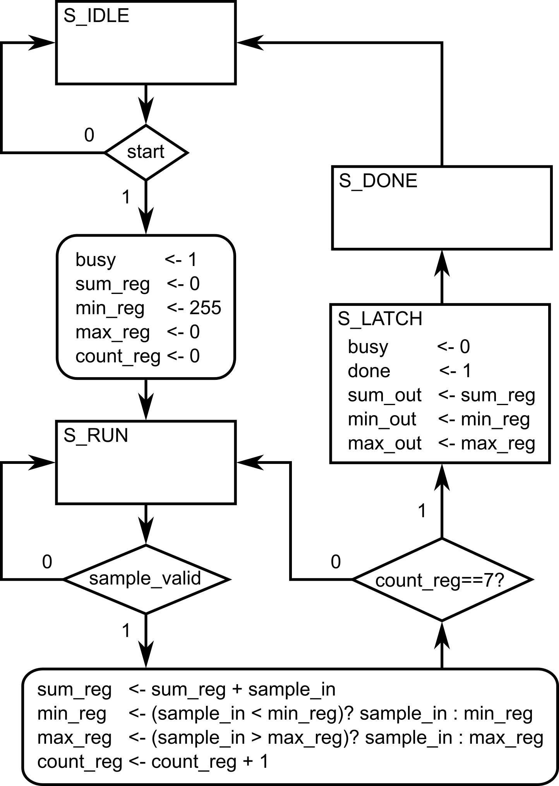
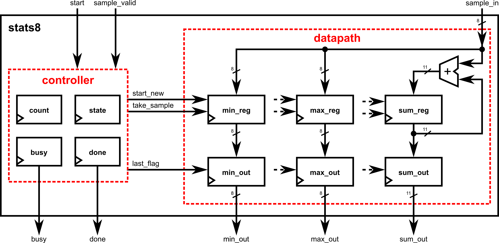
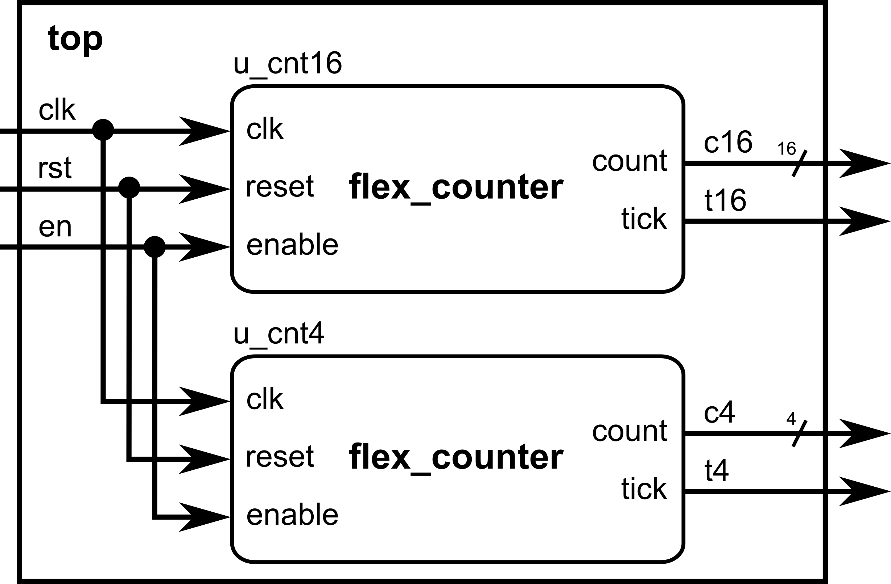
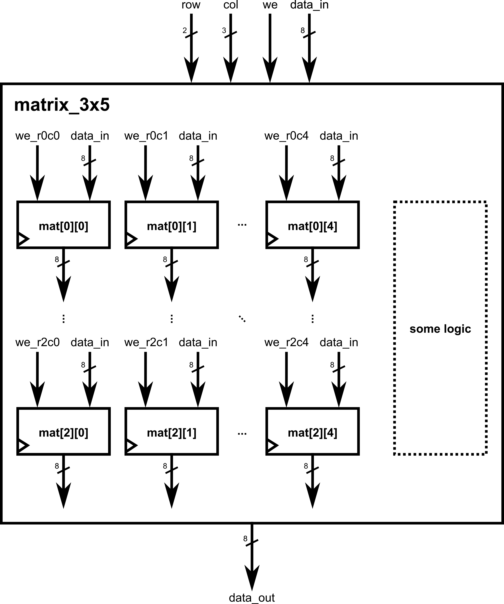
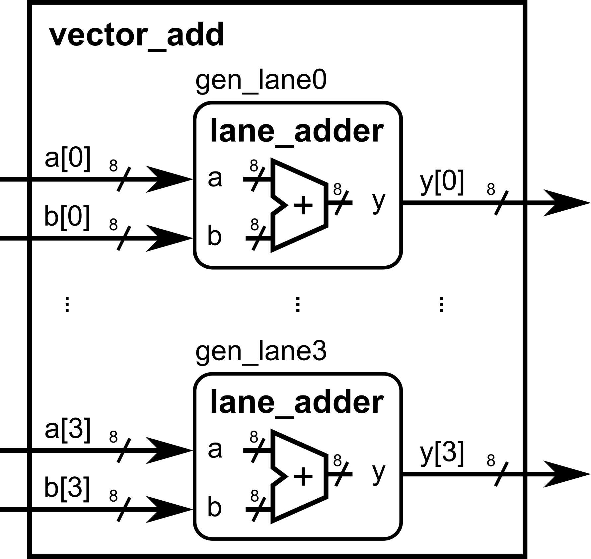
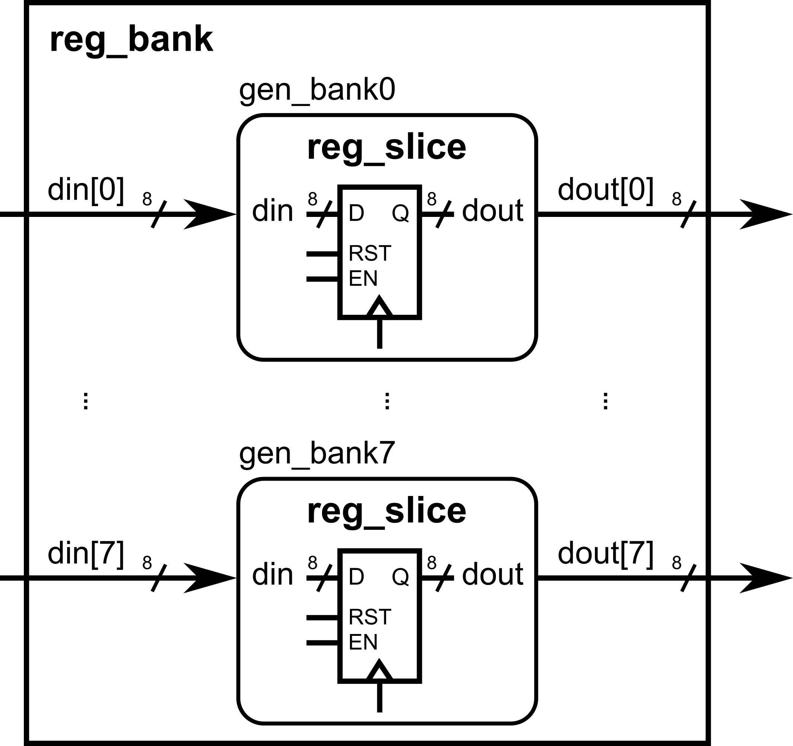

::: {.vcc-nav}
[Overview](index.qmd) | [M000](00-fundamentals.qmd) | [M001](001-combinational.qmd) | [M010](01-combinational.qmd) | [M011](02-sequential.qmd) | [M100](100-advanced-sequential.qmd) | [M101](03-verification.qmd) | [M110](110-advanced-verification.qmd) | [M111](04-practices.qmd) | [Extras](05-extras.qmd) | [Credits](credits.qmd)
:::
# Extra Module 00: Structural Verilog Coding

Up to now, you’ve been prototyping quickly with a **single `always @(posedge clk)`** that reads like your algorithm. That’s great for small/medium blocks. As designs grow, teams often shift to a **structural style** that mirrors real digital methodology: **each register has a single point of ownership** (its own clocked block), with tiny combinational helpers to express “next” intent. This improves readability, timing clarity, and scalability, without abandoning your algorithmic flow.

# Design Problem: Stream 8 Samples, Report Sum/Min/Max

Design a synchronous module that **ingests exactly eight 8-bit samples** from a stream (gated by a valid signal), then produces their **sum**, **minimum**, and **maximum**, along with a **one-cycle `done` pulse** indicating the results are
ready. The design must be clocked and reset synchronously.

We will implement it in two styles:

1. **Monolithic**: one `always @(posedge clk)` block with an FSM that owns all registers.
2. **Structural**: split responsibilities so that **each register has a single point of ownership** (one clocked block per register), with small combinational
   helpers as needed.

## Inputs

- `clk` : Clock. All sequential logic triggers on the **rising** edge.
- `rst` : Synchronous, active-high **reset**. When asserted, all internal state and outputs must return to defined reset values.
- `start` : A (typically one-cycle) pulse signaling the module to begin collecting a new batch of 8 samples.

  - If asserted while the module is already busy, it must be **ignored** (no effect).
- `sample_in[7:0]` : The current sample value on the input stream.
- `sample_valid` : When `1`, indicates `sample_in` holds a **new** sample that should be **accepted this cycle** if the module is currently busy collecting.

## Outputs

- `busy` : When `1`, the module is in the middle of collecting samples (i.e., after a valid `start` until the
  8th sample is accepted).
- `done` : A **one-cycle pulse** asserted **exactly when** the final results are captured/updated.
- `sum_out[10:0]` : The sum of the 8 accepted samples (8 × 255 = 2040 → 11 bits).
- `min_out[7:0]` : The minimum of the 8 accepted samples.
- `max_out[7:0]` : The maximum of the 8 accepted samples.

> Outputs (`sum_out`, `min_out`, `max_out`) must update **once per batch**,
> on the **same cycle that `done` is asserted**, and remain unchanged until the next batch completes.

# Monolithic style (single `always@` block)

A single `always @(posedge clk)` owns the state machine, counters, accumulators, outputs, and pulses. This is close to our earlier “algorithm-in-one-block” style, presented in the previous modules. (*This is also affectionally referred to as Adel-style coding, reflecting his preferred way of describing algorithms, enabling very rapid, 'in-just-one-sitting' implementations)*



---

```verilog
module stats8_monolithic (
    input  clk,
    input  rst,           // sync, active-high
    input  start,         // pulse to begin a new batch
    input  [7:0]  sample_in,
    input  sample_valid,
    output reg         busy,
    output reg         done,          // 1-cycle pulse when outputs valid
    output reg [10:0]  sum_out,       // sum of 8 bytes (max 2040 -> 11 bits)
    output reg [7:0]   min_out,
    output reg [7:0]   max_out
);

    localparam [1:0] S_IDLE=2'd0, S_RUN=2'd1, S_LATCH=2'd2, S_DONE=2'd3;
    reg [1:0] state;

    reg [10:0] sum_reg;
    reg [7:0]  min_reg, max_reg;
    reg [2:0]  count_reg; // 0..7 accepted samples

    always @(posedge clk) begin
        if (rst) begin
            state     <= S_IDLE;
            busy      <= 1'b0;
            done      <= 1'b0;
            sum_reg   <= 11'd0;
            min_reg   <= 8'hFF;
            max_reg   <= 8'h00;
            count_reg <= 3'd0;
            sum_out   <= 11'd0;
            min_out   <= 8'd0;
            max_out   <= 8'd0;
        end else begin
            case (state)
                S_IDLE: begin
                    if (start) begin
                        busy      <= 1'b1;
                        sum_reg   <= 11'd0;
                        min_reg   <= 8'hFF;
                        max_reg   <= 8'h00;
                        count_reg <= 3'd0;
                        state     <= S_RUN;
                    end
                end

                S_RUN: begin
                    if (sample_valid) begin
                        sum_reg   <= sum_reg + sample_in;
                        min_reg   <= (sample_in < min_reg) ? sample_in : min_reg;
                        max_reg   <= (sample_in > max_reg) ? sample_in : max_reg;
                        count_reg <= count_reg + 3'd1;

                        if (count_reg == 3'd7)
                            state <= S_LATCH; // 8th sample just accepted
                    end
                end

                S_LATCH: begin
                    sum_out <= sum_reg;
                    min_out <= min_reg;
                    max_out <= max_reg;
                    done    <= 1'b1;
                    busy    <= 1'b0;
                    state   <= S_DONE;
                end

                S_DONE: begin
                    done  <= 1'b0;
                    state <= S_IDLE;
                end

                default: state <= S_IDLE;
            endcase
        end
    end
endmodule
```

---

✅**Monolithic coding style advantages:** fast to write; reads like the algorithm; people with programming backgrounds can easily understand the sequence of events (given a relatively small FSM/code length)

**❌Limits:** as logic grows, a single block can get dense; ownership of each register can become less obvious; reasoning about per-register timing intent may require more careful reading.

# Structured style (separate `always@` blocks)

Here, **each register has its own `always @(posedge clk)`**; small wires express “next” intent cleanly. This clarifies **who owns what**,
and makes timing/dataflow explicit. (*This, on the other hand, is referred to as Fred-style coding, reflecting his preferred way of describing digital systems like a true digital designer.)*



---

```verilog
// stats8_structured
// Each register gets its own always block (single point of ownership).
// Small combinational helpers express intent and timing clearly.
module stats8_structured (
    input  clk,
    input  rst,           // sync, active-high
    input  start,         // pulse to begin a new batch
    input  [7:0]  sample_in,
    input  sample_valid,
    output reg         busy,
    output reg         done,          // 1-cycle pulse when outputs valid
    output reg [10:0]  sum_out,       // sum of 8 bytes (max 2040 -> 11 bits)
    output reg [7:0]   min_out,
    output reg [7:0]   max_out
);

    localparam [1:0] S_IDLE=2'd0, S_RUN=2'd1, S_LATCH=2'd2, S_DONE=2'd3;
    reg [1:0] state;
    reg [2:0] count_reg;

    // ----------------------------------------------------------------
    // State
    // ----------------------------------------------------------------
    always @(posedge clk) begin
        if (rst) begin
            state <= S_IDLE;
        end else begin
            case (state)
                S_IDLE: begin
                    if (start) begin
                        state <= S_RUN;
                    end
                end
                S_RUN: begin
                    if ((sample_valid) && (count_reg == 3'd7)) begin
                        state <= S_LATCH; // 8th sample just accepted
                    end
                end
                S_LATCH: begin
                    state <= S_DONE;
                end
                S_DONE: begin
                    state <= S_IDLE;
                end
                default: state <= S_IDLE;
            endcase
        end
    end

    // ----------------------------------------------------------------
    // Combinational helpers (control signals)
    // ----------------------------------------------------------------
    wire start_new   = (state == S_IDLE) & start;
    wire take_sample = (state == S_RUN) & sample_valid;
    wire last_flag   = (state == S_LATCH);

    // ----------------------------------------------------------------
    // COUNTER: how many samples have been accepted
    // ----------------------------------------------------------------
    always @(posedge clk) begin
        if (rst) begin
            count_reg <= 3'd0;
        end else begin
            if (start_new) begin
                count_reg <= 3'd0;
            end else if (take_sample) begin
                count_reg <= count_reg + 3'd1;
            end
        end
    end

    // ----------------------------------------------------------------
    // SUM accumulator (11 bits)
    // MIN tracker
    // MAX tracker
    // ----------------------------------------------------------------
    reg [10:0] sum_reg;
    reg [7:0]  min_reg;
    reg [7:0]  max_reg;
    always @(posedge clk) begin
        if (rst) begin
            sum_reg <= 11'd0;
            min_reg <= 8'hFF;
            max_reg <= 8'h00;
        end else begin
            if (start_new) begin
                sum_reg <= 11'd0;
                min_reg <= 8'hFF;
                max_reg <= 8'h00;
            end else if (take_sample) begin
                sum_reg <= sum_reg + sample_in;
                if (sample_in < min_reg) min_reg <= sample_in;
                if (sample_in > max_reg) max_reg <= sample_in;
            end
        end
    end

    // ----------------------------------------------------------------
    // OUTPUT LATCHES
    // ----------------------------------------------------------------
    always @(posedge clk) begin
        if (rst) begin
            sum_out <= 11'd0;
            min_out <= 8'd0;
            max_out <= 8'd0;
        end else begin
            if (last_flag) begin
                sum_out <= sum_reg;
                min_out <= min_reg;
                max_out <= max_reg;
            end
        end
    end

    // ----------------------------------------------------------------
    // BUSY flag: asserted after start, deasserted on last sample
    // ----------------------------------------------------------------
    always @(posedge clk) begin
        if (rst) begin
            busy <= 1'b0;
        end else begin
            if (start_new) begin
                busy <= 1'b1;
            end else if (last_flag) begin
                busy <= 1'b0;
            end
        end
    end

    // ----------------------------------------------------------------
    // DONE pulse (1 cycle) exactly when outputs are captured
    // ----------------------------------------------------------------
    always @(posedge clk) begin
        if (rst) begin
            done <= 1'b0;
        end else begin
            if (last_flag) begin
                done <= 1'b1;
            end else begin
                done <= 1'b0;
            end
        end
    end
endmodule
```

---

✅**Structured coding style advantages:** every register has one owner; intent/timing are explicit; easier to scale, review, and pipeline; this mirrors how large digital systems are partitioned.

**❌Limits:**as logic grows, the number of lines in the code can get very long; people coming from a programming background may struggle to understand the intended algorithm due to block separation.

# How to refactor from monolithic → structured (recipe)

1. **List the registers** you see in the monolithic block (`busy`, `count_reg`, `sum_reg`,
   `min_reg`, `max_reg`, and output latches).
2. **Create tiny helper wires** that describe *when* and *what* (e.g., `start_new`,
   `take_sample`, `last_sample`). Keep them combinational.
3. For **each register**, make a dedicated `always @(posedge clk)` that:

   - Handles **reset** and **batch start** defaults,
   - Updates **only on its enabling condition** (e.g., `take_sample`).
   - Owns **no other registers**.
4. **Latch outputs** where appropriate (often when a final condition becomes true).
5. Keep **pulses** (like `done`) in their **own** register block to avoid accidental stretching.

# Benefits of the structural approach (becoming a true digital designer)

- **✅Single point of ownership** per register → eliminates accidental double drivers and clarifies responsibility.
- **✅Timing intent is explicit**: readers see exactly when and why each register updates; easier to reason about one-cycle “old/new” behavior.
- **✅Scales to bigger blocks**: you can add features by adding **another owner block** and a few helper wires, instead of growing a monolith.
- **✅Closer to real methodology**: mirrors how pipelines, datapaths, and control/status registers are partitioned in industry.
- **✅Refactoring is local**: changing `min_reg` logic doesn’t risk unintended edits to `busy` or `sum_reg`.
- **✅Review & verification friendly**: easier code reviews; formal or assertion checks can be tied to specific owners/signals.
- ****✅**Local debugging/reasoning:** debugging “sum looks wrong” means looking at the **sum block**, not
  a 200-line state machine.

## Pitfalls & guardrails (structural style)

::: {.callout-warning}

- **Don't multi-drive** a reg: one owner block per reg, period.
- **Keep helpers combinational** (simple `assign` or `wire` expressions). Don't hide state in helpers.
- **Reset semantics must match** across owners (use the same reset polarity/priority in the module).
- **Mind the one-cycle rule**: cross-block dependencies still use **old** registered values until the next edge; design helpers like `last_sample` to make that explicit.
- **Name consistently**: `*_reg` for owned regs, `*_out` for outputs, `*_next` only if you introduce next-value combinational signals.

:::

# Extra Module 01: Advanced Verilog Syntax

This module gives you higher-level tools for building **bigger, more reusable** blocks without losing the “algorithm → HDL” mindset. We’ll cover parameters, arrays, `for` loops in clocked blocks, file-driven initialization (simulation), `generate`/`genvar`, and conditional compilation. These topics complement the “fast prototype → verify” flow you’ve been using and build on ideas already introduced.

## Parameterize widths/depths for reusable components

**Why:** One module, many sizes. Parameters let you change bus widths, depths, and timing constants from the **top module** without editing the internals.

### Example: Parameterized counter (width + terminal count)

---

```verilog
module flex_counter #(
    parameter WIDTH = 8,           // number of bits in counter
    parameter MAX   = 8'd200       // terminal count value (sized to WIDTH)
)(
    input              clk,
    input              reset,
    input              enable,
    output reg [WIDTH-1:0] count,
    output reg         tick        // 1-cycle pulse when count == MAX
);
    always @(posedge clk) begin
        if (reset) begin
            count <= {WIDTH{1'b0}}; // use replication syntax to set a defined number of bits (determined by WIDTH) to be 0
            tick  <= 1'b0;
        end else if (enable) begin
            if (count == MAX) begin
                count <= {WIDTH{1'b0}};
                tick  <= 1'b1;
            end else begin
                count <= count + {{(WIDTH-1){1'b0}},1'b1};
                tick  <= 1'b0;
            end
        end else begin
            tick <= 1'b0;
        end
    end
endmodule
```

---

## Top-level overrides (redefine from the instantiation site):

---

```verilog
module top (
    input clk,    input rst,    input en,    output [15:0] c16,
    output        t16,
    output [3:0]  c4,
    output        t4);

    // 16-bit counter to 50000
    flex_counter #(.WIDTH(16), .MAX(16'd50000)) u_cnt16 (
        .clk(clk), .reset(rst), .enable(en), .count(c16), .tick(t16)
    );

    // 4-bit counter to 9
    flex_counter #(.WIDTH(4), .MAX(4'd9)) u_cnt4 (
        .clk(clk), .reset(rst), .enable(en), .count(c4), .tick(t4)
    );
endmodule
```



---

::: {.callout-note}
Parameters let **top-level design** make decisions (bus sizes, memory depth) without touching module code.
:::

## Multi-dimensional arrays (register files, tiles, small memories)

**Why:** Natural way to model matrices, register files, or multi-lane buffers. Start with **declaring and indexing**; we’ll add resets/initialization with
`for` later.

### Example: 3×5 byte matrix (rows=3, cols=5). Indexing: `[row][col]`

---

```verilog
module matrix_3x5(
    input        clk,
    input        reset,
    input  [1:0] row,        // 0..2
    input  [2:0] col,        // 0..4
    input        we,         // write enable
    input  [7:0] data_in,
    output reg [7:0] data_out
);
    // 3 rows (0..2), 5 cols (0..4); each cell is 8 bits
    reg [7:0] mat [0:2][0:4];

    always @(posedge clk) begin
        if (reset) begin
            data_out <= 8'd0;
            // (No mass reset here yet—covered in the next section)
        end else begin
            if (we)  mat[row][col] <= data_in;  // write one cell
            data_out <= mat[row][col];          // read the same addressed cell
        end
    end
endmodule
```



---

::: {.callout-note}
Tip: keep indices well-sized (2 bits for 0..3, 3 bits for 0..7) so synthesis knows the bounds.
:::

## `for` loops in **clocked** blocks to reset/initialize arrays

**Why:** When resetting or clearing arrays, a `for` loop describes **repeat structure**; synthesis **unrolls** it into parallel hardware. Use it for resets/initial fills inside `@(posedge clk)`—it’s clean and scalable.

### Example A: Zeroing a 4×8 on reset (two nested `for` loops)

---

```verilog
module matrix_clear_4x8(
    input clk, reset, load,
    input [1:0] row, input [2:0] col,
    input [7:0] di,
    output reg [7:0] do
);
    reg [7:0] buf [0:3][0:7];
    integer i, j;

    always @(posedge clk) begin
        if (reset) begin
            // Loop unrolls in hardware; intent is a mass clear
            for (i = 0; i < 4; i = i + 1)
                for (j = 0; j < 8; j = j + 1)
                    buf[i][j] <= 8'd0;
            do <= 8'd0;
        end else begin
            if (load) buf[row][col] <= di;
            do <= buf[row][col];
        end
    end
endmodule
```

---

### Example B: Initialize from a **file** (simulation-time) using `$fopen/$fscanf`

Note: File I/O is **simulation-only** (testbench or non-synthesizable code). It’s great to preload memories for verification. We’ll show a TB snippet that writes into the DUT over cycles.

Testbench snippet driving a DUT’s write port from a file:

---

```verilog
`timescale 1ns/1ps
module tb_init_from_file;
    reg clk=0, reset=1, we=0;
    reg [1:0] row;
    reg [2:0] col;
    reg [7:0] data_in;
    wire [7:0] data_out;

    matrix_3x5 dut(
        .clk(clk), .reset(reset),
        .row(row), .col(col),
        .we(we), .data_in(data_in), .data_out(data_out)
    );

    always #5 clk = ~clk;

    integer fd, status;
    initial begin
        // Release reset
        #20 reset = 0;

        // Open file with triplets: row col value   (e.g., "0 0 42")
        fd = $fopen("init_3x5.txt", "r");
        if (fd == 0) begin
            $display("ERROR: cannot open init_3x5.txt");
            $finish;
        end

        while (!$feof(fd)) begin
            status = $fscanf(fd, "%d %d %d\n", row, col, data_in);
            if (status == 3) begin
                @(posedge clk);
                we <= 1;
                @(posedge clk);
                we <= 0;
            end
        end

        $fclose(fd);
        // Read back one entry as a demo
        row = 0; col = 0;
        @(posedge clk);
        $display("mat[0][0] readback = %0d", data_out);

        #50 $finish;
    end
endmodule
```

---

::: {.callout-note}
Alternative: `$readmemh/$readmemb` can bulk-load **1-D memories** (classic ROM/RAM initialization). For 2-D, many flows flatten to 1-D or stream values via a TB like above. (Keep file I/O in TBs; it's non-synthesizable.)
:::

## `generate`/`genvar` to replicate logic or modules at scale

**Why:** When you need N repeated lanes/slices, `generate` keeps code compact and consistent. Combine with parameters for configurable replication.

### Example A: Replicate N identical lanes of an adder slice

---

```verilog
module lane_adder #(parameter WIDTH=8)(
    input  [WIDTH-1:0] a, b,
    output [WIDTH-1:0] y
);
    assign y = a + b;
endmodule

module vector_add #(
    parameter N = 4,
    parameter WIDTH = 8
)(
    input  [WIDTH-1:0] a [0:N-1],
    input  [WIDTH-1:0] b [0:N-1],
    output [WIDTH-1:0] y [0:N-1]
);
    genvar k;
    generate
        for (k = 0; k < N; k = k + 1) begin : gen_lane
            lane_adder #(.WIDTH(WIDTH)) u_add (
                .a(a[k]), .b(b[k]), .y(y[k])
            );
        end
    endgenerate
endmodule
```



---

### Example B: Generate replicated **register slices**

---

```verilog
module reg_slice #(parameter WIDTH=8)(
    input                  clk, reset, load,
    input  [WIDTH-1:0]     din,
    output reg [WIDTH-1:0] dout
);
    always @(posedge clk) begin
        if (reset) dout <= {WIDTH{1'b0}};
        else if (load) dout <= din;
    end
endmodule

module reg_bank #(
    parameter N = 8,
    parameter WIDTH = 8
)(
    input                  clk, reset, load_all,
    input  [WIDTH-1:0]     din [0:N-1],
    output [WIDTH-1:0]     dout[0:N-1]
);
    genvar i;
    generate
        for (i = 0; i < N; i = i + 1) begin : gen_bank
            reg_slice #(.WIDTH(WIDTH)) u_rs (
                .clk(clk), .reset(reset), .load(load_all),
                .din(din[i]), .dout(dout[i])
            );
        end
    endgenerate
endmodule
```



---

## `ifdef`/`ifndef` for conditional compilation

**Why:** Keep one codebase that can enable/disable features, change widths, or insert debug logic depending on a define. Great for **feature flags** and
**debug prints**.

Define a macro at compile time: `+define+DEBUG` (simulator) or `-DDEBUG` (toolchain dependent).

### Example A: Optional debug printing (simulation)

---

```verilog
module datapath(
    input        clk, reset, en,
    input  [7:0] a, b,
    output reg [7:0] y
);
    always @(posedge clk) begin
        if (reset) y <= 8'd0;
        else if (en) y <= a + b;

        `ifdef DEBUG
            // Simulation-only prints when DEBUG is defined
            if (en) $display("DBG: a=%0d b=%0d y=%0d @%0t", a, b, y, $time);
        `endif
    end
endmodule
```

---

### Example B: Feature flag changes width and adds a port

---

```verilog
// If WIDE_MODE is defined, we use 16-bit datapath; else 8-bit.
`ifdef WIDE_MODE
    `define DW 16
`else
    `define DW 8
`endif

module flex_datapath(
    input               clk, reset, en,
    input  [`DW-1:0]    a, b,
    output reg [`DW-1:0] y
`ifdef HAS_SATURATE
    , input             saturate_en   // extra port only when feature exists
`endif
);
    always @(posedge clk) begin
        if (reset) y <= {`DW{1'b0}};
        else if (en) begin
            y <= a + b;
            `ifdef HAS_SATURATE
                // (Sketch) Example of conditional feature body
                // if (saturate_en && y overflowed) y <= MAX_VALUE;
            `endif
        end
    end
endmodule
```

---

Use `ifndef` to provide defaults when a macro isn’t set:

---

```verilog
`ifndef DW
    `define DW 8
`endif
```

---


::: {.vcc-nextprev}
[← M111](04-practices.qmd){.vcc-prev} [Overview](index.qmd){.vcc-next}
:::
