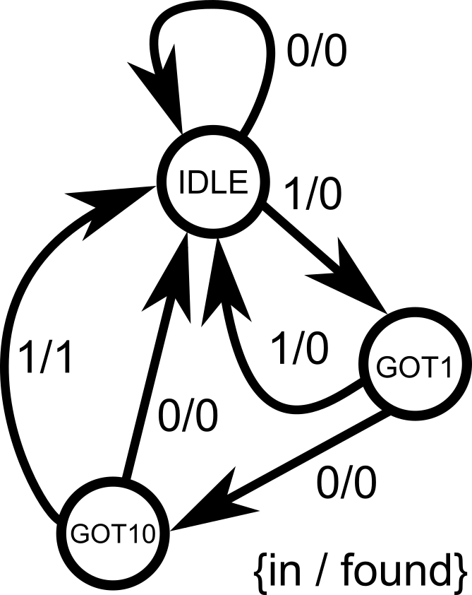
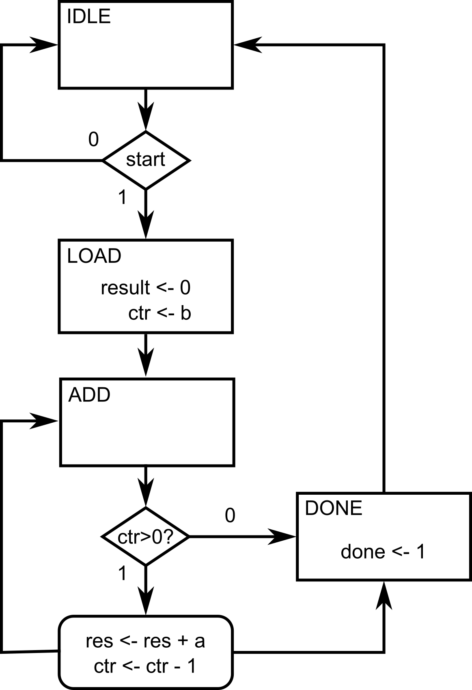
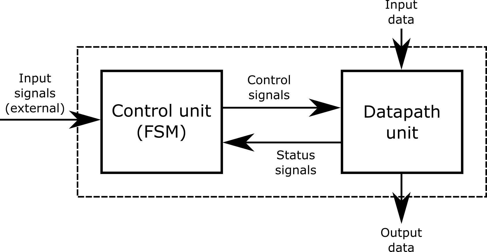

::: {.vcc-nav}
[Overview](index.qmd) | [M000](00-fundamentals.qmd) | [M001](001-combinational.qmd) | [M010](01-combinational.qmd) | [M011](02-sequential.qmd) | [M100](100-advanced-sequential.qmd) | [M101](03-verification.qmd) | [M110](110-advanced-verification.qmd) | [M111](04-practices.qmd) | [Extras](05-extras.qmd) | [Credits](credits.qmd)
:::
# Module 100: Advanced Sequential Logic

In the last module, we built registers and counters, then capped it off with a pipelined multiplier design. Such designs are very structural, meaning we can already imagine what the hardware would look like; we are merely describing the hardware connections.
But what if we want to implement a whole **algorithm**?

Algorithms are made of **steps**, executed in order. In hardware, we capture this by introducing the idea of **states**. Each state represents one step of the algorithm.
At every clock cycle, we can move from one state to another, just like advancing through the steps of a sequence. We will now be writing **Finite State Machines (FSMs)**.

## Code readability tip: Naming states using `localparam`

Whenever we implement FSMs, we typically have descriptive names to help us determine which state we are in at a given clock cycle. To make our code readable, we can give states **names** instead of raw binary
numbers.

We use **`localparam`** for this. For example:

---

```
localparam IDLE = 2'b00,
           STEP1 = 2'b01,
           STEP2 = 2'b10,
           DONE  = 2'b11;
```

---

This way, instead of writing `if (state == 2'b01)`, we can write `if (state == STEP1)`, which is much clearer.

::: {.callout-note}
This is not limited to states. `localparam` can be used to assign meaningful names to constants, improving code readability. The name is not required to be written in all capital letters, like in the example above, but this is a highly preferred coding practice to easily distinguish constants defined using `localparam`.
:::

## FSM Design Example 1: Pattern detector

Suppose we want to detect the bit pattern `101`. Whenever the pattern breaks, we have to start all over. The algorithm is:

1. **At s****tate IDLE:** If we then see a `0`, we remain in **IDLE**. If we see a `1`,
   go to state **GOT1**.
2. **At s**tate GOT1:****If we then see a `0`, go to state **GOT10**. If we see a
   `1`, the pattern is broken, we go back to **IDLE**to start over.
3. **At state GOT10:**If we then see a `0`, the pattern is broken, go back to **IDLE**. If we see a `1`,
   the pattern is complete, assert output (set it to 1), and go back to **IDLE** to start all over again.

{width=40%}

Let’s implement it.

---

```
module pattern_detector(
    input clk,           // system clock
    input reset,         // system reset (high-asserted)
    input in,            // serial input for pattern detection
    output reg found     // 1-bit output to indicate that the pattern is found
);
    // State encoding using localparam
    localparam IDLE  = 2'b00,
               GOT1  = 2'b01,
               GOT10 = 2'b10;

    // internal variable that will hold the current state information
    reg [1:0] state;     // must be declared as reg since it will be inside always@ block

    always @(posedge clk) begin
        if (reset) begin           // synchronous reset for the system
            state <= IDLE;         // reset to state 00 (IDLE), found output = 0
            found <= 1'b0;
        end else begin             // everything under else statement is the main FSM
            case (state)
                IDLE: begin                   // if state = 00 (IDLE)
                    found <= 1'b0;            // pattern is not yet detected, found = 0
                    if (in) state <= GOT1;    // if the input is 1, go to state 01 (GOT1)                                              // no explicit else statement, so remain in state 00 (IDLE) if ever
                end

                GOT1: begin                   // if state = 01 (GOT1)
                    found <= 1'b0;            // pattern is not yet detected, found = 0
                    if (~in) state <= GOT10;  // if the input is 0, go to state 10 (GOT10)
                    else state <= IDLE;       // else, go back to state = 00 (IDLE) to start over
                end

                GOT10: begin                  // if state = 10 (GOT10)
                    if (in) begin             // if input = 1...
                        found <= 1'b1;        // detected 101, so found = 1
                        state <= IDLE;        // go back to state = 00 (IDLE) to repeat the cycle again
                    end else begin            // else if input = 0...
                        found <= 1'b0;        // wrong pattern sequence, found = 0
                        state <= IDLE;        // go back to state = 00 (IDLE) to start over
                    end
                end
            endcase
        end
    end
endmodule
```

---

Key points:

- The FSM keeps track of the algorithm’s progress in `state`.
- On each clock edge, we update `state` and possibly set outputs.
- Using `localparam` makes the code easier to read.

::: {.callout-note title="A useful analogy"}

- Think of `always @(posedge clk)` as an **infinite loop**.
- On each clock tick, you do **one step** of the algorithm (based on the current state).
- You can only be in one state at a time (per clock cycle). So you only evaluate assignments under that state.

:::

## Common Pitfalls

In sequential logic, registers only update **after** the clock edge. That means:

- On the rising edge of the clock, the `if` conditions check the **old values**.
- The assignments (`<=`) schedule updates, but those new values only appear **after the clock edge has passed**.

This often surprises beginners because it creates what looks like an “off-by-one” error.

Consider the following Verilog code of an up-down counter with a midpoint indicator:

---

```
module counter (
    input clk,
    input nrst,
    input up_down,               // counting up or counting down
    output reg [3:0] out,        // 4-bit output, sweep from 0000 (0) to 1111 (15)
    output reg midpoint          // set midpoint = 1 only if out = 7
);
    always @ (posedge clk or negedge nrst) begin
        if (!nrst) begin                     // asynchronous low-asserted reset
            out <= 4'b0000;
            midpoint <= 1'b0;
        end else begin
            if (up_down) begin
                out <= out + 1;              // counting up
                if (out == 4'd7) begin       // check if out == 7
                    midpoint <= 1'b1;        // set midpoint = 1
                end else begin                    midpoint <= 1'b0;        // else midpoint = 0                end
            end else begin
                out <= out - 1;              // counting down
                if (out == 4'd7) begin       // check if out == 7
                    midpoint <= 1'b1;        // set midpoint = 1                end else begin                    midpoint <= 1'b0;        // else midpoint = 0                endend
        end
    end
endmodule
```

---

::: {.callout-warning}
At first glance, it looks like `midpoint` should become `1` exactly when `out` equals 7. But in simulation (and hardware), you’ll find `midpoint` actually goes high when `out` reaches **8** instead of 7 when counting up (`up_down` = 1). When counting down (`up_down` = 0), `midpoint` actually goes high when `out` reaches **6** instead of 7.
:::

{width=70%}

### Why Does This Happen?

Let’s say `out = 7` and `up_down = 1`. On the next clock edge:

1. The `if (out == 7)` check is evaluated using the **old value** of `out` (which is 7). So the condition is
   true.
2. At the same time, `out <= out + 1;` schedules `out` to become 8 after the clock edge.
3. Meanwhile, `midpoint <= 1;` is also scheduled.
4. After the clock edge:

   - `out` becomes 8.
   - `midpoint` becomes 1.

So by the time you observe signals after the clock, `out = 8` and `midpoint = 1`.
 It looks as though `midpoint` “missed” 7 — but really it’s because both updates happened together, one cycle later.

This is the **one-cycle delay of registers**.

### Fix 1: Adjust the condition

One way to fix it is to adjust the `if` checks to anticipate the update:

---

```
always @(posedge clk or negedge nrst) begin
    if (!nrst) begin
        out <= 4'b0000;
        midpoint <= 1'b0;
    end else begin
        if (up_down) begin
            out <= out + 1;
            if (out == 4'd6) begin     // anticipate increment
                midpoint <= 1'b1;            end else begin                midpoint <= 1'b0;            end
        end else begin
            out <= out - 1;
            if (out == 4'd8) begin     // anticipate decrement
                midpoint <= 1'b1;            end else begin                midpoint <= 1'b0;            end
        end
    end
end
```

---

- When counting up: if `out == 6`, then after increment, `out` will become 7.
- When counting down: if `out == 8`, then after decrement, `out` will become 7.
- This works correctly, but feels a little inelegant since the logic has to be “shifted” to match the update timing. It can make the code harder to interpret by eye.

{width=70%}

### Fix 2: Separate Combinational Check

A cleaner approach is to decouple the `midpoint` logic from the clocked process. Instead of updating `midpoint` inside the sequential block, we derive it in a
**combinational block**:

---

```
always @(posedge clk or negedge nrst) begin
    if (!nrst)
        out <= 4'b0000;
    else begin                 // this block just handles the up and down counting        if (up_down)
            out <= out + 1;
        else
            out <= out - 1;    end
end

always @(*) begin             // combinational check, not clock dependent!
    if (out == 4'd7)
        midpoint = 1'b1;
    else
        midpoint = 1'b0;
end
```

---

- The counter `out` is updated on the clock edge, as before.
- But `midpoint` is evaluated in a separate **combinational block**, so it immediately reflects whether `out` is equal to 7, without waiting an extra clock cycle.
- This makes the code cleaner and separates **storage (sequential)** from **logic (combinational)**. It can make the code easier to interpret by eye.

{width=70%}

## FSM Design Example 2: Multiplication by Repeated Addition

Let's try implementing an arithmetic-style FSM algorithm. A nice starter would be **multiplication via repeated addition**. It’s simple, algorithmic, and shows off the FSM style of design. We can start
describing the algorithm in pseudocode fashion, so we can get an idea of how to capture the algorithm steps into states.

### Step 1. Algorithm (software style)

Suppose we want to compute `result = a * b`.
 One simple algorithm is:

---

```
result = 0;
repeat b times:
    result = result + a;
```

---

That’s an iterative algorithm, perfect to map into hardware as a state machine.

### Step 2. Define the Steps as States

We can capture this with states:

- **IDLE (state = 00)**: Wait for a `start` signal.
- **LOAD (state = 01)**: Initialize `result = 0`, set up a counter with `b`.
- **ADD (state = 10)**: Add `a` to `result`, decrement counter.
- **DONE (state = 11)**: When counter = 0, raise `done` flag and return to IDLE.

{width=55%}

### Step 3. Verilog Implementation

Now, we can start writing the FSM implementation in Verilog, following the algorithm steps that we have defined earlier. Here's the formal problem description of the module that we are trying to implement.

**Design a multiplier circuit using an FSM** that takes two unsigned 4-bit inputs `a` (multiplicand) and `b` (multiplier),
and produces their 8-bit product on `result`. The multiplication must be carried out using the **repeated addition algorithm**: initialize `result` to 0, then add `a` to `result`, `b` times. The design should proceed step by step, performing
one addition per clock cycle, until the multiplication is complete.

The circuit should include the following signals:

- **clk** (input): System clock. The FSM advances one step on each rising edge.
- **reset** (input): Synchronous reset signal. When asserted, the FSM returns to the IDLE state, clears `result`, and resets internal registers.
- **start** (input): Control signal to begin multiplication. When `start = 1` in the IDLE state, the FSM loads inputs and starts the algorithm.
- **a** (input, 4 bits): Multiplicand.
- **b** (input, 4 bits): Multiplier.
- **result** (output, 8 bits): Final product of `a * b`. Updated progressively during the FSM operation.
- **done** (output): Completion flag. Asserted high for one cycle when the multiplication is finished.

---

```
module multiplier_fsm(
    input clk,               // system clock
    input reset,             // synchronous reset
    input start,             // start signal to begin multiplication
    input [3:0] a,           // multiplicand (4-bit)
    input [3:0] b,           // multiplier   (4-bit)
    output reg [7:0] result, // multiplication result (up to 8 bits)
    output reg done          // flag to signal completion
);
    // State encoding using localparam for readability
    localparam IDLE = 2'b00, // waiting for 'start'
               LOAD = 2'b01, // initialize values
               ADD  = 2'b10, // perform repeated addition
               DONE = 2'b11; // multiplication complete

    reg [1:0] state;     // internal register that holds current FSM state
    reg [3:0] counter;   // internal register for loop counter (tracks how many adds left)

    always @(posedge clk) begin
        if (reset) begin
            // Reset all values when reset = 1
            state   <= IDLE;
            result  <= 0;
            counter <= 0;
            done    <= 0;
        end else begin        // This is now the main body describing the FSM
            case (state)
                IDLE: begin
                    done <= 0;         // clear 'done' flag
                    if (start)
                        state <= LOAD; // move to LOAD when 'start' asserted (state = 1), else stay in IDLE
                end

                LOAD: begin
                    result  <= 0;      // clear result register
                    counter <= b;      // initialize counter with multiplier value
                    state   <= ADD;    // proceed to ADD loop
                end

                ADD: begin
                    if (counter > 0) begin        // stay in ADD until counter reaches 0
                        result  <= result + a;    // add 'a' to result
                        counter <= counter - 1;   // decrement loop counter

                    end else begin
                        state <= DONE;            // when counter = 0, go to DONE
                    end
                end

                DONE: begin
                    done <= 1;                    // raise 'done' flag for 1 cycle
                    state <= IDLE;                // return to IDLE, ready for next operation
                end
            endcase
        end
    end
endmodule
```

---

- This FSM literally **executes an algorithm one step per clock cycle**.
- When `start = 1`, the FSM saves the value of `b` as the `counter` (**LOAD** state)
- Each clock cycle in the **ADD** state:

  - `result` gets one more `a`.
  - `counter` counts down.
- Once `counter = 0`, FSM goes to **DONE** and asserts `done`.
- The algorithm finishes after `b` clock cycles (with an extra 3 cycles as we transitioned from **IDLE** to **LOAD**, and later to **DONE**).

## Putting It All Together: Controller + Datapath

Here’s a complete example demonstrating a Hamming weight counter using a **controller + datapath** approach. The controller is implemented as an FSM, while the datapath simply performs the data transfer and calculations per clock cycle. The FSM is in a single `a``lways @(posedge clk)` block, and the datapath registers are in another single `always @(posedge clk)` block.

This is the **last design** that we will be covering for this crash course! Take your time to trace how the **controller (FSM)** communicates with the **datapath**: the controller issues registered control signals on each clock edge, and the datapath responds on the **next** edge with register updates. Notice we keep them in **two separate `always @(posedge clk)` blocks:**one for the FSM, one for the datapath, to make responsibilities crystal clear. This “controller + datapath” pattern is how **larger digital systems** are built: CPUs, accelerators, and I/O engines are essentially many small datapaths steered by coordinating FSMs. If you can follow the handshakes (start/busy/done), control signals (load/shift/add/etc.), and the timing of when values become valid, you’re reading the same blueprint used in real-world designs. Take it slow and step through a few clock cycles; you’ll see the whole machine come alive.

{width=75%}

---

```
// =====================================================================
// hamming_weight
// - Counts the number of '1' bits in a 16-bit word, one bit per cycle
// - FSM controller: single always @(posedge clk)
// - Datapath registers: single always @(posedge clk)
// - Flags are simple combinational wires from datapath regs
// - Start pulse launches; 'done' goes high when result is ready
// =====================================================================
module hamming_weight (
    input  clk,
    input  rst,                // synchronous, active-high
    input  start,              // pulse to start
    input  [15:0] data_in,     // word to popcount
    output reg busy,           // high while running
    output reg done,           // 1 when result valid
    output reg [4:0] ones_out  // the number of 1s. result in [0..16]
);

    // -------------------------
    // Datapath registers
    // -------------------------
    reg [15:0] shift_reg;            // shifts right; LSB examined each cycle
    reg [4:0]  ones_accum;           // running count of '1' bits
    reg [4:0]  bit_ctr;              // counts down from 16 to 0

    // -------------------------
    // Combinational flags from datapath
    // -------------------------
    wire lsb_is_one   = shift_reg[0];
    wire ctr_is_zero  = (bit_ctr == 5'd0);

    // -------------------------
    // Controller -> Datapath registered controls
    // (controlled by FSM; used by datapath next clock)
    // -------------------------
    reg ld_inputs;       // load data_in into shift_reg, reset ones_accum, set bit_ctr=16
    reg shift_en;        // shift right by 1
    reg dec_ctr;         // decrement bit_ctr
    reg add_lsb;         // add LSB into ones_accum
    reg hold_result;     // capture ones_accum into ones_out

    // -------------------------
    // FSM state register (3 bits)
    // -------------------------
    reg [2:0] state;
    localparam IDLE = 3'd0,
               LOAD = 3'd1,
               LOOP = 3'd2,
               HOLD = 3'd3,               DONE = 3'd4;

    // ==============================================================
    // Datapath registers: respond to *registered* controls
    // ==============================================================
    always @(posedge clk) begin
        if (rst) begin
            shift_reg   <= 16'h0000;
            ones_accum  <= 5'd0;
            bit_ctr     <= 5'd0;
            ones_out    <= 5'd0;
        end else begin
            if (ld_inputs) begin
                shift_reg  <= data_in;
                ones_accum <= 5'd0;
                bit_ctr    <= 5'd16;
            end else begin
                // Use current-cycle flags for the updates
                if (add_lsb && lsb_is_one) ones_accum <= ones_accum + 5'd1;
                if (shift_en)              shift_reg  <= {1'b0, shift_reg[15:1]}; // logical right shift
                if (dec_ctr)               bit_ctr    <= bit_ctr - 5'd1;
            end

            if (hold_result) ones_out <= ones_accum;
        end
    end

    // ==============================================================
    // FSM controller: single clocked block
    //   - Assert signals needed by the datapath to control it
    //   - Observes flags from current datapath registers
    // ==============================================================
    always @(posedge clk) begin
        if (rst) begin
            state <= IDLE;            ld_inputs <= 1'b0;             shift_en <= 1'b0;             dec_ctr <= 1'b0;             add_lsb <= 1'b0;             hold_result <= 1'b0;
            busy  <= 1'b0;             done  <= 1'b0;
        end else begin
            case (state)
                IDLE: begin
                    if (start) begin
                        ld_inputs <= 1'b1;  // load inputs next cycle
                        busy      <= 1'b1;
                        state     <= LOAD;
                    end                 end

                LOAD: begin
                    state <= LOOP;     // Move into loop on next cycle                    ld_inputs <= 1'b0; // set ld_inputs back to 0
                end

                LOOP: begin
                    // One-bit step per cycle: accumulate, shift, decrement
                    add_lsb  <= 1'b1;
                    shift_en <= 1'b1;
                    dec_ctr  <= 1'b1;

                    // When counter hits zero (this cycle's value), finish next
                    if (ctr_is_zero) begin
                        hold_result  <= 1'b1;  // capture ones_accum next clock
                        state        <= HOLD;
                    end
                end

                HOLD: begin                     state <= DONE;
                    add_lsb  <= 1'b0;     // set add_lsb back to 0
                    shift_en <= 1'b0;     // set shift_en back to 0
                    dec_ctr  <= 1'b0;     // set dec_ctr back to 0                    hold_result <= 1'b0;  // set hold_result back to 0                    done  <= 1'b1;        // result valid now
                end

                DONE: begin
                    busy <= 1'b0;     // set busy back to 0, was set to 1 during IDLE earlier                    done <= 1'b0;     // set done back to 0
                    if (!start) state <= IDLE; // wait for start to drop
                end

                default: state <= IDLE;
            endcase
        end
    end

endmodule
```

.png){width=100%}

---

::: {.callout-note title="Summary"}

In this module, we learned:

- Algorithms can be modeled as **state machines** in hardware.
- `always @(posedge clk)` is like an **infinite loop**, advancing one step each clock.
- Use `localparam` for clear state names.
- State transitions are described with `if-else` or `case`.
- Registers update **after** the clock, so outputs often appear one cycle later (delayed response).

This forms the basis for implementing *any algorithm in hardware*.

:::

### Module Activity : The Stack

This module's activity is in this **[Jupyter Notebook](https://colab.research.google.com/github/Lawrence-lugs/microlabverilogcrashcourse/blob/main/notebooks/adv_seq/adv_seq.ipynb).** Line by line, you can execute the code in order to see how the environment works. I recommend pressing the **Run all** button at the top and giving it about 2 minutes to download all of the requirements. In the middle of the notebook, you'll find a section where you need to fill in some verilog code. *Time to show your stuff.*

A **[stack](https://en.wikipedia.org/wiki/Stack_(abstract_data_type))** is a programming data structure (or type of memory, really) where you can write data (called **pushing to the top of the stack**). When you read data (called a **popping from the top of the stack**), the data comes out in reverse order of how it came in. For tasks that need you to backtrack, like *depth-first searches, or text-processing*, the stack is useful. Implementing these algorithms in hardware can require the use of a stack-type memory.

In this activity, your task is to implement **a stack** using advanced sequential logic. As a guide, remember to use a *finite state machine* to model the behavior of a stack before writing your code.

::: {.vcc-nextprev}
[← M011](02-sequential.qmd){.vcc-prev} [M101 →](03-verification.qmd){.vcc-next}
:::
