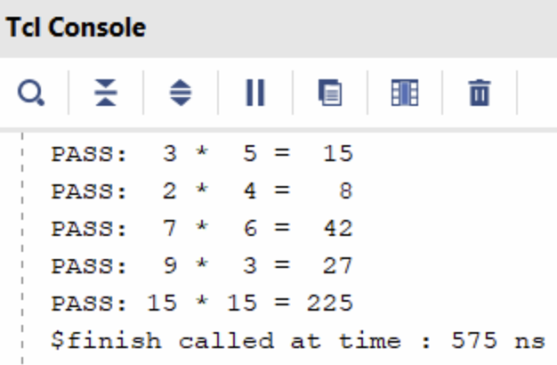
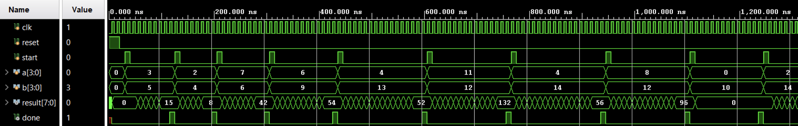
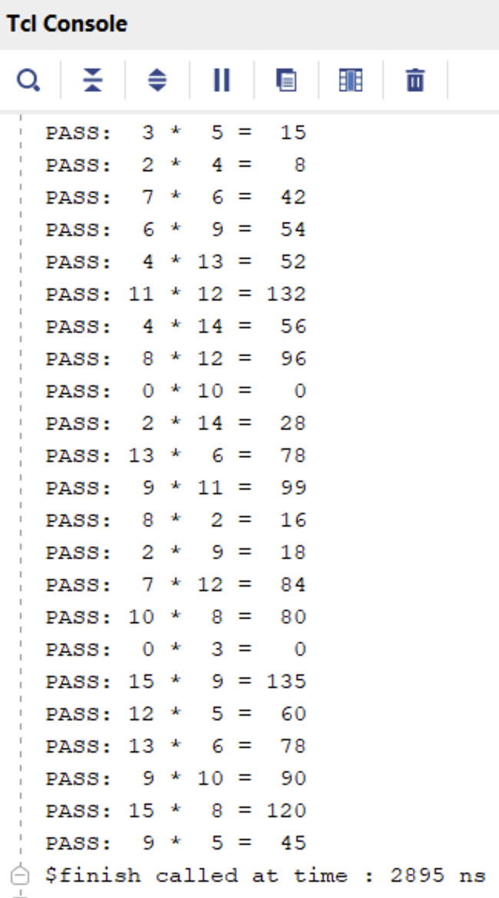

::: {.vcc-nav}
[Overview](index.qmd) | [M000](00-fundamentals.qmd) | [M001](001-combinational.qmd) | [M010](01-combinational.qmd) | [M011](02-sequential.qmd) | [M100](100-advanced-sequential.qmd) | [M101](03-verification.qmd) | [M110](110-advanced-verification.qmd) | [M111](04-practices.qmd) | [Extras](05-extras.qmd) | [Credits](credits.qmd)
:::
# Module 110: Advanced Verification Ideas

The previous module introduced a basic testbench setup that allows you to verify your designs. If you want to thoroughly test your design, you would need more test cases. You can, in fact, scale up the previous testbench module to cover more tests. However, as designs get more complex. testbenches also get complex. Let's now make **more flexible and self-checking** testbenches to simplify our verification tasks.

## From Manual Testing to Automated Testing

In the previous module, we wrote a simple testbench that:

- Ran one multiplication (3 × 5).
- Waited until the design finished.
- Printed the result.

That works for small tests, but real designs need **hundreds or thousands of test cases**. Manually watching waveforms or checking printouts is too tedious.

So now we introduce:

- **Tasks**: reusable “subroutines” in Verilog testbenches.
- **Self-checking testbenches**: testbench automatically compares DUT outputs to expected values.

### Using Tasks for Reusable Tests

A **task** in Verilog is like a **mini-subroutine**:

- You can pass arguments (inputs, outputs).
- You can reuse the same sequence of test steps many times.
- Tasks exist **only in the testbench** — they are not synthesizable hardware.

This is especially helpful when your test sequence has a lot of repeated code (like pulsing `start`, waiting for `done`, checking `result`).

Here’s our **task definition** for running one multiplication test:

---

```verilog
    // Define a reusable test "subroutine"
    task run_test;
        input [3:0] a_in, b_in;    // the test inputs
        input [7:0] expected;      // the expected product
        begin
            // Apply inputs
            #10
            a = a_in;
            b = b_in;

            // Pulse 'start' to begin operation
            start = 1;
            #10 start = 0;

            // Wait until the DUT signals completion
            @(posedge done);

            // Compare DUT output with expected result
            if (result == expected)
                $display("PASS: %d * %d = %d", a_in, b_in, result);
            else
                $display("FAIL: %d * %d, got %d expected %d",
                          a_in, b_in, result, expected);
        end
    endtask
```

---

### How to Call the Task

Calling a task looks just like calling a function in C:

---

```verilog
    // Example calls inside the testbench
    run_test(3, 5, 15);   // expect 3 * 5 = 15
    run_test(2, 4, 8);    // expect 2 * 4 = 8
    run_test(7, 6, 42);   // expect 7 * 6 = 42
```

---

Each call:

1. Sets the inputs `a` and `b`.
2. Pulses the `start` signal.
3. Waits for the DUT to finish.
4. Prints PASS/FAIL automatically.

::: {.callout-note}
Without tasks, you’d have to copy-paste the same dozen lines of code every time you want to test a new input pair. With tasks, you just call `run_test(...)`. This keeps the testbench shorter, clearer, and easier to maintain.
:::

### Running more test cases using `task`

Now let’s build a testbench that runs **several multiplications automatically**:

---

```verilog
`timescale 1ns/1ps
module tb_multiplier;
    reg clk;
    reg reset;
    reg start;
    reg [3:0] a, b;
    wire [7:0] result;
    wire done;

    // Instantiate DUT
    multiplier_fsm uut (
        .clk(clk),
        .reset(reset),
        .start(start),
        .a(a),
        .b(b),
        .result(result),
        .done(done)
    );

    // Clock generation: 10 ns period
    initial clk = 0;
    always #5 clk = ~clk;

    // Define task for test reuse
    task run_test;
        input [3:0] a_in, b_in;
        input [7:0] expected;
        begin
            #10
            a = a_in;
            b = b_in;
            start = 1;
            #10 start = 0;

            // Wait until multiplication is done
            @(posedge done);

            // Self-checking
            if (result == expected)
                $display("PASS: %d * %d = %d", a_in, b_in, result);
            else
                $display("FAIL: %d * %d, got %d expected %d", a_in, b_in, result, expected);
        end
    endtask

    // Test sequence
    initial begin
        // $dumpfile("tb_multiplier.vcd");
        // $dumpvars(0, tb_multiplier);

        // Initialize
        reset = 1; start = 0; a = 0; b = 0;
        #20 reset = 0;

        // Run multiple tests
        run_test(3, 5, 15);
        run_test(2, 4, 8);
        run_test(7, 6, 42);
        run_test(9, 3, 27);
        run_test(15, 15, 225);

        // Finish simulation
        #20 $finish;
    end
endmodule
```

---

### Key Ideas in This Testbench

- **Tasks** simplify code: instead of repeating “set inputs, pulse start, wait, check result” for each test, we just call `run_test(...)`.
- **Self-checking**: the testbench decides **PASS** or **FAIL** automatically by comparing
  `result` with the expected product.
- **Multiple test cases**: we can run as many as we like, quickly.

.png){width=100%}

{width=45%}

## Software vs Hardware Models

So far, we’ve written self-checking testbenches with tasks, but all test inputs were hardcoded. That’s fine for a few cases, but what if we want to test **hundreds** or **thousands** of cases?

In real projects, engineers often have:

- A **software reference model** (e.g., Python, C, MATLAB) that implements the algorithm.
- A **hardware design** (our Verilog DUT).

To verify correctness, they generate test inputs, run them through the software model, and compare the hardware outputs.

Instead of manually coding every test case, we can store them in a **file** and have the Verilog testbench read them automatically.

## File Reading in Verilog Testbenches

Verilog provides system tasks like `$fopen`, `$fscanf`, and `$feof` for file handling. These are simulation-only constructs.

Here’s a simple loop that reads test vectors from a file:

---

```verilog
integer fd;            // file descriptor (handle for opened file)
integer scan_status;   // will hold the return status of fscanf
reg [3:0] a_in, b_in;  // inputs read from file
reg [7:0] expected;    // expected result read from file

initial begin
    // Try to open the file in read mode ("r")
    fd = $fopen("test_vectors.txt", "r");
    if (fd == 0) begin
        $display("ERROR: Could not open file!");
        $finish; // exit simulation if file not found
    end

    // Loop until end of file is reached
    while (!$feof(fd)) begin
        // fscanf returns the number of successful conversions
        // "%d %d %d" means: read 3 integers separated by spaces/newlines
        scan_status = $fscanf(fd, "%d %d %d\n", a_in, b_in, expected);

        if (scan_status == 3) begin
            // Only run test if all 3 numbers were read correctly
            run_test(a_in, b_in, expected);
        end
    end

    // Close the file when done
    $fclose(fd);
    $finish; // end simulation
end
```

---

- `$fopen("filename", "r")` → opens file for reading.
- `$fscanf` → reads formatted text (like `scanf` in C).
- `$feof(fd)` → checks for end of file.
- `$fclose(fd)` → closes the file.

### Python Test Vector Generator

To make test vectors, let’s write a small Python program.

This script randomly generates input pairs `(a, b)`, computes `expected = a * b`, and writes them to a text file:

---

```python
import random

with open("test_vectors.txt", "w") as f:
    for _ in range(20):  # generate 20 test cases
        a = random.randint(0, 15)  # 4-bit input
        b = random.randint(0, 15)  # 4-bit input
        expected = a * b           # software model
        f.write(f"{a} {b} {expected}\n")
```

---

Each line has three numbers:

---

```python
a b expected
```

---

Example output:

---

```python
6 9 54
4 13 52
11 12 132
4 14 56
```

---

Now our testbench:

1. Opens the file generated by the Python script.
2. Reads each line (`a`, `b`, `expected`).
3. Calls `run_test(a, b, expected)`.
4. Prints PASS/FAIL for each case.

### Key Takeaways

- File-driven testbenches let you scale to **large numbers of test cases**.
- You can generate inputs/outputs from a **software reference model** and reuse them in hardware simulation.
- This bridges the gap between **algorithm verification** and **hardware verification**.

## Putting It All Together

Now, we can write a full testbench that utilizes all the concepts introduced so far (tasks + file-reading), which allows the testbench to be more flexible and comprehensive. Here is the complete testbench:

---

```verilog
`timescale 1ns/1ps
module tb_multiplier;
    // Testbench signals
    reg clk;
    reg reset;
    reg start;
    reg [3:0] a, b;
    wire [7:0] result;
    wire done;

    // Instantiate Design Under Test (DUT)
    multiplier_fsm uut (
        .clk(clk),
        .reset(reset),
        .start(start),
        .a(a),
        .b(b),
        .result(result),
        .done(done)
    );

    // Clock generation: 10 ns period
    initial clk = 0;
    always #5 clk = ~clk;

    // Reusable test subroutine
    task run_test;
        input [3:0] a_in, b_in;
        input [7:0] expected;
        begin
            // Apply inputs
            #10
            a = a_in;
            b = b_in;

            // Pulse start signal for one clock cycle
            start = 1;
            #10 start = 0;

            // Wait for DUT to assert "done"
            @(posedge done);

            // Self-checking: compare DUT output with expected value
            if (result == expected)
                $display("PASS: %d * %d = %d", a_in, b_in, result);
            else
                $display("FAIL: %d * %d, got %d expected %d",
                         a_in, b_in, result, expected);
        end
    endtask

    // File handling variables
    integer fd;            // file descriptor
    integer scan_status;   // return value from fscanf
    reg [3:0] a_in, b_in;  // inputs read from file
    reg [7:0] expected;    // expected result read from file

    // Test sequence
    initial begin
        // Enable waveform dumping for GTKWave
        $dumpfile("tb_multiplier.vcd");
        $dumpvars(0, tb_multiplier);

        // Initialize signals
        reset = 1; start = 0; a = 0; b = 0;
        #20 reset = 0;

        // --- Hardcoded tests first ---
        run_test(3, 5, 15);
        run_test(2, 4, 8);
        run_test(7, 6, 42);

        // --- File-driven tests next ---
        fd = $fopen("test_vectors.txt", "r");
        if (fd == 0) begin
            $display("ERROR: Could not open file!");
            $finish;
        end

        while (!$feof(fd)) begin
            scan_status = $fscanf(fd, "%d %d %d\n", a_in, b_in, expected);
            if (scan_status == 3) begin
                run_test(a_in, b_in, expected);
            end
        end

        $fclose(fd);

        #20 $finish;
    end
endmodule
```

---

This combined testbench demonstrates:

- **Manual tests** (good for quick sanity checks).
- **Reusable task** (`run_test`) to avoid repeated code.
- **File-driven verification** so you can easily scale up testing with hundreds of test vectors, possibly generated from a Python “golden model.”

{width=100%}

{width=40%}

::: {.callout-note title="Summary"}

By the end of this module, students can now:

- Write **self-checking testbenches** with tasks.
- Automate testing by **reading from files**.
- Understand the connection between **software models** (Python) and hardware verification.

:::

### Module Activity : The Coding Environment

In reality, we do not use **Jupyter Notebooks** to run Verilog simulations. Rather, Verilog simulations are typically done in integrated design environments.
For this activity,  open the **[Verilog Crash Course Github Repository](https://github.com/Lawrence-lugs/microlabverilogcrashcourse).**
To start the design environment, click **Code > Codespaces > Open in Codespace...**
The codespace will have a setup stage for about 10 minutes. However, at the end, you should see a coding-environment-like window.

From this window, you can write files, see waveforms, run arbitrary code and commands in the terminal, and other such things.
This is how digital design engineers typically do their work.

In this activity, you'll be

1. Familiarizing yourself with using the terminal to run Verilog simulations
2. Using a waveform viewer
3. Writing a testbench and debugging verilog code

The rest of the instructions for this activity are written on the Github page itself (scroll down from there).


::: {.vcc-nextprev}
[← M101](03-verification.qmd){.vcc-prev} [M111 →](04-practices.qmd){.vcc-next}
:::
