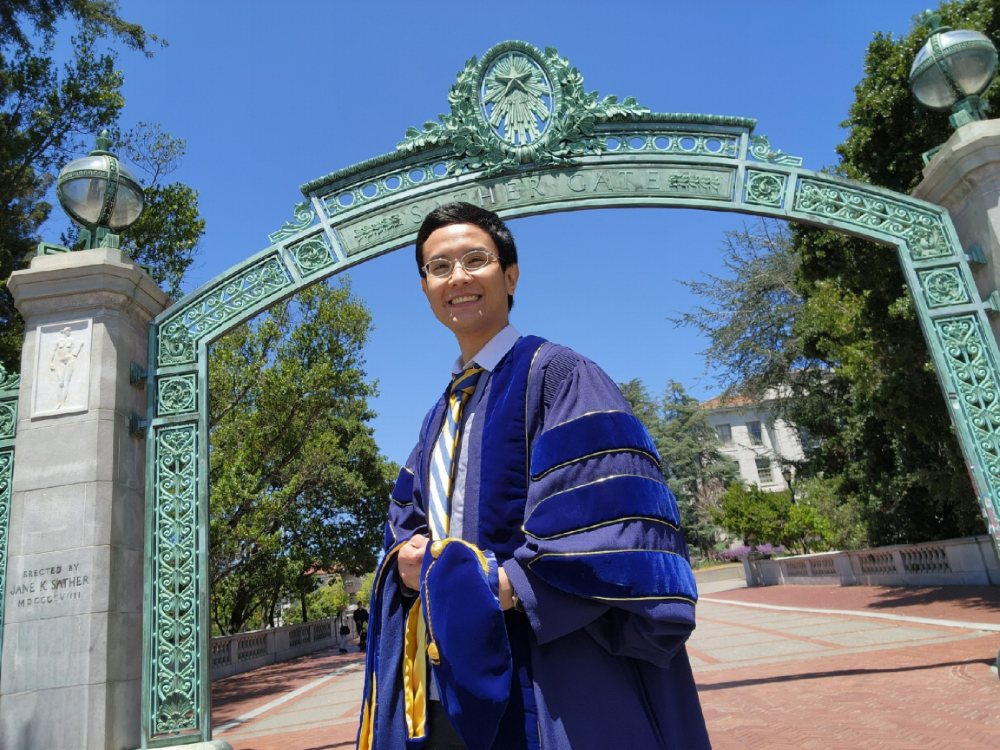
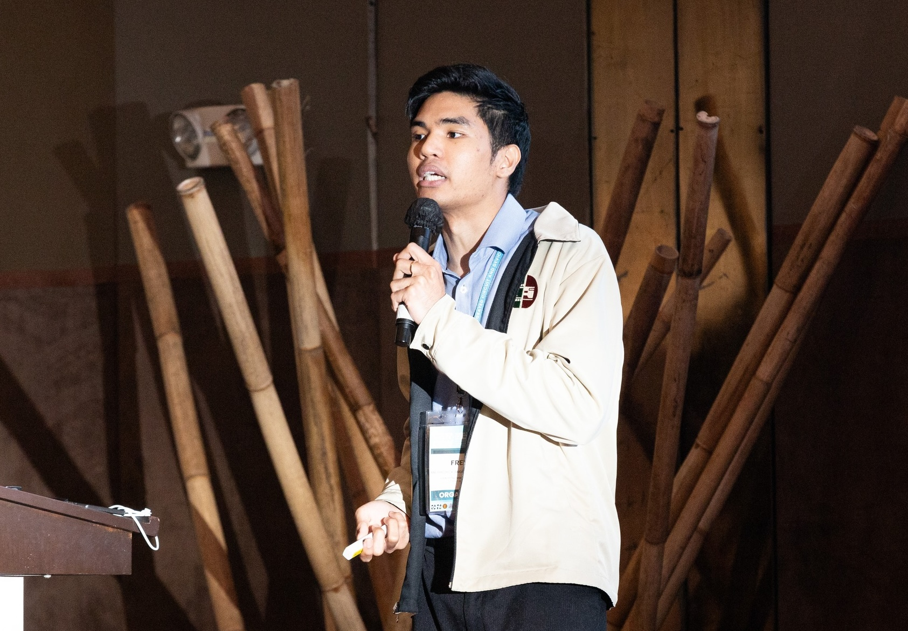

::: {.vcc-nav}
[Overview](index.qmd) | [M000](00-fundamentals.qmd) | [M001](001-combinational.qmd) | [M010](01-combinational.qmd) | [M011](02-sequential.qmd) | [M100](100-advanced-sequential.qmd) | [M101](03-verification.qmd) | [M110](110-advanced-verification.qmd) | [M111](04-practices.qmd) | [Extras](05-extras.qmd) | [Credits](credits.qmd)
:::
# Credits: About the team

>This project started from my own frustration with how Verilog is often taught and, more importantly, from a very real gap in our own Microelectronics laboratory. The truth is simple but pressing: there are too few truly capable digital designers in the lab: designers who can take any realizable algorithm and implement it in hardware *in a day*. Without that skill base, our ability to explore higher-level, research-worthy architectures is severely limited. We end up circling back to standard processor designs and simple protocols, rather than pushing the boundaries of what’s possible.
>
>This **Verilog Crash Course** was born as a direct response. I wanted to strip away the noise, make the essentials crystal clear, and give our students and researchers the confidence to go from algorithm to hardware description quickly. If we can do that, we take the first step toward raising the overall expertise in digital design within the lab. With more people capable of building working prototypes rapidly, we open the door to tackling architectures and systems that are genuinely new and worth researching.
>
>None of this would have been possible without the small team that rallied around this idea; the few in the lab who already had the *rare* skill set of truly capable digital designers. They took that initial frustration and turned it into a structured, accessible course that is now helping others climb the same learning curve far more easily. Their work is what makes this course more than just a set of notes; it’s a resource that can genuinely change how we approach digital design in the lab.
>
>--- Adel

# The Digiboys™

## Adelson Chua

### Course Vision and Content Development

## Fredrick Angelo Galapon

### Visual Design

## Lawrence Roman Quizon

### Assessment Development

.png)

[← Overview](index.qmd){.vcc-prev}
