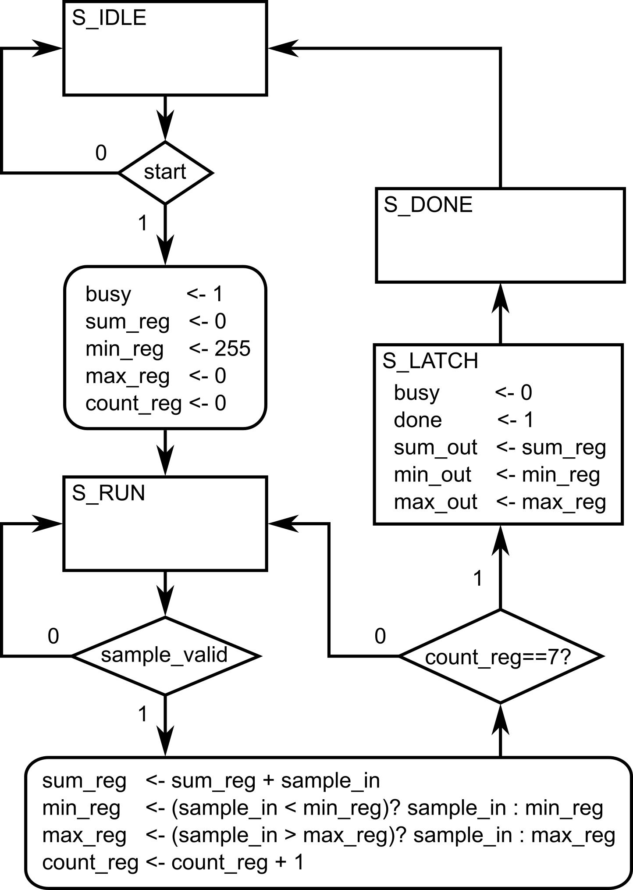

Up to now, you’ve been prototyping quickly with a **single `always @(posedge clk)`** that reads like your algorithm. That’s great for small/medium blocks. As designs grow, teams often shift to a **structural style** that mirrors real digital methodology: **each register has a single point of ownership** (its own clocked block), with tiny combinational helpers to express “next” intent. This improves readability, timing clarity, and scalability, without abandoning your algorithmic flow.

## Design Problem: Stream 8 Samples, Report Sum/Min/Max

Design a synchronous module that **ingests exactly eight 8-bit samples** from a stream (gated by a valid signal), then produces their **sum**, **minimum**, and **maximum**, along with a **one-cycle `done` pulse** indicating the results are
ready. The design must be clocked and reset synchronously.

We will implement it in two styles:

1. **Monolithic**: one `always @(posedge clk)` block with an FSM that owns all registers.
2. **Structural**: split responsibilities so that **each register has a single point of ownership** (one clocked block per register), with small combinational
   helpers as needed.

### Inputs

- `clk` : Clock. All sequential logic triggers on the **rising** edge.
- `rst` : Synchronous, active-high **reset**. When asserted, all internal state and outputs must return to defined reset values.
- `start` : A (typically one-cycle) pulse signaling the module to begin collecting a new batch of 8 samples.

  - If asserted while the module is already busy, it must be **ignored** (no effect).
- `sample_in[7:0]` : The current sample value on the input stream.
- `sample_valid` : When `1`, indicates `sample_in` holds a **new** sample that should be **accepted this cycle** if the module is currently busy collecting.

### Outputs

- `busy` : When `1`, the module is in the middle of collecting samples (i.e., after a valid `start` until the
  8th sample is accepted).
- `done` : A **one-cycle pulse** asserted **exactly when** the final results are captured/updated.
- `sum_out[10:0]` : The sum of the 8 accepted samples (8 × 255 = 2040 → 11 bits).
- `min_out[7:0]` : The minimum of the 8 accepted samples.
- `max_out[7:0]` : The maximum of the 8 accepted samples.

> Outputs (`sum_out`, `min_out`, `max_out`) must update **once per batch**,
> on the **same cycle that `done` is asserted**, and remain unchanged until the next batch completes.

## Monolithic style (single `always@` block)

A single `always @(posedge clk)` owns the state machine, counters, accumulators, outputs, and pulses. This is close to our earlier “algorithm-in-one-block” style, presented in the previous modules. (*This is also affectionally referred to as Adel-style coding, reflecting his preferred way of describing algorithms, enabling very rapid, 'in-just-one-sitting' implementations)*

{width=70%}

---

```verilog
module stats8_monolithic (
    input  clk,
    input  rst,           // sync, active-high
    input  start,         // pulse to begin a new batch
    input  [7:0]  sample_in,
    input  sample_valid,
    output reg         busy,
    output reg         done,          // 1-cycle pulse when outputs valid
    output reg [10:0]  sum_out,       // sum of 8 bytes (max 2040 -> 11 bits)
    output reg [7:0]   min_out,
    output reg [7:0]   max_out
);

    localparam [1:0] S_IDLE=2'd0, S_RUN=2'd1, S_LATCH=2'd2, S_DONE=2'd3;
    reg [1:0] state;

    reg [10:0] sum_reg;
    reg [7:0]  min_reg, max_reg;
    reg [2:0]  count_reg; // 0..7 accepted samples

    always @(posedge clk) begin
        if (rst) begin
            state     <= S_IDLE;
            busy      <= 1'b0;
            done      <= 1'b0;
            sum_reg   <= 11'd0;
            min_reg   <= 8'hFF;
            max_reg   <= 8'h00;
            count_reg <= 3'd0;
            sum_out   <= 11'd0;
            min_out   <= 8'd0;
            max_out   <= 8'd0;
        end else begin
            case (state)
                S_IDLE: begin
                    if (start) begin
                        busy      <= 1'b1;
                        sum_reg   <= 11'd0;
                        min_reg   <= 8'hFF;
                        max_reg   <= 8'h00;
                        count_reg <= 3'd0;
                        state     <= S_RUN;
                    end
                end

                S_RUN: begin
                    if (sample_valid) begin
                        sum_reg   <= sum_reg + sample_in;
                        min_reg   <= (sample_in < min_reg) ? sample_in : min_reg;
                        max_reg   <= (sample_in > max_reg) ? sample_in : max_reg;
                        count_reg <= count_reg + 3'd1;

                        if (count_reg == 3'd7)
                            state <= S_LATCH; // 8th sample just accepted
                    end
                end

                S_LATCH: begin
                    sum_out <= sum_reg;
                    min_out <= min_reg;
                    max_out <= max_reg;
                    done    <= 1'b1;
                    busy    <= 1'b0;
                    state   <= S_DONE;
                end

                S_DONE: begin
                    done  <= 1'b0;
                    state <= S_IDLE;
                end

                default: state <= S_IDLE;
            endcase
        end
    end
endmodule
```

---

✅**Monolithic coding style advantages:** fast to write; reads like the algorithm; people with programming backgrounds can easily understand the sequence of events (given a relatively small FSM/code length)

**❌Limits:** as logic grows, a single block can get dense; ownership of each register can become less obvious; reasoning about per-register timing intent may require more careful reading.

## Structured style (separate `always@` blocks)

Here, **each register has its own `always @(posedge clk)`**; small wires express “next” intent cleanly. This clarifies **who owns what**,
and makes timing/dataflow explicit. (*This, on the other hand, is referred to as Fred-style coding, reflecting his preferred way of describing digital systems like a true digital designer.)*

**

---

```verilog
// stats8_structured
// Each register gets its own always block (single point of ownership).
// Small combinational helpers express intent and timing clearly.
module stats8_structured (
    input  clk,
    input  rst,           // sync, active-high
    input  start,         // pulse to begin a new batch
    input  [7:0]  sample_in,
    input  sample_valid,
    output reg         busy,
    output reg         done,          // 1-cycle pulse when outputs valid
    output reg [10:0]  sum_out,       // sum of 8 bytes (max 2040 -> 11 bits)
    output reg [7:0]   min_out,
    output reg [7:0]   max_out
);

    localparam [1:0] S_IDLE=2'd0, S_RUN=2'd1, S_LATCH=2'd2, S_DONE=2'd3;
    reg [1:0] state;
    reg [2:0] count_reg;

    // ----------------------------------------------------------------
    // State
    // ----------------------------------------------------------------
    always @(posedge clk) begin
        if (rst) begin
            state <= S_IDLE;
        end else begin
            case (state)
                S_IDLE: begin
                    if (start) begin
                        state <= S_RUN;
                    end
                end
                S_RUN: begin
                    if ((sample_valid) && (count_reg == 3'd7)) begin
                        state <= S_LATCH; // 8th sample just accepted
                    end
                end
                S_LATCH: begin
                    state <= S_DONE;
                end
                S_DONE: begin
                    state <= S_IDLE;
                end
                default: state <= S_IDLE;
            endcase
        end
    end

    // ----------------------------------------------------------------
    // Combinational helpers (control signals)
    // ----------------------------------------------------------------
    wire start_new   = (state == S_IDLE) & start;
    wire take_sample = (state == S_RUN) & sample_valid;
    wire last_flag   = (state == S_LATCH);

    // ----------------------------------------------------------------
    // COUNTER: how many samples have been accepted
    // ----------------------------------------------------------------
    always @(posedge clk) begin
        if (rst) begin
            count_reg <= 3'd0;
        end else begin
            if (start_new) begin
                count_reg <= 3'd0;
            end else if (take_sample) begin
                count_reg <= count_reg + 3'd1;
            end
        end
    end

    // ----------------------------------------------------------------
    // SUM accumulator (11 bits)
    // MIN tracker
    // MAX tracker
    // ----------------------------------------------------------------
    reg [10:0] sum_reg;
    reg [7:0]  min_reg;
    reg [7:0]  max_reg;
    always @(posedge clk) begin
        if (rst) begin
            sum_reg <= 11'd0;
            min_reg <= 8'hFF;
            max_reg <= 8'h00;
        end else begin
            if (start_new) begin
                sum_reg <= 11'd0;
                min_reg <= 8'hFF;
                max_reg <= 8'h00;
            end else if (take_sample) begin
                sum_reg <= sum_reg + sample_in;
                if (sample_in < min_reg) min_reg <= sample_in;
                if (sample_in > max_reg) max_reg <= sample_in;
            end
        end
    end

    // ----------------------------------------------------------------
    // OUTPUT LATCHES
    // ----------------------------------------------------------------
    always @(posedge clk) begin
        if (rst) begin
            sum_out <= 11'd0;
            min_out <= 8'd0;
            max_out <= 8'd0;
        end else begin
            if (last_flag) begin
                sum_out <= sum_reg;
                min_out <= min_reg;
                max_out <= max_reg;
            end
        end
    end

    // ----------------------------------------------------------------
    // BUSY flag: asserted after start, deasserted on last sample
    // ----------------------------------------------------------------
    always @(posedge clk) begin
        if (rst) begin
            busy <= 1'b0;
        end else begin
            if (start_new) begin
                busy <= 1'b1;
            end else if (last_flag) begin
                busy <= 1'b0;
            end
        end
    end

    // ----------------------------------------------------------------
    // DONE pulse (1 cycle) exactly when outputs are captured
    // ----------------------------------------------------------------
    always @(posedge clk) begin
        if (rst) begin
            done <= 1'b0;
        end else begin
            if (last_flag) begin
                done <= 1'b1;
            end else begin
                done <= 1'b0;
            end
        end
    end
endmodule
```

---


✅**Structured coding style advantages:** every register has one owner; intent/timing are explicit; easier to scale, review, and pipeline; this mirrors how large digital systems are partitioned.


**❌Limits:** as logic grows, the number of lines in the code can get very long; people coming from a programming background may struggle to understand the intended algorithm due to block separation.

## How to refactor from monolithic → structured (recipe)

1. **List the registers** you see in the monolithic block (`busy`, `count_reg`, `sum_reg`,
   `min_reg`, `max_reg`, and output latches).
2. **Create tiny helper wires** that describe *when* and *what* (e.g., `start_new`,
   `take_sample`, `last_sample`). Keep them combinational.
3. For **each register**, make a dedicated `always @(posedge clk)` that:

   - Handles **reset** and **batch start** defaults,
   - Updates **only on its enabling condition** (e.g., `take_sample`).
   - Owns **no other registers**.
4. **Latch outputs** where appropriate (often when a final condition becomes true).
5. Keep **pulses** (like `done`) in their **own** register block to avoid accidental stretching.

## Benefits of the structural approach (becoming a true digital designer)

- **✅Single point of ownership** per register → eliminates accidental double drivers and clarifies responsibility.
- **✅Timing intent is explicit**: readers see exactly when and why each register updates; easier to reason about one-cycle “old/new” behavior.
- **✅Scales to bigger blocks**: you can add features by adding **another owner block** and a few helper wires, instead of growing a monolith.
- **✅Closer to real methodology**: mirrors how pipelines, datapaths, and control/status registers are partitioned in industry.
- **✅Refactoring is local**: changing `min_reg` logic doesn’t risk unintended edits to `busy` or `sum_reg`.
- **✅Review & verification friendly**: easier code reviews; formal or assertion checks can be tied to specific owners/signals.
- **✅Local debugging/reasoning:** debugging “sum looks wrong” means looking at the **sum block**, not
  a 200-line state machine.

## Pitfalls & guardrails (structural style)

- **⚠️Don’t multi-drive** a reg: one owner block per reg, period.
- **⚠️Keep helpers combinational** (simple `assign` or `wire` expressions). Don’t hide state in helpers.
- **⚠️Reset semantics must match** across owners (use the same reset polarity/priority in the module).
- **⚠️Mind the one-cycle rule**: cross-block dependencies still use **old** registered values until the next edge; design helpers like `last_sample` to make that explicit.
- **⚠️Name consistently**: `*_reg` for owned regs, `*_out` for outputs, `*_next` only if you introduce next-value combinational signals.
