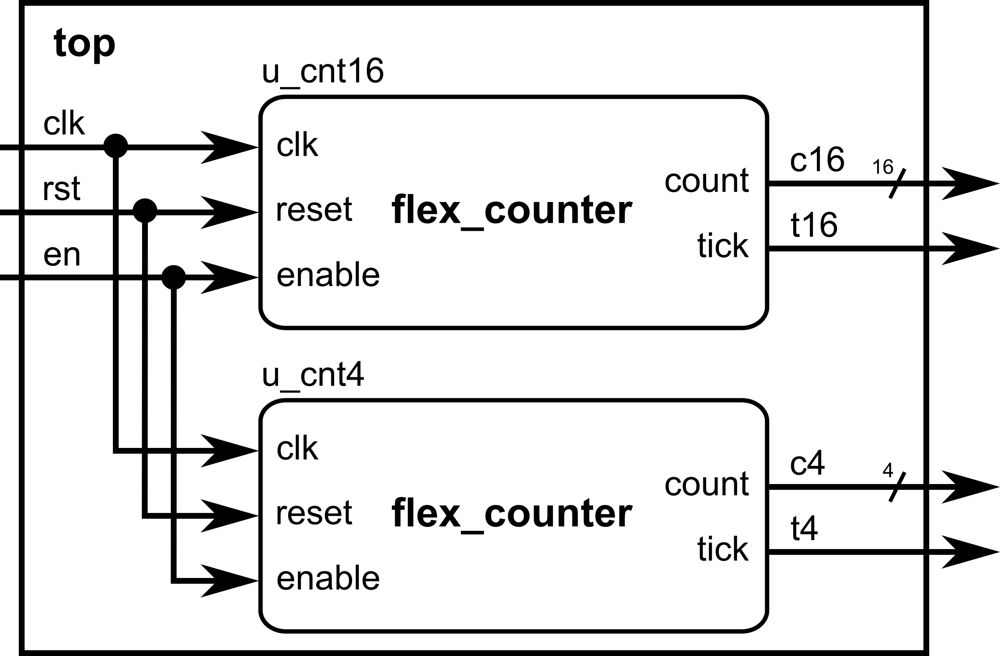
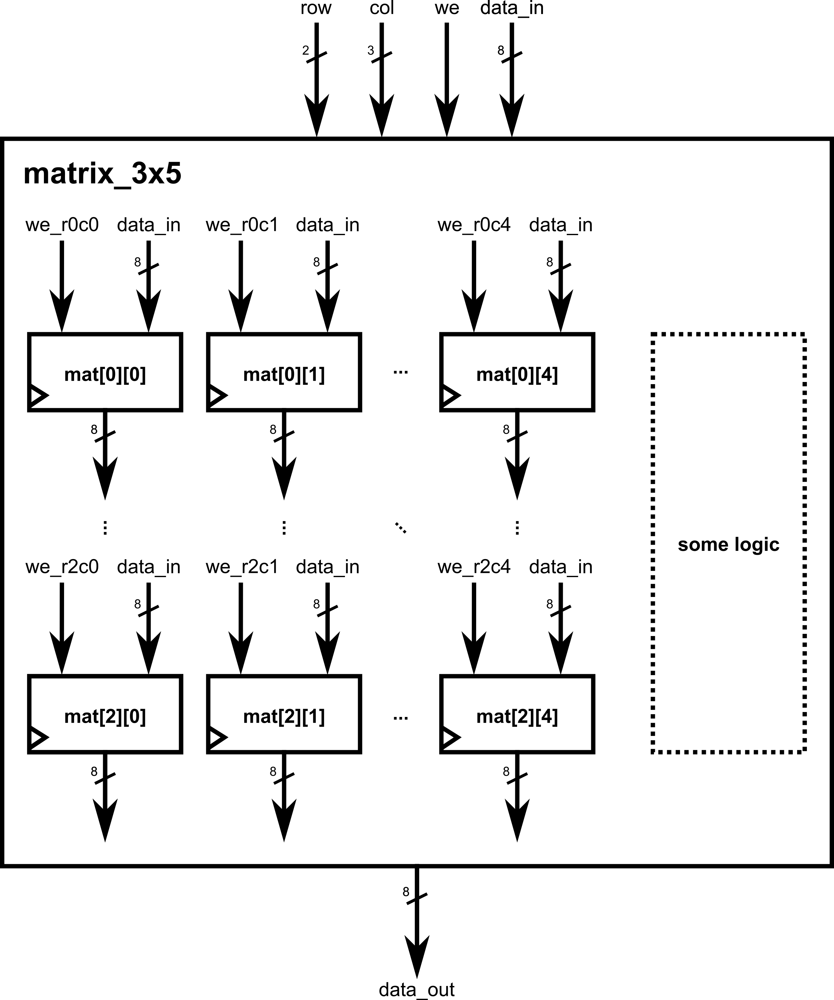
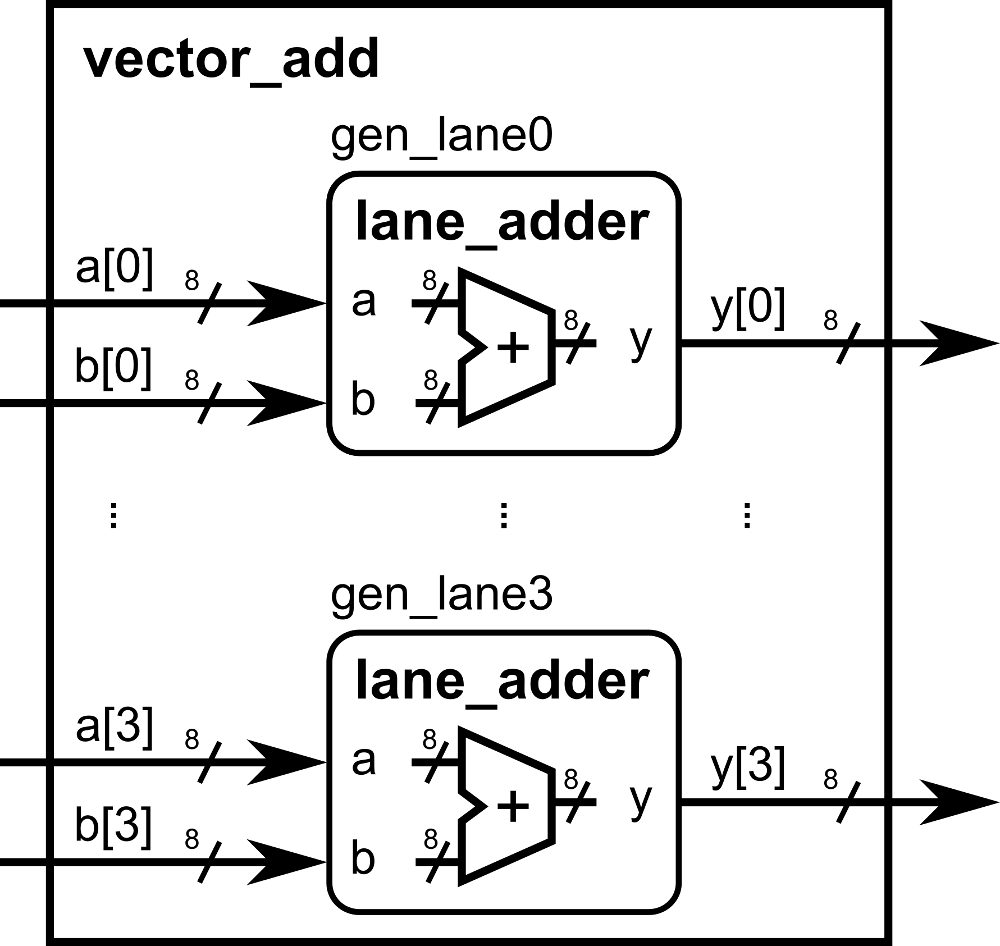
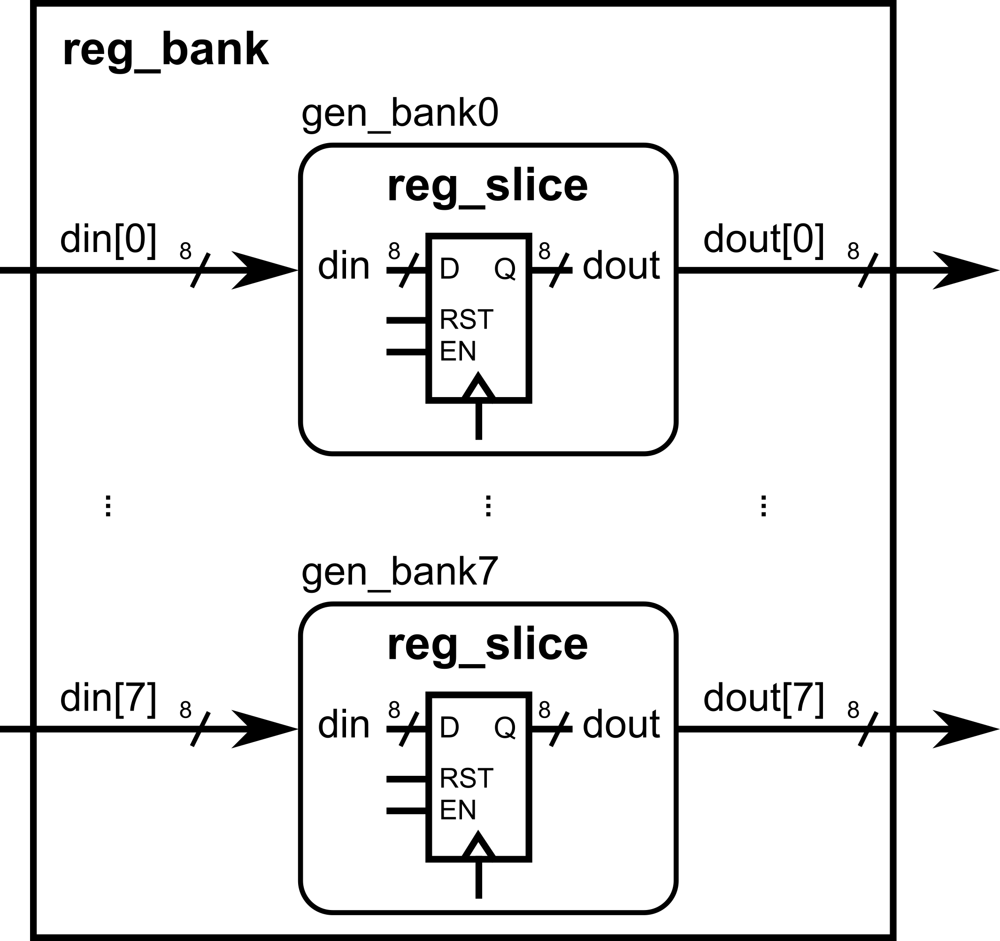

This module gives you higher-level tools for building **bigger, more reusable** blocks without losing the “algorithm → HDL” mindset. We’ll cover parameters, arrays, `for` loops in clocked blocks, file-driven initialization (simulation), `generate`/`genvar`, and conditional compilation. These topics complement the “fast prototype → verify” flow you’ve been using and build on ideas already introduced.

## Parameterize widths/depths for reusable components

**Why:** One module, many sizes. Parameters let you change bus widths, depths, and timing constants from the **top module** without editing the internals.

### Example: Parameterized counter (width + terminal count)

---

```verilog
module flex_counter #(
    parameter WIDTH = 8,           // number of bits in counter
    parameter MAX   = 8'd200       // terminal count value (sized to WIDTH)
)(
    input              clk,
    input              reset,
    input              enable,
    output reg [WIDTH-1:0] count,
    output reg         tick        // 1-cycle pulse when count == MAX
);
    always @(posedge clk) begin
        if (reset) begin
            count <= {WIDTH{1'b0}}; // use replication syntax to set a defined number of bits (determined by WIDTH) to be 0
            tick  <= 1'b0;
        end else if (enable) begin
            if (count == MAX) begin
                count <= {WIDTH{1'b0}};
                tick  <= 1'b1;
            end else begin
                count <= count + {{(WIDTH-1){1'b0}},1'b1};
                tick  <= 1'b0;
            end
        end else begin
            tick <= 1'b0;
        end
    end
endmodule
```

---

### Top-level overrides (redefine from the instantiation site):

---

```verilog
module top (
    input clk,    input rst,    input en,    output [15:0] c16,
    output        t16,
    output [3:0]  c4,
    output        t4);

    // 16-bit counter to 50000
    flex_counter #(.WIDTH(16), .MAX(16'd50000)) u_cnt16 (
        .clk(clk), .reset(rst), .enable(en), .count(c16), .tick(t16)
    );

    // 4-bit counter to 9
    flex_counter #(.WIDTH(4), .MAX(4'd9)) u_cnt4 (
        .clk(clk), .reset(rst), .enable(en), .count(c4), .tick(t4)
    );
endmodule
```

{width=90%}

---

ℹ️Parameters let **top-level design** make decisions (bus sizes, memory depth) without touching module code.

## Multi-dimensional arrays (register files, tiles, small memories)

**Why:** Natural way to model matrices, register files, or multi-lane buffers. Start with **declaring and indexing**; we’ll add resets/initialization with
`for` later.

### Example: 3×5 byte matrix (rows=3, cols=5). Indexing: `[row][col]`

---

```verilog
module matrix_3x5(
    input        clk,
    input        reset,
    input  [1:0] row,        // 0..2
    input  [2:0] col,        // 0..4
    input        we,         // write enable
    input  [7:0] data_in,
    output reg [7:0] data_out
);
    // 3 rows (0..2), 5 cols (0..4); each cell is 8 bits
    reg [7:0] mat [0:2][0:4];

    always @(posedge clk) begin
        if (reset) begin
            data_out <= 8'd0;
            // (No mass reset here yet—covered in the next section)
        end else begin
            if (we)  mat[row][col] <= data_in;  // write one cell
            data_out <= mat[row][col];          // read the same addressed cell
        end
    end
endmodule
```

{width=90%}

---

ℹ️Tip: keep indices well-sized (2 bits for 0..3, 3 bits for 0..7) so synthesis knows the bounds.

## `for` loops in **clocked** blocks to reset/initialize arrays

**Why:** When resetting or clearing arrays, a `for` loop describes **repeat structure**; synthesis **unrolls** it into parallel hardware. Use it for resets/initial fills inside `@(posedge clk)`—it’s clean and scalable.

### Example A: Zeroing a 4×8 on reset (two nested `for` loops)

---

```verilog
module matrix_clear_4x8(
    input clk, reset, load,
    input [1:0] row, input [2:0] col,
    input [7:0] di,
    output reg [7:0] do
);
    reg [7:0] buf [0:3][0:7];
    integer i, j;

    always @(posedge clk) begin
        if (reset) begin
            // Loop unrolls in hardware; intent is a mass clear
            for (i = 0; i < 4; i = i + 1)
                for (j = 0; j < 8; j = j + 1)
                    buf[i][j] <= 8'd0;
            do <= 8'd0;
        end else begin
            if (load) buf[row][col] <= di;
            do <= buf[row][col];
        end
    end
endmodule
```

---

###

### Example B: Initialize from a **file** (simulation-time) using `$fopen/$fscanf`

Note: File I/O is **simulation-only** (testbench or non-synthesizable code). It’s great to preload memories for verification. We’ll show a TB snippet that writes into the DUT over cycles.


Testbench snippet driving a DUT’s write port from a file:

---

```verilog
`timescale 1ns/1ps
module tb_init_from_file;
    reg clk=0, reset=1, we=0;
    reg [1:0] row;
    reg [2:0] col;
    reg [7:0] data_in;
    wire [7:0] data_out;

    matrix_3x5 dut(
        .clk(clk), .reset(reset),
        .row(row), .col(col),
        .we(we), .data_in(data_in), .data_out(data_out)
    );

    always #5 clk = ~clk;

    integer fd, status;
    initial begin
        // Release reset
        #20 reset = 0;

        // Open file with triplets: row col value   (e.g., "0 0 42")
        fd = $fopen("init_3x5.txt", "r");
        if (fd == 0) begin
            $display("ERROR: cannot open init_3x5.txt");
            $finish;
        end

        while (!$feof(fd)) begin
            status = $fscanf(fd, "%d %d %d\n", row, col, data_in);
            if (status == 3) begin
                @(posedge clk);
                we <= 1;
                @(posedge clk);
                we <= 0;
            end
        end

        $fclose(fd);
        // Read back one entry as a demo
        row = 0; col = 0;
        @(posedge clk);
        $display("mat[0][0] readback = %0d", data_out);

        #50 $finish;
    end
endmodule
```

---

ℹ️Alternative: `$readmemh/$readmemb` can bulk-load **1-D memories** (classic ROM/RAM initialization). For 2-D, many flows flatten to 1-D or stream values via a
TB like above. (Keep file I/O in TBs; it’s non-synthesizable.)

## `generate`/`genvar` to replicate logic or modules at scale

**Why:** When you need N repeated lanes/slices, `generate` keeps code compact and consistent. Combine with parameters for configurable replication.

### Example A: Replicate N identical lanes of an adder slice

---

```verilog
module lane_adder #(parameter WIDTH=8)(
    input  [WIDTH-1:0] a, b,
    output [WIDTH-1:0] y
);
    assign y = a + b;
endmodule

module vector_add #(
    parameter N = 4,
    parameter WIDTH = 8
)(
    input  [WIDTH-1:0] a [0:N-1],
    input  [WIDTH-1:0] b [0:N-1],
    output [WIDTH-1:0] y [0:N-1]
);
    genvar k;
    generate
        for (k = 0; k < N; k = k + 1) begin : gen_lane
            lane_adder #(.WIDTH(WIDTH)) u_add (
                .a(a[k]), .b(b[k]), .y(y[k])
            );
        end
    endgenerate
endmodule
```

{width=90%}

---

### Example B: Generate replicated **register slices**

---

```verilog
module reg_slice #(parameter WIDTH=8)(
    input                  clk, reset, load,
    input  [WIDTH-1:0]     din,
    output reg [WIDTH-1:0] dout
);
    always @(posedge clk) begin
        if (reset) dout <= {WIDTH{1'b0}};
        else if (load) dout <= din;
    end
endmodule

module reg_bank #(
    parameter N = 8,
    parameter WIDTH = 8
)(
    input                  clk, reset, load_all,
    input  [WIDTH-1:0]     din [0:N-1],
    output [WIDTH-1:0]     dout[0:N-1]
);
    genvar i;
    generate
        for (i = 0; i < N; i = i + 1) begin : gen_bank
            reg_slice #(.WIDTH(WIDTH)) u_rs (
                .clk(clk), .reset(reset), .load(load_all),
                .din(din[i]), .dout(dout[i])
            );
        end
    endgenerate
endmodule
```

{width=90%}

---

## `ifdef`/`ifndef` for conditional compilation

**Why:** Keep one codebase that can enable/disable features, change widths, or insert debug logic depending on a define. Great for **feature flags** and
**debug prints**.

Define a macro at compile time: `+define+DEBUG` (simulator) or `-DDEBUG` (toolchain dependent).

### Example A: Optional debug printing (simulation)

---

```verilog
module datapath(
    input        clk, reset, en,
    input  [7:0] a, b,
    output reg [7:0] y
);
    always @(posedge clk) begin
        if (reset) y <= 8'd0;
        else if (en) y <= a + b;

        `ifdef DEBUG
            // Simulation-only prints when DEBUG is defined
            if (en) $display("DBG: a=%0d b=%0d y=%0d @%0t", a, b, y, $time);
        `endif
    end
endmodule
```

---

### Example B: Feature flag changes width and adds a port

---

```verilog
// If WIDE_MODE is defined, we use 16-bit datapath; else 8-bit.
`ifdef WIDE_MODE
    `define DW 16
`else
    `define DW 8
`endif

module flex_datapath(
    input               clk, reset, en,
    input  [`DW-1:0]    a, b,
    output reg [`DW-1:0] y
`ifdef HAS_SATURATE
    , input             saturate_en   // extra port only when feature exists
`endif
);
    always @(posedge clk) begin
        if (reset) y <= {`DW{1'b0}};
        else if (en) begin
            y <= a + b;
            `ifdef HAS_SATURATE
                // (Sketch) Example of conditional feature body
                // if (saturate_en && y overflowed) y <= MAX_VALUE;
            `endif
        end
    end
endmodule
```

---

Use `ifndef` to provide defaults when a macro isn’t set:

---

```verilog
`ifndef DW
    `define DW 8
`endif
```

---
